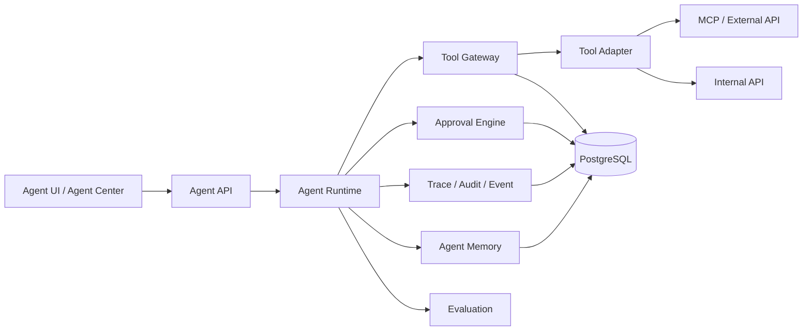

# Amazon AI Agent Platform Architecture

## 1. 目标

当前系统正在从 Amazon PPC SaaS 扩展为 **Amazon AI Commerce OS**。本阶段已落地统一 Agent Runtime、Tool Gateway、Approval、Trace、Evaluation、Agent Center，并完成第一个生产级业务 Agent: **Market Intelligence Agent**。

核心原则：
- Agent 只负责推理、计划、建议和受控动作编排
- Tool 负责能力封装
- MCP 只作为 Tool Adapter 的一种外部实现
- Agent 不能直接访问外部系统
- 所有高风险动作必须走 Human-in-the-loop

## 2. 当前代码结构

### 可复用核心
- `src/lib/agent-platform/`
  - `types.ts`：统一 Agent / Tool / Execution / Approval / Trace / Event / Memory / Evaluation 类型
  - `runtime.ts`：统一 Agent Runtime
  - `tool-gateway.ts`：Tool Gateway 与 Tool Adapter 调度
  - `approval.ts`：Approval 创建与解析
  - `trace.ts`：Trace / Event / 红action
  - `permissions.ts`：Agent-to-Tool 权限判断
  - `defaults.ts`：平台默认 Agent / Tool
  - `evaluation.ts`：Evaluation 运行与评分
  - `market.ts`：Market Agent 定义、工具、运行器、评测 case、SellerSprite adapter
- `src/app/api/agents/`
  - 通用 execution / approval / evaluation / tools / agent detail API
  - Market 专用 projects API
- `src/app/agents/`、`src/components/agents/`
  - Agent Center 与 Market Agent UI
- `prisma/schema.prisma`
  - AgentDefinition / AgentExecution / AgentToolCall / AgentTrace / AgentEvent / AgentApproval / AgentTask / AgentEvaluation 等持久化模型
- `tests/`
  - `agent-platform.test.ts`
  - `market-agent.test.ts`

### 现有业务模块可复用
- `workspace`：SKU / workbook / task / approval 的 UI 组织方式
- `products`：SKU、产品元数据、画像、workbench
- `listing-ai`：AI 输出面板、图像/文案建议展示
- `sellfox`：历史经营数据聚合模式

## 3. 总体架构图

## 4. 统一数据模型

### AgentDefinition
- `id`
- `name`
- `description`
- `version`
- `systemInstructions`
- `goals`
- `skills`
- `tools`
- `permissions`
- `inputSchema`
- `outputSchema`
- `approvalPolicy`
- `enabled`

### 统一运行态对象
- `AgentExecution`
- `AgentContext`
- `AgentToolDefinition`
- `AgentToolCall`
- `AgentDecision`
- `AgentRecommendation`
- `AgentApproval`
- `AgentAction`
- `AgentTraceEvent`
- `AgentEvent`
- `AgentMemoryEntry`
- `AgentEvaluationCase`

## 5. Agent Runtime

`createAgentRuntime()` 是唯一执行入口。

执行顺序：
1. 加载 `AgentDefinition`
2. 生成 `AgentExecution`
3. 初始化 `Trace` / `Event` / `Approval` / `ToolCall`
4. 调用 agent-specific executor
5. Executor 只能通过 `callTool()` 和 `requestApproval()` 进行外部交互
6. Runtime 统一回写状态、token、cost、trace、memory

支持状态：
`CREATED` → `QUEUED` → `RUNNING` → `WAITING_TOOL` / `WAITING_APPROVAL` → `COMPLETED` / `FAILED` / `CANCELLED`

## 6. Tool Gateway

Tool Gateway 是外部能力的唯一出入口。

职责：
- 校验 Agent 是否允许调用该 Tool
- 按 `riskLevel` 决定是否需要审批
- 选择对应 Tool Adapter
- 执行超时 / 重试 / 错误归一化
- 记录 Tool Call、Trace、Event、红action日志

Tool 定义必须包含：
- `toolId`
- `name`
- `description`
- `inputSchema`
- `outputSchema`
- `permission`
- `riskLevel`
- `timeout`
- `retryPolicy`
- `adapterId`

## 7. MCP Adapter

SellerSprite MCP 现在位于：

`Agent -> Tool Gateway -> SellerSprite MCP Adapter -> MCP`

它不是 Agent 业务逻辑的一部分，也不是数据库。

未来新增 SP-API / Ads API / Keepa / Helium10 时，只新增：
- Tool Definition
- Tool Adapter
- Permission Mapping

不改 Agent 核心 runtime。

## 8. Agent Context

当前支持：
- `company`
- `workspace`
- `user`
- `product`
- `sku`
- `marketplace`
- `asin`
- `project`
- `task`
- `historicalData`
- `currentData`

Context 由 API 层组装，Runtime 只消费，不自行查询。

## 9. Agent Memory

长期记忆用 `AgentMemoryEntry` 存储。

建议按 scope 管理：
- `market-research`
- `market-signal`
- `sku-context`
- `approval-history`
- `execution-summary`

Memory 必须绑定：
- `agentDefinitionId`
- `scopeKey`
- `sourceExecutionId`
- `confidence`
- `createdAt` / `updatedAt`

## 10. Agent-to-Agent Handoff

推荐模式：
- Market Agent 输出 `ProductOpportunity`
- 后续 Product / Supplier / Listing / PPC Agent 通过 `memory` + `context` 接力
- Orchestrator 负责串联，不让 Agent 彼此直接调用数据库

## 11. Workflow / Task / Approval

### Workflow
- 用于表示跨步骤业务链路

### Task
- 用于承接单次 Agent 动作或人工待办

### Approval
- 所有 `HIGH` / `CRITICAL` Tool 或 Action 都必须走：
  `Recommendation -> Approval Request -> Human Decision -> Action`

### Notification
- 通过通知系统提醒待审批、失败、完成、重试

## 12. Observability

必须可追踪：
- Agent started
- Tool called
- Tool input
- Tool output
- Decision
- Recommendation
- Approval requested
- Approval result
- Action executed
- Error
- Retry
- Completed

Trace / Event 默认脱敏敏感字段。

## 13. Permission System

权限分两层：

1. **Agent permission**
   - 决定 Agent 能否声明使用某类能力

2. **Tool permission**
   - 决定 Agent 是否可调用某个 Tool

Market Agent 当前只允许：
- 读取外部市场数据
- 输出 opportunity / report
- 不能直接写广告、不能直接执行高风险动作

## 14. Security / Guardrails

- 禁止 Agent 直接访问 MCP / 外部 API
- 禁止绕过 Tool Gateway
- 禁止未经审批的高风险动作
- 通过 redaction 避免敏感数据写入 trace
- 多租户必须按 `organizationId` / `workspaceId` / `accountId` 边界隔离

## 15. API 设计

当前已落地的主要接口：
- `GET /api/agents`
- `GET /api/agents/[agentId]`
- `POST /api/agents/[agentId]/executions`
- `POST /api/agents/market/executions`
- `POST /api/agents/market/projects`
- `POST /api/agents/approvals/[approvalId]`
- `GET /api/agents/evaluations`
- `GET /api/agents/tools`

## 16. Frontend Architecture

### Agent Center
- `/agents`
- `/agents/[agentId]`

### Market Agent Workbench
- `/agents/market`
- 输入研究目标
- 实时 execution timeline
- tool call log
- report / opportunity / evidence
- approval panel
- project creation approval

## 17. 现有能力

已实现：
- 统一 Agent Runtime
- Tool Gateway / Adapter
- SellerSprite MCP Adapter
- 统一 Execution / Trace / Approval / Event
- Agent Center
- Market Agent
- Evaluation cases

## 18. 需要重构的地方

### 适合尽快拆分
- `src/lib/agent-platform/market.ts`
  - 当前同时承担 Agent 定义、执行器、模拟 MCP 数据、评测 case、memory 组装
  - 后续建议拆成 `definition / executor / adapters / evaluation / memory`

### 可继续复用但需收敛
- API routes 中的 execution / approval / persistence 逻辑
  - 现在已可用，但后续可抽出 service 层
- UI 中的 execution detail / trace 展示
  - 可继续复用为通用 Agent 组件

### 架构风险
- SellerSprite 目前是 synthetic adapter，真实 MCP 需要单独验收
- token/cost 统计还偏基础，后续要接真实模型账单
- evaluation 目前以结构和行为检查为主，后续要加数据集和人工标注评分
- `market.ts` 过于集中，容易演变成“第二个 monolith”

## 19. Implementation Roadmap

### Phase 1
- 统一 Agent Runtime
- Tool Gateway
- Permission / Approval / Trace / Audit

### Phase 2
- Market Agent
- Evidence-backed research report
- Project approval flow

### Phase 3
- Product / Supplier / Listing / PPC agents
- Agent-to-Agent handoff
- Orchestrator

### Phase 4
- Real MCP providers
- Cross-agent memory retrieval
- Evaluation dashboard

