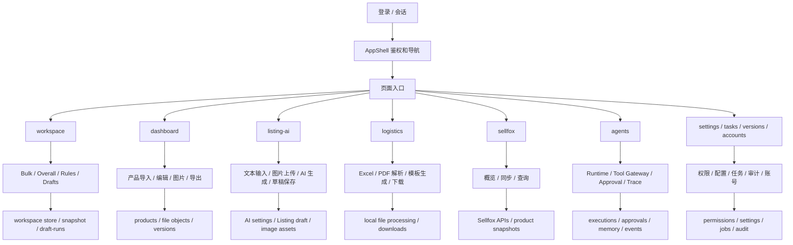

# 项目经理说明：系统页面与运行边界总览

本文按“页面级”说明当前系统。目标是让项目经理一眼看懂：每个页面放在哪里、负责什么、谁能看、怎么流转、依赖什么、边界在哪。

## 1. 系统总定位

这是一个 Amazon 运营工作台，不是单一功能站点。主干由五条业务线组成：

1. PPC 优化工作台：Bulk 导入、Overall 匹配、规则草稿、导出。
2. 产品管理：商品资料、负责人、供应商、竞品、工作流进度。
3. Listing AI：标题、卖点、图片规划、A+、对话式优化。
4. 物流处理：Excel / PDF 模板解析、箱规、对比、导出。
5. AI Agent 平台：市场、产品、供应、刊登、PPC、编排器和审批流。

全站共享同一套鉴权、组织边界、workspace 边界、文件对象、任务中心、版本审计和系统设置。

## 2. 共享布局

所有受控页面基本都使用 `AppShell`：

- 左侧固定窄导航，图标入口。
- 顶部 sticky header，显示页面标题、副标题、工作区切换、通知、版本标识和用户菜单。
- 主内容区使用白底工具型布局，不是营销页。
- 页面间切换时，权限会先过滤掉不可见模块。

共享依赖：

- `src/components/app-shell/app-shell-client.tsx`
- `src/lib/accounts/permissions.ts`
- `src/lib/auth/session.ts`
- `src/lib/workspace/workspace-scope-events.ts`
- `src/components/notifications/*`

## 3. 页面清单

### `/login`

- 布局：居中单卡片表单，支持“登录 / 注册”切换。
- 功能：账号登录、注册、错误提示、登录后跳转。
- 属性：输入账号/手机号、姓名、密码、确认密码。
- 权限：未登录可访问。
- 流程：提交后调用 `/api/auth/login` 或 `/api/auth/register`，成功后按权限跳到首个可访问页面。
- 上下级：无上级 shell，登录后进入首页或 next 参数指定页。
- 能力边界：只负责认证，不负责业务数据。
- 依赖：`/api/auth/*`、session cookie、权限映射。

### `/`

- 布局：上方欢迎区，下方模块卡片网格。
- 功能：作为运营总入口，分发到各业务模块。
- 属性：卡片显示标题、描述、图标。
- 权限：按角色权限过滤模块。
- 流程：先取当前用户，再查角色权限快照，再决定哪些卡片可见。
- 上下级：总入口，上接登录，下接所有业务页面。
- 能力边界：只做导航，不做业务处理。
- 依赖：`getCurrentUserFromSignedCookie()`、`getOrganizationRolePermissionsSnapshot()`。

### `/workspace`

- 布局：顶部 `CampaignGridHome`，下方延迟加载 `WorkspacePanel`。
- 功能：PPC Bulk 工作主台，承载 Campaign 分组、生命周期规则、Overall 数据匹配、草稿、导出。
- 属性：依赖当前 workspace / campaign 选择、规则集、待导出草稿。
- 权限：`workspace` 模块权限。
- 流程：导入 Bulk 文件 -> 解析工作表 -> 生成 Campaign Group / Draft -> 结合 Overall 数据匹配 -> 人工审阅 -> 导出。
- 上下级：是 PPC 业务的主页面；下接规则中心、导出记录、任务中心。
- 能力边界：规则引擎只生成草稿，不直接改原始文件。
- 依赖：workspace store、Bulk parser/export、规则引擎、IndexedDB/本地持久化、任务/文件对象。

补充细节：

- 顶部搜索框是按 `sheetName + campaignName + adGroupName` 的拼接文本模糊筛选。
- 生命周期筛选只影响当前视图，不会改动原始导入数据。
- 屏蔽按钮会把广告组从主列表排除，但数据仍保留，可在管理状态中恢复。
- Overall 上传前必须先选作用范围；单广告组、生命周期组、Workspace Unit 的范围处理不一样。
- 已上传 Overall 的广告组会优先排在前面，再按名称排序。
- 运行规则前必须满足 Overall 已匹配且至少有一条 matched row，否则不会生成草稿。
- 导出时只写回被勾选且通过校验的草稿，冲突和阻止项会单独提示。
- 页面顶部的保存提示表示当前工作区的产品周期分组、Overall 数据、草稿选择和部分 UI 状态已经落到后端快照里；刷新后会自动恢复。
- “清空数据库保存”只删除当前工作区快照，不会删原始 Bulk、不会影响其他 workspace，也不会清空浏览器里的下载文件。
- 页面主动作是三段式：先运行规则，再人工勾选，再导出。前一步不会自动替代后一步，避免误把建议当成最终写回。
- 规则运行按钮会根据视图变更文案：单广告组、产品周期组、组合单元、已匹配广告组批跑，四种文案对应四种作用域。
- Overall 卡片里的“范围广告组 / 可处理 / 未匹配 / 需消歧”四个按钮都会打开明细弹层，方便先看数据质量，再决定是否跑规则。
- 范围广告组弹层只显示当前 scope 的广告组，不会把其他 workspace 或其他历史批次混进来。
- 可处理数据弹层只列 `matchStatus !== unmatched && campaignGroupId` 的行，这部分才进入后续规则和导出逻辑。
- 未匹配和需消歧被拆开是因为两类问题不同：一个是完全找不到对应行，一个是词、投放对象或匹配类型存在歧义。
- 明细弹层最多只显示前 300 行，这是故意截断，不是漏数，目的是避免 Overall 很大时把页面拖慢。
- 表格默认每页 20 条，支持排序、分页、全选、反选、全不选、拖拽选区和框选；它不是静态报表，而是可执行的草稿工作台。
- 排序切换分 Bulk 排序和 Overall 排序两套口径，切换后展示的同一列会基于不同数据源重排。
- 勾选状态和草稿状态是分离的：系统会先生成建议全集，再由人手动决定哪些真写回。
- 表格里的“写回列 / 原始行 / 命中规则 / 调整原因”是给复核和回滚留的定位信息，避免只能靠肉眼猜是哪条规则改的。
- `keyword` 和 `target` 会同时展示，因为 Amazon 报表里同一条逻辑有时被写成关键词，有时被写成投放对象。
- `matchType` 会先归一化成 `exact / phrase / broad` 再参与匹配，不然同一条行在不同报表里会被看成不同记录。
- 鼠标拖选时，按住 `Alt` 会切换为反向选择；按住 `Shift` 会延伸上一次选中的草稿区间，适合成批处理相邻行。
- 框选只作用于带 `data-draft-id` 的表格行，不会误选按钮、输入框或标题栏。
- 如果没有原始 Bulk 缓冲或 `fileId`，导出会直接拦截并提示重新上传，因为导出必须基于原 workbook 的复制件。
- 导出只写回已勾选草稿，不会重建一份新表结构；原文件里的其他 Sheet、其他列、其他未选行都会保留。
- 运行规则后，未命中的匹配行仍会显示在表里，只是不会生成新值，方便知道哪些行“存在但不需要改”。
- 已匹配行优先出现在表前面，草稿孤行会排在后面，这样人工先处理最可信的数据，效率更高。
- 在组合单元视图里，多个广告组会统一生成草稿，但写回仍按原广告组分开，避免批量执行把不同组的数据揉平。
- 在生命周期视图里，规则会按新品、成熟、衰退、清库存四类分别处理，方便按照产品阶段控制节奏。
- 单广告组视图最适合精细调价和逐词复核，因为它只处理当前打开的那个广告组。
- 组合单元不是简单堆叠广告组，而是把多个广告组先组合成一个运行单元，再决定是否允许一起跑规则；组合内生命周期不一致时会先拦住，避免一组里混着不同阶段乱跑。
- Overall 上传前必须先指定作用范围，单广告组、组合单元和全量范围的匹配逻辑不同；上传完成后会自动把当前 scope 激活，必要时还会顺手切回对应广告组或组合单元。
- 规则中心不是单纯的说明弹窗，而是真正的 IF / THEN 编辑器入口，能直接看到当前生命周期下启用的规则列表和优先级。
- 屏蔽名单会同时匹配广告活动名和广告组名，所以新导入的数据只要命中同名规则，也会继续保持屏蔽，不会因重新导入而自动恢复。
- 历史记录弹层分两类：规则运行历史和旧版导出历史。前者能复用运行现场，后者能复用旧导出文件，说明系统把“执行”和“成品”分开记。
- “清空数据库保存”只清当前 workspace 的数据库快照，不碰原 Bulk、不碰历史导出文件，也不清别的 workspace。
- 规则运行进度条和 Overall 上传进度条是分开的，说明上传与计算是两段不同过程。
- 运行规则后会把页面滚回工作台主体，目的是让用户马上看到新生成的草稿，不用自己再去找结果。
- 下载分组状态会把当前 Campaign Group、sheet、生命周期组、workspace unit 一次性导出来，适合离线整理分组信息。

### `/dashboard`

- 布局：产品列表主表 + 筛选区 + 详情区。
- 功能：商品资料、ASIN、采购价、负责人、供应商、规格、备注、版本查看。
- 属性：产品状态、流程进度、选品关键词、图片、版本信息。
- 权限：`products` 模块权限。
- 流程：读取产品记录 -> 按工作区过滤 -> 查看 / 编辑 / 导入导出 / 跳版本。
- 上下级：产品域总页；下接版本审计、任务中心、图片资产。
- 能力边界：管理产品主数据和流程，不处理 PPC 草稿。
- 依赖：`ProductRecord`、工作区 scope、本地缓存、文件对象、图片资产接口。

补充细节：

- 筛选条是组合筛选，不是单一关键字：关键词、ASIN、运营、选品、美工、供应商、状态、采购价区间都能叠加。
- “运营 / 选品 / 美工”是多选下拉，来源于团队角色，不是自由输入。
- 状态支持产品标准状态，还支持派生状态，例如美工处理中、运营进度、超期预警。
- 列表分页和总数由后端接口返回，前端只做展示和局部缓存。
- 点击商品会进入详情编辑，列表页只承担筛选和入口作用。
- 缓存是按 workspaceId 分桶的，切换工作区不会把别的组数据串进来。
- 图片处理链路是两层：列表用缩略图，详情/预览用原图。商品卡片和列表表格先读 `imageAssets[0].thumbUrl`，只有没有资产时才回退到旧的单图字段 `image`。打开详情后，主图按钮和每个缩略图按钮才会读取 `originalUrl`，预览弹层里也优先用原图。
- 上传入口在详情页的图片区，走 `/api/products/image-assets/upload`。允许的文件类型是 JPG、PNG、WEBP、GIF、AVIF，单文件上限 50MB。服务端会先保留原始文件，再用 `sharp` 旋转校正、按 160x160 以内等比压缩、转成 WebP、质量 78，生成一张专门给列表和缩略图条使用的压缩图。
- 服务端会同时落两份 `FileObject`：原图一份、压缩图一份。接口返回里 `thumbUrl` 和 `url` 都指向压缩图，`originalUrl` 指向原图，所以前端默认先拿压缩图渲染，只有点开预览时才切原图。
- 对于从 Excel/本地数据导入的图片，前端会在浏览器里先做一轮轻量压缩：能用 `createImageBitmap` 时会缩到最长边 1400px、转 WebP、质量 0.8；不能压缩时才直接读成 data URL。这样做是为了减少首屏体积，但不改变原始素材的可追溯性。
- 列表页的图片单元格显式使用 `loading="lazy"`、`decoding="async"`、`fetchPriority="low"`，所以图片不会抢首屏主线程和带宽；只有用户滚到可见区域时才逐步加载。详情面板里的主图和缩略图不做 lazy，是因为它们只在打开单个商品后才出现，读原图的时机已经被页面层级自然延后了。
- 图片文案库、竞品图、备注图这类辅助图片不会在列表页预加载，只在打开对应详情模块或弹窗后才拉取或渲染，避免把整批图片一次性塞进产品列表。

### `/listing-ai`

- 布局：多标签工作区，包含输入、视觉、分析、Listing、Image Plan、对话、历史、图片放大。
- 功能：生成标题、五点、描述、A+ 简报、图片计划和对话式优化。
- 属性：AI 模型配置、图文草稿、竞品信息、图片资产、历史记录。
- 权限：`listingAi` 模块权限。
- 流程：录入商品信息和竞品 -> 读取 AI 配置 -> 调用 `/api/listing-ai/*` -> 生成建议 -> 保存草稿/历史。
- 上下级：Listing 业务主页；可接产品管理和 Agent 的 handoff。
- 能力边界：输出建议与草稿，不直接替用户上架。
- 依赖：AI settings、Listing AI types、图像资产存储、浏览器 session/localStorage。

补充细节：

- 页面按标签拆阶段：输入、视觉、分析、Listing、Image Plan、对话、历史、图片放大。
- 输入页优先收集商品信息、竞品信息和图片资产，再进入 AI 生成。
- 图片草稿会先转成可恢复的本地数据或资产引用，再用于重建历史记录。
- `?tab=image-upscale` 会直达图片放大标签，`/image-upscale` 只是跳转入口。
- 文本模型和图片模型是两套配置，彼此独立保存和测试。
- 输入阶段会优先收商品信息、竞品信息、关键词和图片资产，再进入生成；这保证 AI 不是空脑袋写稿，而是带着上下文工作。
- 视觉阶段和文案阶段是分开的，图片草稿不会和 Listing 文案强绑，避免一处修改把整套输出都推翻。
- 历史记录保存的是生成草稿和上下文快照，不是单纯的聊天文本，目的是让后续重建时能恢复当时的输入条件。
- 工作区草稿会先从 `/api/listing-ai/workspace` 恢复，再进入自动同步；只要内容变了，页面会延迟约 700ms 再写回，避免每次敲键都触发保存。
- 读取草稿时会逐项恢复输入、竞品、自有图片、标题生成器、描述生成器、图片生成器、表格样式和当前 tab，某一项坏掉不会拖垮整份草稿。
- `titleGenerator` 不是单状态，而是 old/new 双模式并存；切换模式时，只切当前模式的字段、结果和历史，另一模式会保留。
- 标题和描述共用一部分字段，先有标题上下文，再把描述补充项叠加进去，这样两个生成器不会各写各的。
- 生成标题和生成描述是两条独立调用链，分别走不同 API，某一条失败时不会把另一条一起带崩。
- `AI Analysis` 会拆成 Position、Strength、Weakness、Opportunity、Risk 五类，方便直接读结论结构。
- `Final Listing` 会同时输出多版本标题方案和 bullet 解释，既能看结果，也能看为什么这么写。
- `Image Execution Board` 把每张图拆成 No、主题、卖点、文案、状态、Prompt 六列，默认状态是 Planned。
- 图片计划里的 prompt 是可展开查看的，正文和 negative prompt 分开存，避免上下文只剩半截。
- `ImageGeneratorBoard` 会把竞品图、自有图、生成图分桶管理，支持上传、拖拽、重排和预览，不会混成一团。
- 对于 Excel 导入回来的图片，系统会先识别图片落在哪一行，再把它反推到主图和竞品图槽位。
- 对话页会识别图片意图：如果带图并且 prompt 像“生成 / 生图 / 画一张 / 改图”，默认更偏图片生成；否则更偏普通问答。
- 文档附件会先转摘要再进入消息，不会把长文原封不动塞给模型。
- 图片对话和文字对话共用历史，但会根据附件类型和 prompt 决定默认标题、默认提问和执行路径。
- 历史记录按产品名分组，点击某条记录会整包恢复草稿，而不是只恢复一句话。
- `?tab=image-upscale` 会直达图片放大标签，`/image-upscale` 只是跳转入口。
- 图片放大不是独立系统，而是挂回 Listing AI 的能力面板，避免两套配置和历史分叉。

### `/image-upscale`

- 布局：实际不独立展示，直接重定向到 `/listing-ai?tab=image-upscale`。
- 功能：图片放大。
- 权限：沿用 Listing AI。
- 依赖：`/api/image-upscale`、本机/服务端图像处理能力。

### `/logistics`

- 布局：左侧上传和参数，右侧结果与日志。
- 功能：A/B/C/Saihu/PDF 多模板解析，生成箱规、发票、对比表，打包下载。
- 属性：文件槽位、模板选择、日志、导出 ZIP。
- 权限：`logistics` 模块权限。
- 流程：上传文件 -> 解析 -> 校验模板 -> 生成目标文件 -> 下载。
- 上下级：物流工作主页面；下接模板文件、任务下载。
- 能力边界：优先前端解析；大文件有性能警告，但不做服务端重构。
- 依赖：ExcelJS / XLSX / PDF.js / JSZip / 浏览器 File API。

补充细节：

- `/logistics` 上传文件时不会走 worker，也不会进 Redis 队列。它的主链路是浏览器本地读文件 -> 动态加载 `@/lib/logistics/jobs` -> 调 `parseLogistics*` / `buildLogistics*` -> 直接在前端生成或下载结果。
- 这里的“本地”指的是用户浏览器本地，不是服务器本地。文件内容会先进入当前页面的内存状态，再被解析函数消费；页面不会先上传到后端再转一圈处理。
- A 表、B 表、C 表、赛狐模板和 PDF 都是当前页面即时处理的输入，成功后直接在浏览器里产出可下载的 workbook / zip / 重命名 PDF。
- 30MB 和 80MB 的提示也是前端本地性能提示，不是 worker 任务队列的分流条件。超过阈值后只是提醒或跳过图片读取，不会改成后台异步任务。
- 这个页没有 `enqueueImportJob`、`processImportJob` 这条链，所以不要把它和 workspace 的 Bulk 导入、产品导出混为一谈。后两者才会走 job queue 和 worker。
- 也因为不走 worker，这个页的处理结果不会出现在任务中心里。用户看到的日志、导出和下载，都是当前浏览器会话内完成的。
- 现在的体验问题也很明确：大文件解析时会占住浏览器主线程，导致上传期间很难切换其他一级页面，这一点体验偏差，待优化。
- 部署到服务器时，`/logistics` 只需要和普通 Next.js 页面一起发布：把代码、`public/logistics-templates/` 和静态资源打进同一个发布包即可，不需要额外起物流专用 worker。
- 服务器侧真正要保留的是 Next 应用本身、静态模板文件和正常的系统服务，不是物流后台任务。换句话说，物流页上线看的是“页面能不能打开、模板能不能被 fetch 到、浏览器能不能解析”，不是“worker 是否在线”。
- 如果物流模板文件改了，必须跟着前端版本一起发布，因为这些模板是页面运行时直接 fetch 的静态资源。
- 现在的设计是把物流处理放在前端，优点是不用排队、也不用等后台任务；代价是大文件会吃用户浏览器性能，所以页面才会明确提示慢文件和超大文件风险。
- 其他大公司 ERP 在处理大文件时，通常会把“收文件”和“处理文件”拆成两段：上传只负责把文件送到对象存储或后端，马上返回 `fileId` / `jobId`，真正的解析、校验、压缩、匹配和结果生成放到 worker 或队列里异步跑，前端只轮询进度或订阅状态。这样切换页面会顺，因为当前页不会被重计算堵住。
- 队列不是唯一方案，但只要目标是“大文件 + 丝滑切页 + 进度可见 + 可重试 + 可审计”，worker / 队列几乎就是最稳妥的做法。
- 这个页之所以会卡，不是因为“只有解析那一瞬间才重”，而是上传动作之后紧接着做了读取、解析、生成预览、压缩和状态更新；这些步骤里只要有一段跑在主线程上，就会把浏览器交互堵住，所以体感上会在“上传时”就开始卡。
- 所以这里的优化方向不是再加一个更大的 loading，而是把处理链拆开：先上传、再异步处理、再刷新结果。对现在的 `/logistics` 来说，这一类优化是明确待办。

- A 表是主入口，先读最后一个 sheet，再抽 SKU、发货总数、箱号分布和相关汇总；后续 B、C、赛狐、发票模板都依赖它。
- A 表的发货数量口径必须在解析阶段一次性确定：优先识别 `发货总数 / 总发货 / 最终发货`，这些列都识别不到时，才兜底使用精确表头 `发货`；不能把 `待发货`、备注里的发货字样或箱号列误当作最终发货数量。
- A 表文件识别时，SKU、FNSKU 或发货数量相关表头只用于定位表头行；真正写入下游的数量字段统一保存为 `totalShipment`，箱号列仍按表头数字动态映射，不能按非空顺序重排箱号。
- B 表生成时只读取 A 解析结果中 `totalShipment > 0` 的 SKU，写入 `Create workflow – template` 的 `Merchant SKU` 和 `Quantity`；`Quantity` 只能来自 A 解析后的 `totalShipment`，不能在 B 表写入阶段重新扫描原 A 表列。
- C 表生成时按 `A.SKU == C.SKU` 匹配行，再按 A 表箱号映射把每箱数量写回对应箱号列；是否进入预览和总量统计仍以 `totalShipment > 0` 为准，但 C 表每箱明细以 `boxMap` 为准，避免只写总数不写箱分布。
- D 表和物流发票/对比表生成时同样只消费 A 解析后的统一口径：SKU、品名、箱号、箱重和 `totalShipment` 来自同一份 A summary；PDF 只补货件、仓库、FBA、箱唛位置和渠道信息，不覆盖 A 表的发货数量。
- B/C/D 每个导出按钮和“打包下载”都必须沿用同一次 A 解析结果。重新上传 A 表后才允许改变 `totalShipment` 来源；只上传 B/C/D 模板或 PDF 不应触发发货数量口径重算。
- A 表超过 30MB 会提示解析较慢，超过 80MB 会明确提示优先读核心数据并暂时跳过图片，避免大文件把页面卡死。
- B 表不是自由编辑表，而是由 A 表反推生成；按钮文案里“下载 B 表”实际就是把 A 表的结果重建成指定模板。
- C 表会按 SKU 和箱号回填数量、重量、尺寸；如果箱号列都识别不到，会直接报错，不会硬生成。
- 赛狐模板会根据模板结构和 A 表内容回填，当前仅对已接入的模板生效，其他模板会保留为待接入状态。
- PDF 文件不是按文件名理解，而是按页解析货件标题、货件号、仓库码、FBA 号和页数；重命名后的文件名会直接用于打包下载。
- “下载全部箱唛”不是重新生成 PDF，而是把原 PDF 按识别出的新文件名批量重命名后再 zip。
- 物流发票会根据 A 表和 PDF 的组合生成，凯奇模板是当前已接通的模板，其他模板会先拦住。
- `taskSummary` 会把货件标题、货件号、仓库、FBA 编号、箱数、SKU 数、总发货量、PDF 页数和警告/错误数一起汇总，方便先看任务健康度再看明细。
- A 表预览只展示 `totalShipment > 0` 的行，已经没有发货量的行会被隐藏，避免把表格撑太大。
- 处理日志保留最近 40 条，成功、警告、错误和普通信息会用不同颜色区分，方便定位解析问题。
- 每个导出结果都能单独下载，也能打包下载，用户不用先拆文件再找正确条目。
- 这个页默认优先浏览器本地解析，不会把所有重计算提前推到服务端；大文件性能上限是设计约束，不是待修 bug。

迁移建议：

- 当前方案：前端本地解析 + 前端本地生成 + 直接下载。优点是链路短、无需排队、部署简单；缺点是大文件会占主线程，体验不稳。
- 推荐方案：上传和处理拆开。上传先把文件保存到对象存储或后端，立刻返回 `fileId` / `jobId`；真正的解析、校验、生成和压缩进入 worker 或队列；前端只轮询状态和读取结果。
- 为什么推荐这样做：这样用户可以继续切别的一级页面，任务还能后台跑；同时还可以加进度、失败重试、结果缓存和审计记录，适合多人共用和大文件场景。
- 迁移代价：需要新增 job 状态、结果文件存储、进度查询接口、失败重试入口、worker 处理器和前端状态展示；模板文件也要继续作为静态资源随版本发布。
- 上线顺序建议：先保留现有前端直处理，再加异步后端路径做灰度；等新路径稳定后，再把大文件或重型解析逐步切到 worker，保留轻量文件走前端，避免一次性重构把页面打穿。
- 对 PM 来说，这件事不是“功能要不要改”，而是“体验已经有明显短板，什么时候把短板从前端主线程迁走”。如果目标是切页顺滑和稳定处理，大文件异步化是应该做的。

对照说明：

- `workspace` 之所以更适合 worker，是因为它处理的不是单纯“看一遍就能出结果”的文件，而是一条完整业务链：上传 Bulk、解析 Sheet、生成 Campaign Group、匹配 Overall、写入快照、记录版本、生成草稿、导出结果，后面还有重试和审计。这个链路天然需要任务状态和结果落库。
- `workspace` 的上传入口会先把文件存到对象存储，再创建 import job，随后通过 `enqueueImportJob` 进入 `inline` 或 `redis` 执行路径。`inline` 只是方便本地开发或单机运行时直接执行，生产更偏向 `redis + worker`。
- `workspace` 一旦走 worker，就能把“上传完成”和“处理完成”拆开，前端可以立刻切页、看任务中心、继续改分组，而不必等整本工作簿处理完。
- `logistics` 现在没有这条任务链，所以它更像一个“本页即处理即下载”的工具。它的目标不是排队调度，而是即时出结果。当前体验问题恰恰来自它还没把重计算迁出主线程。
- 迁移判断可以很简单：只要一个页面的处理结果需要可恢复、可重试、可审计、可多人并发，就该优先走 worker；只要是一次性、轻量、个人临时使用的文件工具，前端直处理还可以先保留。
- 这也是为什么 `workspace` 和 `logistics` 不能用同一套同步方式硬套：前者是业务任务，后者是工具页。前者适合异步，后者目前还偏向即时操作，但需要优化掉主线程阻塞。

### `/saihu-search-merge`

- 布局：上传区、预览表、差异比对表、导出区。
- 功能：合并赛狐搜索词报表，做去重、统计和对比。
- 属性：输入文件、合并结果、差异行、历史记录。
- 权限：`searchMerge` 模块权限。
- 流程：上传 Excel/CSV -> 合并 -> 预览 -> 导出 -> 保存历史。
- 上下级：独立工具页；`/history` 是它的后台历史页。
- 能力边界：只处理搜索词合并，不接广告自动执行。
- 依赖：本地文件处理、history 存储、导出 workbook。

补充细节：

- 这个页本质上是把赛狐搜索词报表做去重和整理，不负责广告投放逻辑，也不直接改 PPC 草稿。
- 合并结果会先进入预览，再决定是否导出，避免一上传就把报表写坏。
- 历史页保存的是这类合并动作的记录、源文件和导出文件，不是通用任务中心。

### `/history`

- 布局：历史卡片 + 历史明细表。
- 功能：查看和下载赛狐搜索词合并历史记录，支持清空。
- 属性：记录时间、动作、源文件、导出文件、汇总指标。
- 权限：`history` 模块权限。
- 流程：从本地历史存储读取 -> 展示 -> 下载 / 清空。
- 上下级：赛狐工具的附属页。
- 依赖：本地历史存储、导出 workbook。

补充细节：

- 历史页按动作记录读取，默认只对赛狐搜索词合并这一类任务可见。
- 清空动作是针对本地历史存储，不会删除业务主数据，也不会影响别的模块。
- 这页适合 PM 回看某次合并的结果和导出文件，但不适合当“永久审计台”理解。

### `/sellfox`

- 布局：概览、商品列表、表现数据、同步操作。
- 功能：Sellfox 店铺、商品、小时数据和绩效同步。
- 属性：工作区/账号/站点 scope、店铺状态、同步状态。
- 权限：`products` 模块权限。
- 流程：读取概览 -> 选择 store -> 拉商品/绩效 -> 触发同步。
- 上下级：产品域的外部数据接入页。
- 能力边界：只同步和查看，不直接改 Amazon 原站数据。
- 依赖：`/api/sellfox/*`、workspace scope headers、本地/后端产品数据。

补充细节：

- 这个页把 Sellfox 数据和 dashboard 产品主数据分成两套存储和展示，不会把两个系统的数据混在一起。
- 页顶会先读概览，再读商品列表和产品表现；概览里会告诉你服务端凭据是否配置、店铺数量、商品数量、小时数据量和最近同步情况。
- 同步按钮分四种：店铺、在线商品、产品表现、小时报告。每一种都独立触发，不会互相串联。
- 同步前必须先有服务端凭据，否则按钮直接禁用；页面也会显式提示要先在环境变量里配置 `SELLFOX_CLIENT_ID` 和 `SELLFOX_CLIENT_SECRET`。
- 商品列表支持按 SKU、品名、ASIN 搜索，再叠加状态过滤；状态是产品状态，不是随便一个标签。
- 商品表里的负责人字段会优先显示 selection owner，拿不到再回退 developer，说明这个页是围绕运营责任链读的。
- 产品表现页支持按店铺、日期和关键词筛选，并提供当前筛选导出，适合按日快照看毛利和广告花费。
- 右上角的导出其实是直接访问导出接口，不是先生成临时文件再弹下载。
- 最近同步信息会显示资源、状态、开始时间和错误摘要，便于区分“没配好”和“同步失败”。
- `workspaceId + accountId + marketplace` 会通过请求头和 query 一起传给接口，防止同一个 Sellfox 账号在不同工作区里串数。

### `/agents`

- 布局：Agent 列表、运行状态、当前任务、runtime 配置概览。
- 功能：查看所有业务 Agent 的注册状态、最近执行、等待审批、运行健康。
- 属性：AI 模型配置、SellerSprite MCP 配置、工作流 Agent 列表。
- 权限：`agents` 模块权限。
- 流程：读取 `/api/agents` -> 展示 Agent 中心 -> 跳各 Agent 详情。
- 上下级：Agent 总入口；下接各业务 Agent 页面。
- 能力边界：只做编排展示，不直接访问外部系统。
- 依赖：Agent Runtime、Tool Gateway、审批、Trace、配置状态。

补充细节：

- 列表页会把工作流 Agent 和 Orchestrator 分开展示，工作流 Agent 只列市场、产品、供应、刊登、PPC 五类。
- 每个 Agent 卡片都带当前健康状态和最近任务摘要，空闲态会显示“等待某某输入”，方便 PM 看链路卡在哪一步。
- 当前任务只展示未完成的执行状态，像 `RUNNING`、`WAITING_TOOL`、`WAITING_APPROVAL`、`FAILED` 才会浮出来。
- `lastStatus` 为空或已经完成时，Agent 不会出现在当前任务区，避免历史执行把首页刷乱。
- 页头里的 AI 模型和 SellerSprite MCP 状态是全局 runtime config 的快照，不是单个 Agent 专属配置。
- 列表页的刷新只会重新拉 `/api/agents`，不会重跑 Agent，也不会清空执行态。
- 入口链接只去详情页，不在中心页直接展开 trace，目的是把“看全局”和“看单次执行”分层。

### `/agents/orchestrator`

- 布局：左侧编排参数，右侧计划、handoff、trace、审批和工具调用。
- 功能：把市场、产品、供应、刊登、PPC 串成一条链。
- 属性：目标、站点、类目、SKU、ASIN、是否已批准 Launch。
- 权限：`agents` 模块权限。
- 流程：输入目标 -> 调 `/api/agents/orchestrator/executions` -> 生成计划和 handoff -> 必要时审批 -> 继续下一 Agent。
- 上下级：Agent 链路的总编排页。
- 能力边界：只编排，不替代各专用 Agent 的细节决策。
- 依赖：Orchestrator runtime、handoff 结构、审批流、Trace。

补充细节：

- 编排页的目标是把市场、产品、供应、刊登、Launch、PPC 串成一条链，不是单点研究工具。
- `launchApproved` 是一个显式闸门，只有勾选后才会把后续链路往下推，避免 Launch 前置条件没满足就进入 PPC。
- 编排输出里会同时保留 plan 和 handoffs，前者看顺序，后者看接力内容。
- 站点、类目、SKU、ASIN 都是上下文，不是必填强校验；但只要填了，就会进入执行上下文，影响下游 Agent 的判断。
- 运行结果既看当前这次手工触发，也看最近一次执行，因此页面刷新后仍能看到上次编排输出。
- 工具调用、轨迹、审批分别拆栏显示，PM 可以先看流程，再看证据，再看是否需要人工处理。
- 这个页本质上是给下游 Agent 派工，不是给业务人直接做最终经营决策。

### `/agents/market`

- 布局：目标输入、参数区、执行结果、机会列表、证据、审批。
- 功能：市场机会发现、证据聚合、机会评分、项目审批。
- 属性：价格区间、销量区间、Review 上限、利润率目标、关键词、竞争强度。
- 权限：`agents` 模块权限。
- 流程：填写目标 -> 执行研究 -> 产出 report / opportunity -> 对机会发起审批或项目。
- 上下级：Orchestrator 的上游起点；产品 Agent 的输入来源。
- 能力边界：只做市场发现，不直接改广告。
- 依赖：SellerSprite / 外部市场数据、memory、approval、trace。

### `/agents/product`

- 布局：目标参数、输出报告、项目草案、审批区。
- 功能：把 market opportunity 转成 PRD、成本目标和产品项目。
- 属性：价格、成本、利润率、类目、约束、handoff。
- 权限：`agents` 模块权限。
- 流程：接收市场 handoff -> 生成产品计划 -> 可触发项目审批 -> 保存任务。
- 上下级：市场 Agent 的下游，供应 / 刊登的上游。
- 能力边界：输出产品计划，不直接下采购。
- 依赖：market handoff、Product report、审批、memory。

### `/agents/supplier`

- 布局：输入目标、供应建议、RFQ 草案、审批区。
- 功能：把产品计划转成供应商推荐和 RFQ。
- 属性：市场、类目、产品 handoff、项目审批。
- 权限：`agents` 模块权限。
- 流程：接收产品 handoff -> 生成供应计划 -> 发起项目审批。
- 上下级：产品 Agent 下游，刊登前置。
- 能力边界：只给推荐和 RFQ 草案，不直接下单。
- 依赖：product handoff、approval、trace、memory。

### `/agents/listing`

- 布局：关键词输入、竞品输入、执行报告、审批、项目创建。
- 功能：把产品/市场信息转成 Listing 草稿。
- 属性：目标、站点、类目、关键词图谱、竞品差异、handoff。
- 权限：`agents` 模块权限。
- 流程：读取产品/市场 handoff -> 生成 listing report -> 需要时创建项目审批。
- 上下级：产品和市场 Agent 的下游，PPC 前置。
- 能力边界：只生成刊登草稿，不直接上架。
- 依赖：listing handoff、memory、approval、trace。

### `/agents/ppc`

- 布局：目标参数、工作区上下文、执行报告、调整草稿、审批与动作区。
- 功能：诊断 PPC 工作区，输出控损、扩量、竞价、否定词和广告结构建议。
- 属性：ACoS / ROAS / Margin、SellerSprite 关键词、产品上下文、workspace store 状态。
- 权限：`agents` 模块权限。
- 流程：读取 workspace 数据 -> 执行 PPC 分析 -> 生成 adjustment drafts -> 审批后可走批量或 Ads 动作。
- 上下级：编排链末端，最靠近执行层。
- 能力边界：草稿先行，不自动覆盖原始 Bulk。
- 依赖：workspace store、PPC report、approval、tool calls、Amazon Ads / SellerSprite。

补充细节：

- 进入页面后先从 workspace store 读取当前 campaign group、workspace unit、performance rows、overall rows。
- 如果是组合视图，会先按组合内广告组截取 scope；如果是单广告组视图，就只处理当前组。
- Performance 只保留当前 scope 的前 120 行，Overall 只保留前 160 行，避免表格过重。
- 执行时会串联多个工具调用：工作区加载、广告快照、关键词信号、诊断、竞价建议、否定建议、结构建议、报告拼装。
- 报告里的竞价建议只是建议，不会立刻改 Amazon 广告。
- 批量交接审批和 Amazon API 审批是两条独立高风险路径。
- 审批通过后，Bulk 草稿会进入工作台待处理队列，不会自动写回原文件。
- 默认规则里，新品组的主动作比较直白：2 单以上且 ACOS < 25% 时通常 +15%；2 单以上且 ACOS 25%~44.999% 时通常 +10%；2 单以上且 ACOS 45%~59.999% 时通常 -10%；2 单以上且 ACOS >= 60% 时通常 -35%；0 单且点击 >= 18 时通常 -20%；0 单且点击 < 5、曝光 < 100 时通常 +10%。
- 成熟组比新品更依赖 Overall 数据：2 单以上且 Bulk ACOS < 25%、Overall 曝光 < 100 时强放量；同样条件但 ACOS 更健康时按 10% 左右补量；0 单且点击 >= 15 时先控损；0 单且点击低、Bulk 曝光低时才补量；0 单且 Bulk 无结果但 Overall ACOS 仍在 10%~30% / 30%~40% / 40%~50% / 50% 以上时，会分别进入补量、微补、降价、强降四档。
- 衰退组更保守：0 单且点击 >= 10 时就倾向止损；有单但 ACOS 偏高时快速降价；0 单但 Overall ACOS 仍有 10%~30% 时只给很小的反弹空间，超过 50% 基本强压。
- 清库存组不追求长期最优，而是追求出货速度：有单低 ACOS 时温和提量，有单高 ACOS 时降价，0 单且点击达到阈值后强止损；如果是核心词且订单占比高、Overall 曝光低，还会进一步压价，避免把钱继续耗在少数核心词上。
- 四组都共用 bid floor、high ACOS cap 和 low impression boost 这三类基础护栏，但新品最激进、成熟最均衡、衰退最保守、清库存最强调出货。
- 规则引擎会先把 matchType 统一成 `exact / phrase / broad`，再按 `campaignGroupId + 词 + matchType` 去找 Overall；`keyword` 和 `target` 都会同时作为候选键。
- `exact`、`精准`、`精准匹配`、`精确`、`精确匹配` 最终都会归一成 `exact`；`phrase`、`短语`、`词组`、`短语匹配`、`词组匹配` 最终归一成 `phrase`；`broad`、`广泛`、`广泛匹配` 最终归一成 `broad`。
- 规则动作不是只有加减百分比，还包括 `set_bid_to_overall_cpc_ratio`、`increase_bid_percent_capped_at_overall_cpc` 和 `increase_bid_percent_with_overall_cpc_bounds` 这类按 Overall CPC 夹住上下限的动作。
- 生成草稿时会把 `oldValue / newValue / deltaPercent / reason / matchedRule` 一起写入，所以 PM 回溯时能直接看到改动链。
- 引擎执行是按优先级从小到大扫，普通规则命中后会把该行标记成 touched，后面普通规则不会继续叠加；只有 bid validation 规则会继续在同一行上修正。
- `currentBid` 最终会先四舍五入到两位小数，再做 `0.02` 的最低保护，避免写出不可用竞价。
- `isCoreKeywordCandidate` 会把活动名或广告组名里带 `core / 核心` 的行，以及 exact 且不是 `ASIN=` 的行视为核心候选，所以清库存组会特别关注核心词曝光。

竞价逻辑细节：

- 有订单且 ACOS 不高于目标：通常轻度加价，约 5% 到 8%。
- 点击达到阈值但没有订单：先降价控损，通常约 20% 左右。
- ROAS 高于组合均值且有订单：可以继续轻度加价，约 5%。
- 样本不足时：保持当前竞价，不做激进调整。
- 生成草稿时会写入 `field = bid`、`oldValue`、`newValue`、`deltaPercent`、`reason`、`matchedRule`。
- 所有建议最终都要经过勾选、审批和导出，才会变成实际修改。

### `/agents/[agentId]`

- 布局：通用 Agent 详情页。
- 功能：查看单个 Agent 的定义、执行历史、轨迹、建议和审批。
- 属性：根据 `agentId` 动态加载。
- 权限：`agents` 模块权限。
- 流程：从中心页点入 -> 拉取详情 -> 查看执行和 trace。
- 上下级：所有专用 Agent 的统一详情页。
- 能力边界：只读详情，不负责发起工作流。
- 依赖：Agent detail workbench、execution/traces/approvals/api。

补充细节：

- 目标区优先显示执行输入里的自然语言目标，拿不到时才回退到 Agent 默认目标。
- 轨迹和工具调用是分开的：轨迹回答“做了什么”，工具调用回答“用了什么能力”。
- 工具调用里会显示 adapter、风险等级和状态，方便判断这次动作是读取、分析还是高风险触发。
- 审批动作直接挂在详情页里，审批理由会一起写回审批接口。
- 证据会从 output 和 report 双路径抽取，避免只看摘要不看证据。
- 最新审批会优先取 `REQUESTED`，如果没有待审批项就回退到最新一条审批，避免页面空掉。
- 详情页会把 output 里的 evidence 和 report.evidence 一起拼出来，所以 PM 看证据时不会漏掉一半。
- 风险等级会用颜色区分，CRITICAL / HIGH / MEDIUM / 默认四档，方便快速扫一眼判断是不是高风险动作。
- 工具区和执行轨迹都是只读审计面，不在这里直接执行业务操作。

### `/tasks`

- 布局：表格 + 状态筛选 + 搜索 + 重试按钮。
- 功能：查看导入、解析、导出任务状态。
- 属性：状态、进度、更新时间、文件名、结果文件。
- 权限：`tasks` 模块权限。
- 流程：调 `/api/jobs` -> 查看任务 -> 失败可重试。
- 上下级：公共运维页，服务于所有导入导出流程。
- 依赖：任务表、队列状态、文件对象。

补充细节：

- 这里不是业务处理页，只负责看任务、看进度、看失败原因和重试。
- 搜索只作用于任务元数据，不会去扫文件正文。
- 已完成任务会直接显示下载入口，失败任务会提供重试按钮。
- 进度条是“状态反馈”，不是精确耗时统计。

### `/versions`

- 布局：版本过滤 + 版本表格 + 恢复操作。
- 功能：查看产品、Listing、PPC、规则、文件等版本历史。
- 属性：实体类型、版本号、动作、说明、时间。
- 权限：`versions` 模块权限。
- 流程：查询版本 -> 查看审计 -> 可对可恢复对象执行恢复。
- 上下级：审计页，供回滚和追踪。
- 依赖：`/api/audit/versions`、数据变更版本表。

补充细节：

- 版本页主要做“谁在什么时候改了什么”的审计，不做日常编辑。
- 实体类型覆盖 AI 配置、产品、Listing、PPC 草稿、规则配置、文件对象、导入任务和导出记录。
- 恢复按钮只对可恢复对象开放，纯审计对象只显示历史不显示恢复。
- 查询可以按实体类型和实体 ID 精确缩小范围。
- 恢复不是“撤销上一页 UI”，而是走真实恢复接口，把某一版对象重新写回当前状态。
- 只有 AI 配置、产品、Listing AI 工作区、PPC 工作区快照和规则配置能恢复；文件对象、导入任务、导出记录只保留审计。
- 这页本质上是审计和回滚入口，不是编辑中心。

### `/accounts`

- 布局：账号表、角色表、导入导出、搜索、编辑区。
- 功能：维护同事账号、密码、角色、部门、权限矩阵。
- 属性：账号状态、角色、组织、门店权限、联系方式。
- 权限：`accounts` 模块权限。
- 流程：读取团队成员和角色 -> 编辑 -> 保存 -> 导入导出。
- 上下级：权限治理中心。
- 依赖：team roster、role catalog、权限映射、账号 workbook。

补充细节：

- 账号页把“账号管理”和“角色权限”放在同一屏，方便先改人，再改权限。
- 搜索支持姓名、手机号、邮箱、用户名、部门、职务和 ID。
- 归档账号单独保存，默认不混在日常列表里。
- 角色权限是按模块 + 动作粒度管理的，不是粗粒度开关。
- 新建账号会自动补默认密码和待首次登录状态，避免空账号入库。
- 导入时会优先按 username、phone、email、id 匹配已有账号，减少重复创建。
- `owner` 和默认超级账号不能被普通管理动作改掉，防止把最高权限删穿。

### `/settings`

- 布局：数据库/系统状态、workspace 边界、worker 健康、AI 设置、集成设置、通知设置。
- 功能：配置 AI 模型、SellerSprite MCP、企业微信通知，检查后端接入状态。
- 属性：AI key / baseUrl / model、SellerSprite 地址、Webhook、worker 心跳。
- 权限：`settings` 模块权限。
- 流程：读取数据库配置 -> 编辑保存 -> 测试连通性 -> 观察 worker 和数据健康。
- 上下级：系统治理页，影响多个模块。
- 能力边界：只管配置和诊断，不直接执行业务。
- 依赖：`/api/ai-settings`、`/api/integrations/sellersprite`、`/api/system/worker-health`、`/api/workspaces`、`/api/notifications/wecom/settings`。

补充细节：

- AI 主配置和生图配置是两条独立链路，避免文本模型和图片模型互相覆盖。
- provider 预设按钮会自动补默认 baseUrl、model 和协议。
- custom 模式会保留高级连接参数，适合接兼容接口或自建网关。
- 测试聊天会把当前配置发去测试接口，成功后回显模型和 baseUrl，用来确认连对了端点。
- SellerSprite MCP 的密钥不会在列表里长期明文展示，保存后只保留可调用状态。
- 企业微信通知页和 worker 健康一起，形成“配置 -> 发送 -> 记录”的闭环。
- 数据库状态卡会把仍留在本地草稿层的数据单独指出，避免误以为全部都已入库。
- 页面进入后会先从数据库读配置，再同步一份到 localStorage；这样 Listing AI 和 Agent 能先拿缓存续上，再被数据库值覆盖。
- 系统配置和生图配置是两套 profile，但它们通过同一个 `bundleId` 绑定成一对，切文本配置时不会把图片配置丢掉。
- 保存系统配置时，如果正在编辑已有 profile，就原地更新这组 bundle；如果是新配置，就新建 profile。列表最多保留 20 个 profile，避免历史无限增长。
- 保存生图配置时会检查模型是否真像图片模型，如果协议选了 `image_generations` 却填了文本模型，会直接报错。
- 删除某个 profile 不是删单条记录，而是按 bundle 整组删除，避免只剩半个配置对。
- `resetSettings` 和 `resetImageSettings` 都会先清 localStorage，再写默认值回数据库和 profile 列表，所以“重置”不是只重置前端表单。
- 测试聊天只发一条短消息，不会把整个配置展开给模型；成功后会把模型名和 baseUrl 一起回显，方便人工核对连的是哪一路。
- SellerSprite MCP 保存后会清空前端输入框，但 `hasApiKey` 会保留，表示后端已经记住密钥。
- SellerSprite 测试页会返回 `ok / status / message` 一类结果，UI 根据测试结果分别显示成功、待完善或失败。
- SellerSprite 页面固定把 header 名写成 `secret-key`，不是任意自定义鉴权头。
- 配置保存后会直接影响 Agent Runtime，所以 settings 本质上是整个系统的运行参数中心，不只是一个偏好设置页。
- 企业微信通知组件是独立嵌入的，说明通知能力是系统级能力，只是和配置页放在一起集中治理。
- worker 健康卡和数据库状态卡一起出现，是为了把“配置可用”与“后台正在跑”分开看。

补充细节：

- 数据库状态卡会直接读真实计数，展示组织、账号、团队成员、workspace、商品、图片文案、文件对象、任务、导出、企业微信配置。
- 它会额外指出仍留在本地草稿层的数据，比如 PPC workspace snapshot、Listing AI 历史、赛狐合并历史、物流本次处理状态。
- 如果 `QUEUE_DRIVER=inline`，页面会明确提示任务是同步执行，不适合多人并发。
- workspace 边界强调 `workspaceId + accountId + marketplace` 三元组，避免不同店铺串数。
- 生命周期分组现在固定为四类，规则只会在同一组内生效，不会跨组串跑：
  - 新品组（`launch`）：目标是快速验证词路和首单效率。常见动作是有单低 ACOS 时强放量，健康 ACOS 时提量，偏高 ACOS 时降价，高 ACOS 时强降；无单高点击直接止损，无单低点击低曝光则补量。它更看重“先验证，再放量”，所以新品组的风格是更快、更敏感。
  - 成熟组（`mature`）：目标是结合 Bulk 与 Overall 的长期表现控制效率，同时保留补量空间。低 ACOS 且 Overall 曝光低时强放量，健康 ACOS 且 Overall 曝光低时补量，极低 ACOS 时提量，高 ACOS 时降价；无单高点击止损，无单低点击低曝光时补量；如果 Bulk 无单但 Overall ACOS 仍在 10%~30% 会提量，30%~40% 继续补量，40%~50% 降价，50% 以上强降。它更像“已跑通的主力组”，所以判断时同时看 Bulk 和 Overall。
  - 衰退组（`decline`）：目标是先控浪费，再给仍有潜力的词保留极小调节空间。无单高点击会强止损，有单高 ACOS 会强降，有单低 ACOS 则保持不变；Bulk 无单但 Overall ACOS 在 10%~30% 时只做轻微提量，30%~40% 只做微提，40%~50% 降价，50% 以上强降。它的风格是“收缩优先，保留少量反弹空间”。
  - 清库存组（`clearance`）：目标是围绕清货速度做温和放量和快速止损。低 ACOS 有单时温和提量，高 ACOS 有单时降价，无单点击达到阈值后强止损；如果是核心词且订单占比高、Overall 曝光低，也会压价防止继续把钱花在少数核心词上。它的重点不是长期效率，而是尽快把库存推掉，所以核心词和曝光会被更严格管控。
- 这四组都共用同一套 bid floor / high ACOS / low impression 的基础保护规则，但各自的阈值和动作强度不同；新品最激进，成熟最均衡，衰退最保守，清库存最强调清货目标。
- 规则分组不是自动推断业务含义，而是通过人工把广告组拖进对应生命周期组后，才决定运行哪一套默认规则。

### `/forbidden`

- 布局：居中提示卡片。
- 功能：权限不足时兜底展示。
- 权限：无，任何被拦截用户都可见。
- 依赖：`/accounts` 权限开启后才能继续访问对应模块。

补充细节：

- 这个页的作用是把“没权限”与“页面不存在”明确区分开。
- 它不会吐出任何业务数据，只给返回路径。
- 返回路径会尽量落到当前角色能访问的模块首页。

## 4. AI 能力边界与最终形态

### 4.1 现在的 AI 能力

当前系统里的 AI 不是“聊天机器人”，而是“受控工作流引擎”：

1. 能理解业务目标，把自然语言目标转换成结构化任务。
2. 能读取当前上下文，包括商品、PPC、市场、供应、Listing、workspace、SKU、ASIN、类目。
3. 能生成可执行草稿，例如标题、要点、图片计划、A+ 结构、PPC 竞价建议、否定词建议、产品计划、供应计划、市场机会报告。
4. 能做证据聚合，把多个数据源拼成一个可审计的结论。
5. 能做阶段编排，把 Market -> Product -> Supplier -> Listing -> Launch -> PPC 串起来。
6. 能在高风险动作前发起审批，而不是直接执行。
7. 能输出 trace、event、approval、memory，方便回溯和审计。

### 4.2 现在不能做的事

AI 目前明确不能越过这些边界：

1. 不能直接访问外部系统，只能通过 Tool Gateway。
2. 不能绕过审批去执行高风险动作。
3. 不能直接改 Amazon 广告、Listing、供应链或账号权限。
4. 不能把没有证据的事实当成真实数据写回系统。
5. 不能把敏感信息原样写进 trace，系统会做脱敏。
6. 不能替代用户做最终经营决策，最终仍要人审。
7. 不能跨组织、跨 workspace、跨 account 随意串数据。

### 4.3 AI 在各页面里的角色

- Listing AI：负责内容生成和视觉方案，不负责上架。
- PPC Agent：负责诊断、建议和草稿，不负责自动执行投放。
- Market Agent：负责机会发现，不负责执行广告。
- Product / Supplier Agent：负责 PRD、RFQ、项目草案，不负责下单。
- Orchestrator：负责串联与控制节奏，不负责代替各专业 Agent 做细节判断。

### 4.4 最终会长成什么形态

最终形态不是“一个大模型页面”，而是一个 Amazon AI Commerce OS：

1. 每个业务域都有自己的 Agent。
2. 每个 Agent 都有固定输入、输出、工具权限和审批边界。
3. 所有动作都可追踪、可回放、可审计。
4. 所有高风险动作都走 human-in-the-loop。
5. 所有业务结果都以草稿、计划、建议或受控动作的形式落地。
6. Agent 之间通过 handoff 和 memory 接力，而不是互相乱调数据库。

### 4.5 现在到最终形态的演进方向

当前已经落地的是：

- 统一 AI 配置
- 统一 Agent Runtime
- Tool Gateway
- Approval
- Trace
- Evaluation
- Market / Product / Supplier / Listing / PPC / Orchestrator 的基础形态

后续会继续补齐的是：

- 更真实的外部数据适配器
- 更细的长期记忆
- 更完整的评测集和人工评分
- 更稳定的跨 Agent handoff
- 更强的对象存储和队列化执行

## 5. 关键筛选与计算逻辑

### 4.1 产品筛选卡

产品管理页的筛选是“前端输入 + 后端分页 + 本地缓存”三层配合：

1. 输入关键字、ASIN、供应商、价格区间、人员筛选、状态。
2. 多选人员来源于角色映射，不是自由文本。
3. 点击搜索后，参数会拼成 query string 传给 `/api/products`。
4. 后端返回当前页数据、总数和统计摘要。
5. 前端只负责展示和缓存，不在浏览器里把全库扫一遍。

### 4.2 Workspace / 广告组筛选

Workspace 页的筛选主要靠四类条件：

1. 文本查询：广告活动名、广告组名、sheet 名。
2. 生命周期分组：新品、成熟、衰退、清库存。
3. 屏蔽集合：被屏蔽的广告组从主视图剔除。
4. 当前 scope：单广告组、生命周期组、Workspace Unit 组合。

广告组排序会优先把已上传 Overall 的组排到前面，再按名称排序。详情表则按关键词、匹配类型、展示量、点击量等列做二次排序和分页。

### 4.3 广告表格怎么生成竞价

广告表格里的竞价不是拍脑袋写死的，来源有两条：

1. 规则引擎
   - 先检查当前 Bulk 行是否命中规则条件。
   - 条件可能来自 Bulk 指标、Overall 指标、派生指标，甚至 bid validation。
   - 命中后执行动作，例如：
     - `increase_bid_percent`
     - `decrease_bid_percent`
     - `increase_bid_fixed`
     - `decrease_bid_fixed`
     - `set_bid`
     - `set_bid_to_overall_cpc_ratio`
     - `increase_bid_percent_capped_at_overall_cpc`
     - `increase_bid_percent_with_overall_cpc_bounds`

2. PPC Agent
   - 先聚合当前 scope 的历史表现。
   - 再看 ACOS、ROAS、点击量、订单数、CPC 和 Overall 结果。
   - 最终输出 `bidRecommendations`，并转换成 `AdjustmentDraft`。

竞价的落地逻辑是：

1. 先算当前 bid。
2. 通过规则或 Agent 算出建议 bid。
3. 四舍五入到两位小数，最低不低于 0.02。
4. 写入草稿表中的 `oldValue`、`newValue`、`deltaPercent`。
5. 用户勾选后才会进入导出。

更细一点看，系统现在是按“词、投放对象、匹配类型、绩效阈值”四层一起判断，不是只看一个 ACOS 数字：

1. 先找同一 `campaignGroupId` 下的行。
2. 再把 `keyword` 和 `target` 都作为候选键去找 Overall。
3. 再把 match type 归一成 `exact / phrase / broad` 后对齐。
4. 最后再看 ACOS、ROAS、CPC、点击量、订单量和样本是否足够。

竞价建议的实际分支是：

- 有订单，且 ACOS 不高于目标：通常轻度加价。当前实现里基础值是 `+8%`，文案会描述成“上调 5-10% 并单独观察转化”。这类词一般是赢家词，适合继续放量。
- 有订单，且 ROAS 不低于组合均值：也会轻度加价，当前实现里基础值是 `+5%`。这是“已经能赚钱，但还可以多拿一点流量”的信号。
- 点击较多但没有订单：先降价控损。当前实现里常见动作是直接降到原价的 `80%`，也就是约 `-20%`；如果后续还持续浪费，再考虑暂停或转否定。
- 样本不足：不做激进动作，建议维持当前竞价，继续收集数据。
- 当前 `currentBid` 过低时，最终建议值会被保底到 `0.02`，不会写出更低的值。

这里的“ACOS 到多少该怎么做”不是单一死规则，而是三段式：

- `ACOS <= targetAcos`：偏放量，优先保留和轻提价。
- `ACOS > targetAcos`：先看是不是高点击无订单；如果是，先压价，不急着扩量。
- `ACOS` 低但 `ROAS` 也不错：可以继续扩量，但一般只做小步加价，不直接翻倍。

找词这块也不是靠拍脑袋补词，而是先把候选池搭出来：

1. PPC 侧先从当前 scope 的表现行里取词，优先看有订单、低 ACOS、低浪费的行。
2. 再叠加 SellerSprite 的关键词信号。
3. 候选词会分成 `primary / secondary / long-tail` 三层。
4. 当前实现最多保留 12 个候选词，超过就不再往下塞。

否定词的来源也很明确：

- `clicks >= 20 && orders === 0` 的行，会优先被视为浪费流量。
- 这类行会进入否定词建议，文案通常是“建议添加否定词或把该词从广泛流量中隔离出去”。
- 如果还没有足够明确的浪费词，但候选词池存在，就会先给一个监控型否定建议，避免把泛词流量直接放大。
- 如果 Overall 有 unmatched，系统会先提醒修复匹配数据，因为错误匹配会污染否定词判断。

### 4.4 Overall 和 Bulk 怎么对齐

对齐规则不是按纯文本模糊猜，而是按这些键：

1. `campaignGroupId`
2. `keyword / target`
3. `matchType`

系统会先把 matchType 归一成 `exact / phrase / broad` 再比对；词、投放对象和匹配类型任一不对，就可能变成 unmatched 或 ambiguous。

更具体地说：

- `exact` 对应“精准 / 精确 / 精准匹配 / 精确匹配 / exact / exact match”这一组写法。
- `phrase` 对应“短语 / 词组 / 短语匹配 / 词组匹配 / phrase / phrase match”这一组写法。
- `broad` 对应“广泛 / 广泛匹配 / broad / broad match”这一组写法。
- 系统会先把空格和大小写统一，再做键值比对。
- 同一行会同时尝试用 `keyword` 和 `target` 去找匹配项，因为 Amazon 数据里有的表写的是关键词，有的表写的是投放对象。
- 只要 `campaignGroupId + 词 + matchType` 不能对齐，就不会当成同一条绩效记录来用。
- 不是所有 `exact` 都自动等于核心词；如果投放对象本身是 `ASIN=` 这类产品目标，系统会优先把它看作产品目标行，而不是纯关键词行。

这里的业务含义是：

- `exact` 更像收割词和保护词，适合拿来做独立控制。
- `phrase` 更像中间层，既能吃搜索流量，也能承接一定扩词。
- `broad` 更像探索层，容易带来新词，但也更容易混入噪音。
- 当同一个词在 `exact` 里已经有明确转化时，系统会更倾向把它当核心词处理。
- 当前代码里“核心词”还有一个辅助判断：广告活动名或广告组名里含 `core / 核心`，或者本身就是 `exact` 且不是 `ASIN=` 这类产品目标，就更容易被当成核心词。

### 4.5 规则执行顺序

规则引擎对每个广告组会：

1. 先挑出当前 scope 相关行。
2. 再按 lifecycleGroup 取对应规则。
3. 对每条 rule 逐个判断 conditionGroup。
4. 命中后执行 action。
5. 生成 adjustment draft。
6. 追加理由和命中规则名。

最终导出的不是原始表，而是“原始表 + 草稿改写层”的结果。

## 6. 运行逻辑总线

1. 用户登录后，session 决定身份和组织。
2. 角色权限决定左侧导航、首页卡片和页面可见性。
3. workspace scope 决定产品、Sellfox、PPC 等数据是否归属同一边界。
4. 文件对象统一进数据库，真实二进制落 local / S3 / R2。
5. 导入、导出和部分 AI 任务走 job/worker。
6. Agent 类页面先写 execution / trace / approval，再根据审批决定是否继续动作。

## 7. 明确边界

- PPC、Listing、产品、供应、市场都允许输出草稿或建议，但默认不直接覆盖原数据。
- 规则和 Agent 的高风险动作必须经过审批。
- 本地草稿和数据库共享数据是分层的，`settings` 页专门暴露哪些仍在本地、哪些已入库。
- 物流和赛狐合并都偏本地工具型处理，不应被误解成后端统一服务。

## 8. 主要依赖

- 前端：Next.js 15、React 19、Tailwind 4、lucide-react。
- 数据：Prisma + PostgreSQL。
- 队列：Redis + BullMQ。
- 文件：ExcelJS、XLSX、JSZip、PDF.js、Sharp。
- AI：统一 AI settings + `fetchAiApi()`。
- 存储：local / S3 / R2。
- 观测：AuditLog、DataChangeVersion、WorkerHeartbeat、Agent trace/approval/event。

## 9. 核心代码职责地图

这一节按“文件 -> 函数 -> 作用”补齐代码级说明。目标不是把每一行都翻译成自然语言，而是把复现系统时必须知道的入口和边界讲清楚。

### 9.1 Bulk 和 Workspace 主链路

- `src/lib/bulk/workbook-parser.ts`：`bulkSheetMatches` 负责识别 Amazon Bulk 的目标 Sheet，`buildRowsWithSourceIndexes` 负责把表头保留下来并补上原始行号，`parseBulkWorkbook` 负责整本工作簿解析，`chunkParsedBulkWorkbook` 负责把大文件拆块给 worker 或进度条使用。
- `src/lib/workspace/workspace-import.ts`：`normalizeMatchValue` 统一空格、大小写和空值，`normalizeMatchType` 统一 exact / phrase / broad 写法，`buildCampaignGroupId` 生成广告组主键，`toPerformanceRow` 把可执行关键词行转成性能行，`collectDiagnostics` 统计是否真的读到了可执行数据，`buildParseFailureMessage` 在没有可执行行时给出可诊断错误，`buildGroupsFromRows` 根据导入结果回填广告组，`buildWorkspaceUnitsFromGroupingRows` 把分组表导成 Workspace Unit，`buildSheetGroups` 只负责把广告组按 Sheet 聚合。
- `src/lib/workspace/workspace-import.ts` 里的 Overall 相关函数：`buildOverallAdDataRows`、`buildOverallAdDataRowsFromFiles`、`matchOverallAdDataRows` 负责把 Overall 报表和 Bulk 广告组对齐，匹配键是 `campaignGroupId + keyword/target + matchType`，`matchStatus` 会被标成 `matched / unmatched / ambiguous`，`buildBlockedCampaignIdentityId` 只负责生成屏蔽集合的稳定 ID。
- `src/lib/workspace/workspace-snapshot.ts`：`takeWorkspaceSnapshot` 负责挑出需要持久化的状态切片，`mergeDefaultRulesWithPersistedRules` 负责把默认规则与历史保存规则合并，`migrateWorkspaceSnapshot` 负责兼容旧快照字段和旧 Overall 字段名。
- `src/lib/workspace/workspace-drafts.ts`：`getRunnableRowsForCampaignGroup` 只挑当前 scope 且来自当前批次的数据，`buildNoDraftMessage` 负责解释为什么规则跑了却没草稿，`replacePendingDraftsForCampaignGroups` 负责替换某个 scope 的待处理草稿，`findOverallAdDataUploadForScope` 负责找当前 scope 对应的 Overall 上传，`summarizeOverallRows` 负责汇总匹配结果，`upsertOverallAdDataUpload` 负责把新上传顶到前面，`createRuleRunHistory` 负责把一次规则运行拆成历史记录和草稿。
- `src/lib/rule-engine/engine.ts`：`evaluateConditionGroup` 递归判断条件组，`evaluateCondition` 处理单个条件，`applyBidAction` 根据动作计算新竞价，`runRuleEngine` 负责把 Bulk 行、Overall 行、规则和上下文合成 `AdjustmentDraft`。它不会改原始文件，只输出草稿和理由。
- `src/lib/excel/bulk-export.ts`：`buildHeaderMap` 找到表头列，`getCellByField` 定位要写回的单元格，`validateDraftCellTarget` 检查草稿是否勾选、Sheet 是否存在、行号是否存在、原值是否一致，`applyDraftToWorkbook` 只把通过校验的 bid 草稿写回，并顺手标记 operation 列，`exportSelectedDrafts` 负责最终生成可下载工作簿。
- `src/lib/bulk/optimization.ts`：`runBulkOptimizationForCampaignGroup`、`runBulkOptimizationForLifecycleGroup`、`runBulkOptimizationForWorkspaceUnit` 都是规则引擎的不同作用域包装器，核心差别只是 scope 选取方式不同。

### 9.2 工作区状态和持久化

- `src/lib/stores/workspace-store.ts`：这是 PPC 工作台的状态中枢。它负责导入、解析、分组、生命周期分配、Workspace Unit 维护、Overall 上传、规则运行、草稿勾选、导出历史、规则历史、屏蔽集合、快照恢复和清空。它本身不做复杂业务判断，判断逻辑尽量下沉到 `src/lib/workspace/*`、`src/lib/bulk/*` 和 `src/lib/rule-engine/*`。
- `src/lib/repositories/workspace-repository.ts`：`readWorkspaceSnapshot` / `writeWorkspaceSnapshot` / `deleteWorkspaceSnapshot` 负责读写数据库快照，`readWorkspaceDraftRunHistory` 负责读规则和导出历史，`writeWorkspaceDraftRun` 负责把一次规则运行或导出写进后端，`hydrateWorkspaceSnapshotBuffer` 负责在快照里补回原始 workbook 二进制。
- `src/lib/storage/index.ts`：`getStorageType` 根据环境变量选 local / s3 / r2，`getStorageDriver` 返回对应存储驱动。
- `src/lib/storage/local-storage.ts`：本地文件存储实现，`putFile` / `putBuffer` 落盘，`getBuffer` 读回，`delete` / `deletePrefix` 做清理，`getLocalPath` 和 `getPublicPath` 只在本地模式有意义。
- `src/lib/storage/s3-storage.ts`：S3/R2 存储实现，`putFile` / `putBuffer` 上传对象，`getBuffer` 下载对象，删除逻辑目前是最小实现，预留给生命周期清理。

### 9.3 任务、导入和后台处理

- `src/lib/jobs/processor.ts`：这是 worker 侧主处理器。`createResultKey` 生成结果文件路径，`getDefaultLifecycleGroupId` 提供默认生命周期，`buildImportedData` 把解析出来的 Bulk 行转成性能行和广告组，`buildDataBatches` 生成批次记录，`runImportedBulkOptimization` 调规则引擎，`processImportJob` 负责把导入任务从解析、写版本、生成草稿到结果文件串起来，`processProductExportJob` 负责产品导出任务。
- `src/lib/audit/versioning.ts`：负责把导入、导出、配置变化写入版本审计，供 `/versions` 和 worker 追踪。
- `src/lib/queue/*`：负责 Redis 队列封装，给导入、导出、异步处理提供任务入口。

### 9.4 Listing AI 代码链

- `src/lib/listing-ai/workspace-draft.ts`：这是 Listing AI 前端草稿模型。`createEmptyCompetitor`、`createPersistableDraft`、`buildCompetitorInfo`、`buildImageRequirements`、`formatCopywriting`、`formatImages` 负责把表单草稿、竞品信息、图片信息和最终输出整理成可保存结构。
- `src/lib/listing-ai/client.ts`：`extractOutputText`、`extractChatCompletionText` 负责提取模型返回文本，`optimizeListing` 负责把结构化请求发给 AI。
- `src/lib/listing-ai/chat.ts`：`buildListingAiChatSystemPrompt` 负责系统提示词，`generateListingAiChatReply` 负责对话式生成。
- `src/lib/listing-ai/prompt.ts`：`buildListingOptimizationPrompt` 负责把 Listing 输入转成正式优化提示。
- `src/lib/listing-ai/image-generation.ts`：`hydrateImagePreviews` 负责恢复图片预览，`generateListingAiImages` 负责生成图片，内部还会拼 `image_generations` 或 Responses API 请求。
- `src/lib/listing-ai/image-assets.ts`：`saveListingAiImageAsset`、`readListingAiImageAsset` 负责保存和读取图片资产，`blobToDataUrl` 负责浏览器侧预览。
- `src/lib/listing-ai/chat-attachments.ts`：`createChatAttachment` 负责把图片、文档、文本附件统一成聊天可读附件。
- `src/lib/listing-ai/chat-history.ts`：`normalizeChatHistory` 负责把历史记录补成稳定形状。

### 9.5 产品管理代码链

- `src/lib/products/list-query.ts`：`splitMultiValue` 处理多值筛选，`applyProductSourceFilter` 处理 dashboard / sellfox 来源过滤，`getProductRecordSource` 识别数据来源，`createProductListWhere` 生成 Prisma 查询条件，`createProductListItem` 负责把数据库记录压成列表行，`createProductListSummary` 负责汇总页头统计。
- `src/lib/products/workflow.ts`：`getProductWorkflowStage` 判断产品当前阶段，`getCurrentWorkflowAssignee` 找当前负责人，`normalizeAssigneeList` 和 `formatAssigneeList` 处理多负责人文本，`createWorkflowDueAt` 和 `isProductWorkflowOverdue` 处理 SLA，`buildWorkflowEvent` 和 `appendWorkflowEvent` 负责写流程历史。
- `src/lib/products/operations-progress.ts`：`createEmptyOperationsProgress` 创建空运营进度，`normalizeOperationsProgress` 修复缺字段数据，`isOperationsProgressComplete` / `isOperationStageComplete` 判断是否完结，`summarizeOperationsProgressChanges` 生成变更摘要。
- `src/lib/products/product-export-job.ts`：负责把产品列表筛选条件转换成导出任务 payload，并组装 CSV。
- `src/lib/products/product-list-summary.ts`、`src/lib/products/product-list-cache.ts`、`src/lib/products/product-record-index.ts`、`src/lib/products/image-assets.ts`、`src/lib/products/video-plan.ts`：分别负责汇总统计、列表缓存、索引、图片资产聚合和视频计划草稿。

### 9.6 Agent 平台代码链

- `src/lib/agent-platform/runtime.ts`：`createAgentRuntime` 是执行时中枢。它会创建 execution、记录 trace、发事件、调用工具、处理审批、汇总 tool calls、记忆项和最终状态。
- `src/lib/agent-platform/orchestrator.ts`：定义编排器 Agent、本体说明、工具清单、审批策略和 stage / handoff 结构。它只做计划与接力，不直接执行下游业务动作。
- `src/lib/agent-platform/tool-gateway.ts`、`trace.ts`、`approval.ts`、`evaluation.ts`、`permissions.ts`、`runtime-config.ts`、`defaults.ts`、`catalog.ts`：分别负责工具路由、轨迹记录、审批结构、评估、权限、运行时配置、默认值和 Agent 目录。

### 9.7 页面和 API 入口

- `src/app/page.tsx` 是系统首页总入口，负责把用户带到能看的模块。
- `src/app/login/page.tsx` 负责登录和注册。
- `src/app/workspace/page.tsx`、`src/app/dashboard/page.tsx`、`src/app/listing-ai/page.tsx`、`src/app/logistics/page.tsx`、`src/app/saihu-search-merge/page.tsx`、`src/app/history/page.tsx`、`src/app/sellfox/page.tsx`、`src/app/agents/*`、`src/app/settings/page.tsx`、`src/app/tasks/page.tsx`、`src/app/versions/page.tsx`、`src/app/accounts/page.tsx`、`src/app/image-upscale/page.tsx` 分别承接各业务工作台。
- `src/app/api/*` 是各业务的服务端入口，常见包括 auth、workspace snapshot、draft runs、files、jobs、listing AI、AI settings、notifications、accounts、sellfox、agents 和 product export。

## 10. 复现顺序

如果要按这份系统重新搭一个同等可用版本，顺序应该是：

1. 先搭登录、session、组织和权限边界，否则后面所有页面都没法正确分流。
2. 再搭 storage、文件对象、workspace snapshot 和 draft-run 持久化，保证系统有状态。
3. 接着实现 Bulk 解析、Overall 匹配、规则引擎和导出，这是一条最核心的闭环。
4. 然后补产品管理、Listing AI、物流、赛狐搜索合并和任务中心，让系统从单一 PPC 工具变成完整工作台。
5. 最后补 Agent 平台、审计、通知、worker 和设置页，把高风险动作收口到可审计的运行层。

最小可运行闭环不是“所有页面都做完”，而是：

1. 能登录。
2. 能导入 Bulk。
3. 能生成 Campaign Group 和草稿。
4. 能上传 Overall 并完成匹配。
5. 能运行规则并看见 Adjustment Draft。
6. 能勾选后导出回写。
7. 能恢复快照和历史。

只要这七步成立，PPC 工作台就已经具备可复现的主骨架。

## 11. 请求、权限和数据闭环

这一段讲“数据怎么进来、怎么被允许、怎么被保存、怎么被别人看到”，这是复现时最容易漏掉的一层。

### 11.1 鉴权链

- `src/lib/auth/constants.ts` 定义 session cookie 名、session 时长、公有路由和 bootstrap 管理员默认值。
- `src/lib/auth/password.ts` 只负责本地密码哈希和校验，使用 `scrypt`。
- `src/lib/auth/session.ts` 负责 session 签名、校验、创建、销毁和读取当前用户。
- `src/app/api/auth/login/route.ts` 支持两种模式：`AUTH_DRIVER=local` 时直接用 bootstrap 账号登录，`AUTH_DRIVER=database` 时校验数据库里的 `userSession` 和密码哈希。
- `src/app/api/auth/register/route.ts` 在数据库模式下创建组织、用户、membership、审计日志和 roster 记录；第一次注册会给 owner。
- `src/app/api/auth/logout/route.ts` 只做会话销毁。

### 11.2 页面壳和路由控制

- `src/components/app-shell/app-shell.tsx` 是服务端壳层。它先取当前用户，再取组织权限快照，再根据 `x-current-path` 做一次访问校正；如果没登录就跳 `/login`，如果当前路径没权限就跳到最近可访问模块。
- `src/components/app-shell/app-shell-client.tsx` 是客户端壳层。它负责左侧导航、顶部标题、用户菜单、工作区切换、通知入口和版本标识。
- `src/components/app-shell/workspace-scope-selector.tsx` 会把当前 workspace / account / marketplace 写入 localStorage，并 monkey-patch `window.fetch`，让所有 `/api/*` 请求自动带上 scope headers。
- `src/components/app-shell/lazy-workbenches.tsx` 只做懒加载分发，不承载业务逻辑。

### 11.3 工作区边界

- `src/lib/workspace/scope.ts` 统一从 URL、请求体或 header 中解析 `workspaceId`、`accountId`、`marketplace`。
- `workspaceScopeFromRequest()` 是后端所有 scope API 的统一入口。
- 这个系统里，很多数据库记录都按 `organizationId + workspaceId + userId` 或 `organizationId + workspaceId + userId + marketplace` 存取，复现时不能把 workspace 当可有可无的展示字段。

### 11.4 文件和存储

- `src/app/api/workspace/workbook-files/upload/route.ts` 接收原始 Bulk 文件，校验扩展名和大小后，调用 `getStorageDriver().putFile()`，再写 `fileObject`。
- `src/app/api/files/route.ts` 负责文件列表查询，支持分页和原文件名搜索。
- `src/app/api/files/[id]/download/route.ts` 负责下载单个文件对象。
- `src/lib/storage/index.ts` 根据 `STORAGE_DRIVER` 选择 local / s3 / r2。
- `src/lib/storage/local-storage.ts` 把文件写到 `uploads/`。
- `src/lib/storage/s3-storage.ts` 把对象写到 S3/R2。
- 代码层面依赖的是 `fileId` / `storageKey`，不是磁盘路径。

### 11.5 任务和 worker

- `src/app/api/jobs/*` 提供任务列表、重试和详情入口。
- `src/lib/jobs/processor.ts` 是 worker 处理主函数：导入 Bulk、生成草稿、生成产品导出、记录版本。
- `src/app/api/workspace/draft-runs/route.ts` 保存每次规则运行或导出对应的历史快照。
- `src/app/api/workspace/snapshot/route.ts` 保存当前工作区快照。

### 11.6 通知和设置

- `src/lib/notifications/wecom.ts` 负责企业微信通知阈值、超期提醒、消息体和去重记录。
- `src/components/notifications/wecom-notification-runner.tsx` 会定时扫描当前 workspace 的 launch 组，满足阈值就发企业微信。
- `src/components/notifications/user-notification-center.tsx` 每 15 秒拉一次站内通知，支持单条已读和全部已读。
- `src/app/api/notifications/wecom/settings/route.ts` 保存当前用户当前 scope 的企业微信设置。
- `src/app/api/notifications/wecom/route.ts` 只做 webhook 转发，不自己拼业务判断。
- `src/app/api/notifications/user/route.ts` 负责站内通知读写。

### 11.7 AI 配置

- `src/lib/server/ai-runtime.ts` 决定 text / image 两套 AI 参数怎么合并环境变量和用户配置。
- `src/lib/server/user-ai-settings.ts` 读取当前用户当前 workspace 的文本模型配置。
- `src/lib/server/integration-settings.ts` 读取和保存 SellerSprite MCP 配置。
- `src/app/api/ai-settings/*`、`src/app/api/integrations/sellersprite/route.ts`、`src/app/api/ai-settings/test-chat/route.ts` 共同构成系统运行参数中心。

## 12. 页面入口和工作台分工

这些页面大多是很薄的入口层，真正复杂的逻辑都在对应 workbench 组件里。

- `/` -> `src/app/page.tsx`，总入口，只做模块分发。
- `/login` -> `src/app/login/page.tsx`，登录和注册。
- `/workspace` -> `src/app/workspace/page.tsx`，挂载 PPC 工作台。
- `/dashboard` -> `src/app/dashboard/page.tsx`，挂载产品工作台。
- `/listing-ai` -> `src/app/listing-ai/page.tsx`，挂载 Listing AI 工作台。
- `/logistics` -> `src/app/logistics/page.tsx`，挂载物流工作台。
- `/sellfox` -> `src/app/sellfox/page.tsx`，挂载 Sellfox 工作台。
- `/agents`、`/agents/[agentId]`、`/agents/market`、`/agents/product`、`/agents/supplier`、`/agents/listing`、`/agents/orchestrator`、`/agents/ppc` 分别挂载 Agent 中心、详情和各专业 Agent。
- `/tasks` -> 任务中心。
- `/versions` -> 版本审计。
- `/accounts` -> 账号权限。
- `/settings` -> 系统设置。
- `/history` -> 赛狐搜索词合并历史。
- `/saihu-search-merge` -> 赛狐搜索词合并主工作台。
- `/image-upscale` -> 直接重定向到 Listing AI 的图片放大标签。
- `/forbidden` -> 无权限兜底页。

对应 workbench 里最重要的入口组件是：

- `src/components/workspace/campaign-grid-home.tsx`
- `src/components/workspace/workspace-panel.tsx`
- `src/components/rule-builder/rules-editor-shell.tsx`
- `src/components/products/product-workbench.tsx`
- `src/components/listing-ai/listing-ai-workbench.tsx`
- `src/components/logistics/logistics-workbench.tsx`
- `src/components/sellfox/sellfox-workbench.tsx`
- `src/components/accounts/account-workbench.tsx`
- `src/components/settings/settings-workbench.tsx`
- `src/components/tasks/task-center-workbench.tsx`
- `src/components/versions/version-history-workbench.tsx`
- `src/components/saihu-search-merge/saihu-search-merge-workbench.tsx`
- `src/components/saihu-search-merge/saihu-search-merge-history.tsx`
- `src/components/agents/*-workbench.tsx`

### 12.1 页面级输入与业务流转总览

下面这组说明只记录每个页面的关键输入、上传和状态流转，不重复展开底层实现。

- `/` 首页只做模块分发，没有业务输入；它按权限显示可访问模块，并把用户带到对应工作台。
- `/login` 只有账号 / 手机号、姓名、密码、确认密码四个输入。提交时按登录 / 注册模式分别调用认证接口，成功后根据权限跳转到可访问页面。
- `/workspace` 的主输入是 Bulk 文件、广告组分组状态文件和 Overall 文件。Bulk 导入后先解析广告组和生命周期，再通过搜索、生命周期筛选、屏蔽列表和规则中心完成匹配、规则运行、草稿生成与导出；Overall 文件按选中的广告组或工作区单元分作用域导入。
- `/dashboard` 先通过 `.xlsx/.xls` 导入商品 workbook，再把 workbook 里的嵌入图片上传成独立资产并保存商品。页面内还有搜索、状态、负责人、价格等筛选输入，商品编辑表单，试算商品表单，版本恢复，图片 / 备注图批量上传，以及结论文件上传和视频方案入口。
- `/listing-ai` 是多 tab 工作台。`标题描述` tab 维护产品名、ASIN、卖点、关键词和 prompt；`Images & A+` tab 负责竞品图、主图、补图、自己的六视图上传以及画廊样式；`AI Analysis`、`Listing`、`Image Plan` 主要消费前面输入；`对话` tab 处理文本消息和附件上传；`图片放大` tab 负责单图上传、放大倍数、图片类型和降噪强度。
- `/logistics` 的输入分成 A / B / C / 赛狐 / PDF 五类文件槽位和一个物流模板下拉框。A 表上传后先做轻量解析，生成 C 表、对比表和 D 表时再按需补图片；B 表和赛狐模板只做模板识别；C 表做箱号回填；PDF 则按多文件批量解析、重命名、对比和发票生成。
- `/sellfox` 没有文件上传，核心输入是商品搜索、状态筛选、店铺选择、报表日期和表现搜索词。同步按钮按资源类型分别拉取店铺、在线商品、小时报告和产品表现，再刷新概览和列表。
- `/saihu-search-merge` 主页有两个文件输入，表 A 和表 B 选完后立即比较、合并并生成结果。支持 `.xlsx/.xls/.csv`。`/history` 历史页没有文件上传，只提供历史搜索、统计、下载和清理。
- `/tasks` 只有状态筛选和文件名搜索，用来查看上传、解析、导出任务的状态、进度和失败原因；失败任务可以重试，完成任务可以下载结果。
- `/versions` 只有实体类型下拉框和实体 ID 输入，用来查版本审计记录；支持恢复的实体类型才显示恢复按钮。
- `/accounts` 支持账号 workbook 导入 / 导出，同时提供账号搜索、角色筛选、分页、角色编辑、权限勾选、账号新增 / 编辑 / 停用和密码输入。页面保存后会回写团队成员和角色配置。
- `/settings` 集中管理 AI 文本模型、AI 图片模型、SellerSprite MCP、workspace scope 和 worker 健康。主要输入是 provider、baseUrl、model、apiKey、timeout、测试聊天消息和 SellerSprite 服务参数；保存和测试会分别走配置接口。
- `/agents` 中心页不接收文件，只展示 Agent 状态、运行中任务和进入各专用 Agent 的入口。`/agents/[agentId]` 详情页会展示执行轨迹、工具调用和审批卡片；审批时只输入理由并选择批准 / 驳回。
- `/agents/market` 主要输入是目标、marketplace、类目、关键词、ASIN、竞争强度、价格 / 销量 / Review 范围、利润率和约束，提交后生成市场研究、机会列表和审批任务。
- `/agents/product` 主要输入是目标、marketplace、类目、目标售价、目标成本、目标毛利率和约束，输出产品规划草案与项目建议。
- `/agents/supplier` 主要输入是目标和 marketplace，围绕供应商推荐、报价分析、RFQ 草稿和采购项目流转。
- `/agents/listing` 主要输入是目标、marketplace、类目、关键词、竞品和商品背景，用来生成 Listing、要点、描述、A+ 简报并进入审批闭环。
- `/agents/ppc` 主要输入是目标、marketplace、ACOS / ROAS / margin、SellerSprite 关键词、商品背景和 handoff message；它会结合当前 workspace 的 campaign、performance 和 overall 数据生成 PPC 诊断、草稿和审批建议。
- `/agents/orchestrator` 负责把市场、产品、供应、刊登、上架和 PPC 的执行串起来，重点不是单点输入，而是手动切换阶段、查看 handoff 和审批。
- `/image-upscale` 只有单张图片上传、图片类型、放大倍数和降噪强度输入；提交后把文件发给放大接口，再展示结果图和模型名。

## 13. 复现时必须保持的结构

如果真要 1:1 复现，这些约束不能改：

1. `AppShell` 先做鉴权，再渲染页面。
2. 所有业务请求都要能从 request 或 header 读出 workspace scope。
3. PPC 规则只产出草稿，不直接改原始 Bulk。
4. 导出只写回被勾选且校验通过的草稿。
5. 快照和历史要可恢复，不能只靠前端内存。
6. 文件对象要通过 storage driver 管，不要绑死本地磁盘路径。
7. AI 配置、SellerSprite 配置、WeCom 配置都要按 user + workspace 分层保存。
8. 站内通知、企业微信通知、worker 健康、版本审计必须保留，因为它们是系统可运维性的组成部分。

## 14. 主要业务工作台内部结构

### 14.1 产品工作台

- `src/components/products/product-workbench.tsx`：产品工作台主控。它按 workspace 做本地缓存分桶，先读缓存再拉接口，支持列表、详情、编辑、试算、版本查看、活动日志和导入导出。
- `normalizeProductFilters()` 负责把空筛选转成稳定对象。
- `readCurrentWorkspaceId()` / `getProductWorkbenchStorageKey()` / `getProductDetailCacheKey()` 负责本地缓存 key。
- `readCachedProductWorkbench()` / `writeCachedProductWorkbench()` 负责整页缓存。
- `fetchProducts()` 负责调 `/api/products`，支持分页、摘要和简版/全版详情。
- `loadProductDetail()` 和 `prefetchProductDetail()` 负责按 SKU 拉单品详情。
- 这个工作台的编辑区由 `TrialProductEditor`、`ProductEditor`、`ProductVersionModal`、`ProductImageCopyGalleryModal`、`ProductVideoPlanModal`、`ProductOperationsProgress` 等子组件拆开，分别对应试产草稿、正式产品、版本、图片文案、视频计划和运营进度。

### 14.2 物流工作台

- `src/components/logistics/logistics-workbench.tsx`：物流工作台是文件驱动的多模板处理器，围绕 A / B / C / 赛狐 / PDF 五类文件槽位工作。
- `handleFileUpload()` 负责单文件上传、解析和日志记录。
- `handlePdfUploads()` 负责多 PDF 上传。
- `handleBuildC()` 负责从 A 表和 C 表生成新的 C 表。
- `handleBuildD()` 负责根据 A 表和 PDF 生成发票/出货相关文件。
- B/C/D 的生成按钮只消费当前页面内存里的 A 表解析结果。A 表的 `totalShipment` 来源已经在解析阶段确定，按钮层不再判断 `发货总数` 或 `发货` 列，避免同一文件在不同导出入口出现不同数量。
- 该工作台以 `src/lib/logistics/jobs` 为解析和生成核心，前端只负责状态、日志、下载和模板切换。

### 14.3 Sellfox 工作台

- `src/components/sellfox/sellfox-workbench.tsx`：Sellfox 是独立同步面板，不和 dashboard 主产品表混表。
- `loadOverview()` 读 `/api/sellfox/overview`。
- 商品列表通过 `/api/sellfox/products` 拉取，表现表通过 `/api/sellfox/performance` 拉取。
- `sync(resource)` 统一触发 `/api/sellfox/sync` 的 stores / products / hourly / performance 四种同步。
- 工作台内部会自动把当前 workspace scope 塞进请求头，确保同一账号切换 workspace 不串数。

### 14.4 账号工作台

- `src/components/accounts/account-workbench.tsx`：账号权限工作台把账号管理、角色表、导入导出和权限矩阵放在一屏。
- `loadAccountsFromApi()` / `saveAccountsToApi()` 对应 `/api/accounts/team-members`。
- `normalizeRoleCatalogResponse()` 对应 `/api/accounts/roles`。
- `canManageRole()` / `canManageAccount()` 负责保护 owner 和默认超级账号。
- 导入导出基于 `account-workbook`，不是手工拼 CSV。

### 14.5 任务中心与版本审计

- `src/components/tasks/task-center-workbench.tsx`：任务中心只看 `/api/jobs`，支持状态筛选、文件名搜索、重试和进度展示。
- `src/components/versions/version-history-workbench.tsx`：版本审计只看 `/api/audit/versions`，支持按实体类型和实体 ID 查询，并对可恢复对象提供恢复按钮。

### 14.6 赛狐搜索词合并

- `src/components/saihu-search-merge/saihu-search-merge-workbench.tsx`：上传两份或多份 Excel/CSV，做去重、合并、差异对比和导出。
- `mergeSaihuSearchTerms()` 负责合并。
- `compareSaihuExcelRows()` 负责差异比对。
- `saveSaihuHistoryRecord()` 负责保存历史。
- `src/components/saihu-search-merge/saihu-search-merge-history.tsx` 负责查看和下载历史。

### 14.7 Settings 工作台

- `src/components/settings/settings-workbench.tsx`：系统配置主界面，包含 AI 文本模型、AI 图片模型、SellerSprite MCP、企业微信通知、连接测试和 profile 管理。
- 它先读 `/api/ai-settings`，再读 `/api/integrations/sellersprite`，同时维护本地缓存和数据库缓存。
- `applyProviderPreset()` 负责一键套用 provider 默认值。
- 该页面本质上是运行参数中心，不只是偏好设置页。

### 14.8 Agent 工作台

- `src/components/agents/agent-center-workbench.tsx`：Agent 总览，展示各 Agent 当前状态、最后运行、AI / SellerSprite runtime 状态和正在等待的任务。
- `src/components/agents/agent-detail-workbench.tsx`：单 Agent 详情页，展示定义、工具、执行历史、轨迹、审批和 evidence。
- `src/components/agents/orchestrator-agent-workbench.tsx`：编排器工作台，输入目标后跑 `/api/agents/orchestrator/executions`，输出 plan、handoff、trace、approval 和 next action。
- `src/components/agents/market-agent-workbench.tsx`、`product-agent-workbench.tsx`、`supplier-agent-workbench.tsx`、`listing-agent-workbench.tsx`、`ppc-agent-workbench.tsx` 分别是五个专业 Agent 的执行入口，核心都是“输入 -> 运行 -> 结果 -> 审批”。

## 15. 关键 API 面

### 15.1 产品与文件

- `/api/products`：产品主数据列表、筛选、摘要。
- `/api/products/[sku]`：单个产品详情。
- `/api/products/export`：产品导出任务。
- `/api/products/image-assets/upload`、`/api/products/video-assets/upload`、`/api/products/conclusion-files/upload`：产品附件上传。
- `/api/files` 和 `/api/files/[id]/download`：通用文件列表和下载。
- `/api/assets/upload` 和 `/api/assets/[...key]`：通用对象上传和读取。

### 15.2 PPC 工作台

- `/api/workspace/workbook-files/upload`：Bulk 上传。
- `/api/workspace/workbook-files/[id]/download`：原始 workbook 下载。
- `/api/workspace/snapshot`：工作区快照读写删。
- `/api/workspace/draft-runs`：规则运行和导出历史。

### 15.3 Listing AI

- `/api/listing-ai/workspace`：Listing AI 草稿和历史。
- `/api/listing-ai/optimize`：Listing 优化。
- `/api/listing-ai/generate-title`：标题生成。
- `/api/listing-ai/generate-description`：五点描述生成。
- `/api/listing-ai/chat`：对话式优化，支持文本和图片模式。
- `/api/listing-ai/generate-images`：生图。
- `/api/listing-ai/chat-history`：对话历史。

### 15.4 Agent 平台

- `/api/agents`：Agent 中心。
- `/api/agents/[agentId]`：单 Agent 详情。
- `/api/agents/[agentId]/executions`：执行历史。
- `/api/agents/approvals/[approvalId]`：审批决策。
- `/api/agents/tools`、`/api/agents/evaluations`、`/api/agents/orchestrator/executions`、`/api/agents/product/projects`、`/api/agents/supplier/projects`、`/api/agents/listing/projects`、`/api/agents/ppc/actions` 等：各专项执行和项目入口。

### 15.5 运维和整合

- `/api/jobs`、`/api/jobs/[id]`、`/api/jobs/[id]/retry`：任务查询和重试。
- `/api/audit/versions`：版本审计。
- `/api/notifications/user`：站内通知。
- `/api/notifications/wecom/settings` 和 `/api/notifications/wecom`：企业微信配置和发送。
- `/api/ai-settings` 和 `/api/ai-settings/test-chat`：AI 模型配置与连通性测试。
- `/api/integrations/sellersprite`：SellerSprite 配置。
- `/api/sellfox/*`：Sellfox 概览、商品、表现和同步。

## 16. 1:1 复现补充清单

如果要做到“看文档就能重建”，还要保住这些实现习惯：

1. 所有列表页都先读缓存，再异步读接口，保证首屏不空。
2. 所有输入工作台都允许保存草稿，不能把编辑状态只放内存。
3. 所有高风险动作都要先落 audit / version / approval，再执行或提交。
4. 所有 workspace 相关 API 都要吃 scope header，否则多工作区会串。
5. 所有 AI 请求都要支持 timeout、错误回显和模型响应格式校验。
6. 所有导出都必须可追溯，能关联原始文件、行号和生成原因。
7. 所有通知都要有去重和已读机制，不然页面会重复打扰。
8. 所有历史页都不是“日志展示”，而是恢复和审计入口。

## 17. 文件级实现说明补充

### 17.1 物流模块

- `src/lib/logistics/types.ts`：定义物流工作台的整套状态模型，包括 A/B/C/Saihu/PDF 的解析摘要、导出结果、日志和模板选项。它是物流功能的数据契约。
- `src/lib/logistics/utils.ts`：`makeId()` 负责生成日志和临时 ID，`parseNumber()` / `toText()` 负责标准化单元格值，`downloadBlob()` / `downloadFilesAsZip()` 负责前端下载，`formatMetricNumber()` 负责数值展示，`inferPdfMetaFromFileName()` 负责从 PDF 文件名反推货件、仓库、FBA 和箱数。
- `src/lib/logistics/jobs.ts`：把解析和生成函数统一封装成工作流入口。`parseLogisticsAWorkbook()`、`parseLogisticsBWorkbook()`、`parseLogisticsCWorkbook()`、`parseLogisticsSaihuWorkbook()`、`parseLogisticsDWorkbook()`、`parseLogisticsPdfFiles()` 负责解析，`buildLogisticsBWorkbook()`、`buildLogisticsCWorkbook()`、`buildLogisticsSaihuWorkbook()`、`buildLogisticsSummaryWorkbook()`、`buildLogisticsComparisonWorkbook()`、`buildLogisticsDWorkbooks()` 负责导出，`runLogisticsFullBuild()` 负责一次性跑全链路。
- `src/lib/logistics/excel.ts`：物流 Excel 的真正处理核心。它负责读取 workbook、识别 Sheet、解析 A 表箱规、写入 B/C/Saihu/D 表、处理共享公式、生成模板和比较表。这个文件决定了物流系统的“可复现规则”。其中 A 表发货数量列的优先级是 `发货总数 / 总发货 / 最终发货`，缺失时兜底精确表头 `发货`，下游所有 B/C/D 导出都沿用解析后的 `totalShipment`。
- `src/lib/logistics/pdf.ts`：PDF 解析核心。它会先用 `pdfjs-dist` 读文本页，再在必要时解压 stream 扫字串，识别货件标题、位置码、箱号、仓库码和 FBA 码，最后组装成 `PdfSummary`。

### 17.2 Listing AI 细节

- `src/lib/listing-ai/types.ts`：定义 Listing 优化请求和结果的完整 JSON 结构，包括定位、关键词覆盖、标题方案、五点、描述、后台词、图片计划、A+ 计划、设计清单和合规说明。只要这些字段保持稳定，前后端就能互通。
- `src/lib/listing-ai/client.ts`：`extractOutputText()` / `extractChatCompletionText()` 负责兼容不同 AI 接口的文本提取，`optimizeListing()` 负责把 Listing 请求变成结构化 JSON 输出并做格式校验。
- `src/lib/listing-ai/chat.ts`：`buildListingAiChatSystemPrompt()` 定义对话助手身份，`generateListingAiChatReply()` 负责文本/图片混合输入、超时控制、接口兼容和回复提取。
- `src/lib/listing-ai/image-generation.ts`：`hydrateImagePreviews()` 会把 assetId 转成可用于模型的 data URL，`generateListingAiImages()` 负责拼接 image generation 请求、读取模型输出和落库前的预览恢复。
- `src/lib/listing-ai/image-assets.ts`：`saveListingAiImageAsset()` 会在浏览器里先压缩图片再上传，`readListingAiImageAsset()` 负责按 asset id 拉回，`blobToDataUrl()` 负责本地预览。
- `src/lib/listing-ai/workspace-draft.ts`：这里定义了 Listing AI 页面状态的骨架。`initialInput`、`initialCompetitors`、`initialTitleGenerator`、`initialDescriptionGenerator`、`initialImageGenerator`、`createPersistableDraft()` 等函数决定了草稿怎么保存、怎么恢复、怎么跨 tab 共享。

### 17.3 Agent 平台细节

- `src/lib/agent-platform/types.ts`：定义 Agent execution、tool call、trace、approval、memory、decision、recommendation 和 execution detail 的所有核心类型，是 Agent 系统的结构约束。
- `src/lib/agent-platform/defaults.ts`：声明平台默认 Agent 和默认工具。`platform-runtime-core` 是安全底座，其余 market/listing/product/supplier/ppc/orchestrator 是业务 Agent。`createPlatformToolAdapter()` 提供默认上下文快照能力。
- `src/lib/agent-platform/catalog.ts`：`toAgentDefinition()`、`toAgentToolDefinition()` 负责把数据库记录变成运行时定义，`summarizeAgentExecutions()` 负责统计 Agent 总览卡片，`mapExecutionSummary()` 负责简化执行记录。
- `src/lib/agent-platform/tool-gateway.ts`：是所有 Agent 工具调用的统一拦截层。它负责权限检查、是否需要审批、适配器分发、超时、重试、错误归一和红action。
- `src/lib/agent-platform/runtime.ts`：是执行生命周期总控。它创建 execution、记录 trace/event、调用 tool gateway、收集 approvals 和记忆、在成功或等待审批时收尾。
- `src/lib/agent-platform/orchestrator.ts`：定义编排器 Agent 的 stage、handoff 和 tool policy。它只管计划、接力和审批门，不替代业务 Agent 做具体工作。

### 17.4 账号和角色

- `src/lib/accounts/permissions.ts`：定义模块、动作、默认可访问路径和 cookie 名，是整个系统权限判断的基础。
- `src/lib/accounts/role-definitions.ts`：定义角色字典以及每个角色默认拥有哪些模块和动作。
- `src/lib/accounts/role-catalog.ts`：把角色定义转换成可存储的 role catalog。
- `src/lib/accounts/team-roster.ts`：把团队成员、角色和工作流角色互相映射，`normalizeTeamAccounts()` / `accountsToTeamMembers()` / `filterTeamMembersByRoles()` 是产品工作台和账号工作台共享的成员基础。
- `src/lib/accounts/account-workbook.ts`：负责账号 Excel 的导入导出。`parseAccountWorkbookFile()` 读取表格并映射成 `TeamAccountRecord`，`exportAccountWorkbook()` 把账号列表导出成 xlsx。

### 17.5 关键 API 的具体行为

- `/api/agents` 会返回 Agent 中心列表和 runtimeConfig；如果数据库还没开，会回退到默认 Agent 定义。
- `/api/agents/[agentId]` 会返回单个 Agent 的定义、工具、最近执行、最新 detail 和 memory。
- `/api/agents/[agentId]/executions` 会创建一次 Agent execution，并根据具体 Agent 选择 executor、工具集、适配器和上下文。
- `/api/agents/product/projects`、`/api/agents/supplier/projects`、`/api/agents/listing/projects`、`/api/agents/ppc/actions` 都是“审批先行”的高风险接口，返回 execution、approval、task 和 trace。
- `/api/products/image-assets/upload` 会上传原图并生成 WebP 缩略图，返回 thumbUrl 和 originalUrl。
- `/api/products/video-assets/upload` 会上传视频或图片素材，图片会转 WebP，非图片则原样存储。
- `/api/products/conclusion-files/upload` 只接收结论 Excel，返回下载地址，不直接解析文件内容。
- `/api/ai-settings` 会自动创建默认 profile pair，保存时会同步文本配置、图片配置和 profiles。
- `/api/system/worker-health` 会结合队列、心跳和最近任务输出 worker 真实健康度。
- `/api/workspaces` 会保证至少有一个 default workspace，并允许新增 scope。

### 17.6 页面工作台文件

- `src/components/products/product-workbench.tsx`：产品工作台总入口，负责读取缓存、串起筛选、详情、导入、导出、版本、历史、视频计划和图片复制弹窗，是产品域的页面控制器。
- `src/components/products/product-workbench-model.ts`：定义产品工作台的筛选条件、草稿结构、试算表格结构、竞品行、供应商行、关键词行和分页参数，是表单与列表的共享契约。
- `src/components/products/product-workbench-data.ts`：负责从 Excel workbook 解析产品草稿、把列表项压成可编辑壳、创建空试算稿，并在导入时补齐 workflow 初始状态。
- `src/components/products/product-workbench-utils.ts`：负责 SKU 序列、利润试算、Trial pricing 和外链拼装，是产品页里的纯计算工具层。
- `src/components/products/product-workbench-shell.tsx`：承载筛选条、表格和活动日志弹层，负责把产品列表渲染成可浏览的工具台。
- `src/components/products/product-workbook-detail-sections.tsx`：负责详情页里的利润试算、竞品分析、供应商报价、改进方案、关键词和备注区，是产品 workbook 的编辑区。
- `src/components/products/product-workbench-fields.tsx`：封装产品页常用输入控件、只读指标、文本框、链接按钮，保证整页表单风格一致。
- `src/components/products/product-operations-progress.tsx`：展示产品运营流程进度、阶段完成情况和过期状态，给产品状态一个可扫描的 SLA 视图。
- `src/components/products/product-image-copy-gallery-modal.tsx`：用于复制和整理商品图片画廊素材，不承载主数据，只处理图片编排。
- `src/components/products/product-video-plan-modal.tsx`：用于创建和编辑商品视频方案，是独立的创意计划弹窗。

### 17.7 Listing AI 页面工作台文件

- `src/components/listing-ai/listing-ai-workbench.tsx`：Listing AI 总工作台，负责 tab 切换、草稿恢复、AI 设置读取、图片资产水合、历史保存、接口调用和各子面板联动。
- `src/components/listing-ai/listing-ai-input-panel.tsx`：输入面板，负责商品信息、竞品信息、关键词、图片和基础上下文收集。
- `src/components/listing-ai/listing-ai-chat-panel.tsx`：对话面板，负责混合图片/文本消息、聊天历史和单轮回复展示。
- `src/components/listing-ai/listing-ai-aplus-panel.tsx`：A+ 结构面板，负责 A+ 模块草稿和版块编排。
- `src/components/listing-ai/listing-ai-output-panels.tsx`：统一承载 AI Analysis、Listing、Image Plan 等输出块的展示逻辑。
- `src/components/listing-ai/title-generator-card.tsx`：标题生成器卡片，负责标题多版本、字段编辑、历史和模式切换。
- `src/components/listing-ai/description-generator-card.tsx`：描述生成器卡片，负责描述文案、字段拼装和生成结果。
- `src/components/listing-ai/image-generator-board.tsx`：图片生成看板，负责六视图、自有图、竞品图、prompt、生成结果和生成历史。
- `src/components/listing-ai/gallery-primitives.tsx`：图文画廊基础件，负责预览格、信息字段、图片条和弹窗复用。
- `src/components/listing-ai/image-upload-primitives.tsx`：图片上传基础件，负责拖拽上传、缩略图展示和输入封装。
- `src/components/listing-ai/review-history-section.tsx`：历史面板，负责把一次次生成记录按产品和上下文恢复。

### 17.8 Agent 页面工作台文件

- `src/components/agents/agent-center-workbench.tsx`：Agent 中心页，负责 Agent 列表、运行态、runtime config 快照和详情页跳转。
- `src/components/agents/agent-detail-workbench.tsx`：Agent 详情页，负责展示单个 Agent 的定义、执行历史、轨迹、工具、证据、审批和最新建议。
- `src/components/agents/orchestrator-agent-workbench.tsx`：编排器工作台，负责输入目标、生成 stage plan、展示 handoff、trace、tool calls 和审批。
- `src/components/agents/market-agent-workbench.tsx`：市场 Agent 工作台，负责机会发现、报告和审批入口。
- `src/components/agents/product-agent-workbench.tsx`：产品 Agent 工作台，负责把市场机会转成产品计划和项目草案。
- `src/components/agents/supplier-agent-workbench.tsx`：供应 Agent 工作台，负责 RFQ 草案、供应建议和项目审批。
- `src/components/agents/listing-agent-workbench.tsx`：刊登 Agent 工作台，负责 Listing 草稿、关键词和竞品信息。
- `src/components/agents/ppc-agent-workbench.tsx`：PPC Agent 工作台，负责广告诊断、建议草稿、审批和动作记录。

### 17.9 关键 API 路由文件

- `src/app/api/auth/login/route.ts`、`src/app/api/auth/register/route.ts`、`src/app/api/auth/logout/route.ts`、`src/app/api/auth/me/route.ts`：登录、注册、登出和当前会话查询。
- `src/app/api/workspace/snapshot/route.ts`、`src/app/api/workspace/draft-runs/route.ts`、`src/app/api/workspace/workbook-files/upload/route.ts`、`src/app/api/workspace/workbook-files/[id]/download/route.ts`：PPC workspace 的快照、草稿运行历史、工作簿上传和下载。
- `src/app/api/files/route.ts`、`src/app/api/files/upload/route.ts`、`src/app/api/files/[id]/download/route.ts`：通用文件对象的创建、上传、下载和元数据管理。
- `src/app/api/assets/upload/route.ts`、`src/app/api/assets/[...key]/route.ts`：通用资产上传与对象读取，支撑图片、附件和外部资源。
- `src/app/api/products/route.ts`、`src/app/api/products/[sku]/route.ts`、`src/app/api/products/export/route.ts`：产品列表、单品详情和导出入口。
- `src/app/api/products/image-assets/upload/route.ts`、`src/app/api/products/video-assets/upload/route.ts`、`src/app/api/products/conclusion-files/upload/route.ts`、`src/app/api/products/conclusion-files/[id]/download/route.ts`：产品图片、视频、结论文件的上传下载。
- `src/app/api/listing-ai/optimize/route.ts`、`src/app/api/listing-ai/chat/route.ts`、`src/app/api/listing-ai/chat-history/route.ts`、`src/app/api/listing-ai/generate-title/route.ts`、`src/app/api/listing-ai/generate-description/route.ts`、`src/app/api/listing-ai/generate-images/route.ts`、`src/app/api/listing-ai/workspace/route.ts`：Listing AI 的优化、对话、历史、标题、描述、图片和草稿保存。
- `src/app/api/ai-settings/route.ts`、`src/app/api/ai-settings/test-chat/route.ts`、`src/app/api/integrations/sellersprite/route.ts`：AI 配置、连通性测试和 SellerSprite 集成。
- `src/app/api/notifications/user/route.ts`、`src/app/api/notifications/wecom/route.ts`、`src/app/api/notifications/wecom/settings/route.ts`：站内通知、企业微信发送和企业微信配置。
- `src/app/api/sellfox/overview/route.ts`、`src/app/api/sellfox/products/route.ts`、`src/app/api/sellfox/performance/route.ts`、`src/app/api/sellfox/performance/export/route.ts`、`src/app/api/sellfox/sync/route.ts`：Sellfox 概览、商品、表现、导出和同步。
- `src/app/api/jobs/route.ts`、`src/app/api/jobs/[id]/route.ts`、`src/app/api/jobs/[id]/retry/route.ts`：任务列表、任务详情和失败重试。
- `src/app/api/accounts/team-members/route.ts`、`src/app/api/accounts/roles/route.ts`、`src/app/api/accounts/role-permissions/route.ts`：成员、角色和权限矩阵接口。
- `src/app/api/agents/route.ts`、`src/app/api/agents/[agentId]/route.ts`、`src/app/api/agents/[agentId]/executions/route.ts`、`src/app/api/agents/orchestrator/route.ts`、`src/app/api/agents/orchestrator/executions/route.ts`、`src/app/api/agents/market/route.ts`、`src/app/api/agents/market/projects/route.ts`、`src/app/api/agents/market/executions/route.ts`、`src/app/api/agents/product/projects/route.ts`、`src/app/api/agents/product/executions/route.ts`、`src/app/api/agents/supplier/projects/route.ts`、`src/app/api/agents/listing/route.ts`、`src/app/api/agents/listing/projects/route.ts`、`src/app/api/agents/listing/executions/route.ts`、`src/app/api/agents/ppc/actions/route.ts`、`src/app/api/agents/ppc/executions/route.ts`、`src/app/api/agents/approvals/[approvalId]/route.ts`、`src/app/api/agents/tools/route.ts`、`src/app/api/agents/evaluations/route.ts`：Agent 平台中心、详情、执行、编排、项目、审批、工具和评测接口。

### 17.10 设置、通知和运行时

- `src/components/settings/settings-workbench.tsx`：系统设置总面板，负责 AI 文本/图片配置、profile 对、SellerSprite MCP、测试聊天、保存、重置和本地缓存同步。
- `src/components/settings/system-data-status-panel.tsx`：数据库状态卡，负责展示组织、账号、Workspace、商品、文件、任务、导出和本地草稿边界。
- `src/components/settings/workspace-scope-panel.tsx`：Workspace 边界管理卡，负责读取、创建和编辑 workspaceId / accountId / marketplace 组合。
- `src/components/settings/worker-health-panel.tsx`：worker 健康面板，负责队列积压、worker 心跳和失败任务概览。
- `src/components/settings/wecom-notification-settings.tsx`：企业微信通知配置区，负责 webhook、开关和测试发送。
- `src/components/notifications/user-notification-center.tsx`：站内通知中心，负责读取未读数、列表和标记已读。
- `src/components/notifications/wecom-notification-runner.tsx`：企业微信发送执行器，负责把待发通知按配置推送出去。
- `src/lib/ai-settings.ts`：AI 配置核心模型，定义文本/图片 settings、profile pair、默认值、归一化、存储键和配置名生成。
- `src/lib/server/ai-runtime.ts`：把前端保存的配置解析成真正可调用的 runtime settings，并负责默认回退。
- `src/lib/server/user-ai-settings.ts` 和 `src/lib/server/integration-settings.ts`：服务端读取用户级 AI / 集成配置，供页面和 route 复用。
- `src/lib/notifications/wecom.ts`：企业微信 webhook 验证、settings 归一化、发送记录归一化和默认配置。

### 17.11 Sellfox、赛狐合并和任务页

- `src/components/sellfox/sellfox-workbench.tsx`：Sellfox 独立同步台，负责店铺概览、商品列表、表现数据、分页、搜索和同步动作。
- `src/lib/sellfox/client.ts`：Sellfox API 客户端封装，统一外部请求、鉴权和响应解析。
- `src/lib/sellfox/performance-query.ts`：产品表现查询条件构造器，负责报表日期、店铺、搜索词和分页。
- `src/lib/sellfox/product-records.ts`：Sellfox 商品记录映射与规整。
- `src/lib/sellfox/product-performance.ts`：Sellfox 表现行的标准化与汇总。
- `src/components/saihu-search-merge/saihu-search-merge-workbench.tsx`：赛狐搜索词合并主页面，负责上传、合并、预览、差异比对、导出和历史保存。
- `src/components/saihu-search-merge/saihu-search-merge-history.tsx`：赛狐历史页，负责查看、下载和清空历史记录。
- `src/lib/saihu-search-merge/merge.ts`：合并逻辑核心，负责去重、聚合指标、生成 workbook 和导出文件名。
- `src/lib/saihu-search-merge/diff.ts`：比对逻辑，负责找出两份表的差异行和变化列。
- `src/lib/saihu-search-merge/history.ts`：历史记录存储与读取，负责 upload/export 记录落地。
- `src/lib/saihu-search-merge/types.ts`：赛狐合并结果、差异行、历史记录的数据契约。
- `src/components/tasks/task-center-workbench.tsx`：任务中心，负责查看导入/导出任务、过滤、下载结果和重试失败任务。

### 17.12 账号、版本和工作区页面

- `src/components/accounts/account-workbench.tsx`：账号与角色工作台，负责团队成员、角色矩阵、导入导出、分页、搜索和编辑保存。
- `src/lib/accounts/account-workbook.ts`：账号 Excel 导入导出核心，负责表头映射、行规整和 workbook 生成。
- `src/lib/accounts/permissions.ts`：模块和动作权限常量，决定哪些页面与接口可访问。
- `src/lib/accounts/role-definitions.ts`、`src/lib/accounts/role-catalog.ts`、`src/lib/accounts/role-permissions-utils.ts`、`src/lib/accounts/role-permissions-server.ts`：角色字典、权限目录、权限工具和服务端权限快照。
- `src/lib/accounts/team-roster.ts`、`src/lib/accounts/roster-auth-sync.ts`：团队成员与认证账号同步、角色归并和工作流角色映射。
- `src/components/versions/version-history-workbench.tsx`：版本历史页，负责版本筛选、对象审计、恢复按钮和分页。
- `src/components/workspace/campaign-grid-home.tsx`、`src/components/workspace/workspace-panel.tsx`、`src/components/workspace/adjustment-table.tsx`、`src/components/workspace/pending-draft-queue.tsx`：PPC 主工作台的首页、侧板、草稿表和待处理队列。
- `src/components/workspace/campaign-grid-home-utils.ts`：Campaign 网格、分组和筛选辅助函数。
- `src/lib/stores/workspace-store.ts`：PPC 工作区 store 中枢，负责导入、恢复、Overall、规则、草稿、导出、历史和快照状态协调。
- `src/lib/workspace/scope.ts`、`src/lib/workspace/workspace-scope-events.ts`、`src/lib/workspace/workspace-drafts.ts`、`src/lib/workspace/workspace-import.ts`、`src/lib/workspace/workspace-snapshot.ts`：工作区边界、scope 事件、草稿构建、导入对齐和快照迁移。
- `src/lib/workspace-repository.ts`：工作区快照和草稿运行的数据库仓库实现。

### 17.13 文件、存储和产品辅助库

- `src/lib/storage/index.ts`：存储驱动选择入口，根据环境变量在 local / s3 / r2 间切换。
- `src/lib/storage/types.ts`：存储层接口定义，约束 put/get/delete 等能力。
- `src/lib/storage/local-storage.ts`：本地文件驱动，负责落盘、读取、删除和公开路径。
- `src/lib/storage/s3-storage.ts`：S3/R2 驱动，负责对象上传、读取和删除。
- `src/lib/repositories/workspace-repository.ts`：工作区快照、草稿运行和原始 workbook 缓冲的持久化仓库。
- `src/lib/files/*` 与 `src/app/api/files/*`：通用文件对象和下载接口的入口，服务于导入、导出、资产和任务结果。
- `src/lib/products/list-query.ts`：产品列表筛选查询构造。
- `src/lib/products/product-list-summary.ts`：产品列表统计摘要。
- `src/lib/products/product-list-cache.ts`：产品列表前端缓存。
- `src/lib/products/product-record-index.ts`：产品记录索引与查找。
- `src/lib/products/image-assets.ts`：商品图片资产的保存和读取。
- `src/lib/products/image-copy-gallery.ts`：商品图片文案画廊数据模型。
- `src/lib/products/video-plan.ts`：商品视频方案数据模型与默认值。
- `src/lib/products/product-export-job.ts`：产品导出任务构造。
- `src/lib/products/operations-progress.ts`：产品流程进度判断和汇总。
- `src/lib/products/workflow.ts`：产品流程阶段、负责人、SLA 和历史事件。

### 17.14 物流相关文件

- `src/components/logistics/logistics-workbench.tsx`：物流主工作台，负责 A/B/C/Saihu/PDF 处理入口、日志和下载。
- `src/lib/logistics/types.ts`：物流数据契约。
- `src/lib/logistics/utils.ts`：物流通用工具、下载和 PDF 文件名推断。
- `src/lib/logistics/excel.ts`：物流 Excel 解析与回填核心。
- `src/lib/logistics/pdf.ts`：物流 PDF 解析核心。
- `src/lib/logistics/jobs.ts`：物流工作流编排与导出。

### 17.15 底层纯函数与运行时

- `src/lib/auth/session.ts`：session 签名、验签、读取当前用户、创建数据库会话和本地会话；它同时会下发角色权限快照 cookie，保证页面壳层能在不重复查库的情况下做路由过滤。
- `src/lib/auth/api-permissions.ts`：API 权限守门，先取当前用户，再按模块和动作检查角色权限，不通过就直接返回 `401 / 403`。
- `src/lib/auth/constants.ts`：鉴权常量与 bootstrap 管理员默认值，决定 session cookie 名、时效、公开路由和本地默认密码。
- `src/lib/notifications/wecom.ts`：企业微信通知的 settings 归一化、Webhook 校验、超期告警构建、发送记录生成和 markdown 拼装，核心是把新品超期提醒变成可控的、按天去重的消息。
- `src/lib/server/ai-runtime.ts`：把用户保存的 AI 配置和环境变量合并成最终 runtime 配置，负责文本/图片两条链路的默认回退和 API endpoint 拼接。
- `src/lib/server/ai-fetch.ts`：AI 请求发送层，自动探测系统代理并通过 `undici` 发起请求，失败时会把“代理可见但外网不可达”这类错误翻译成可读提示。
- `src/lib/bulk/workbook-parser.ts`：Amazon Bulk workbook 解析器，负责识别目标 Sheet、保留原始行号、按 chunk 切片给 worker 或进度条使用。
- `src/lib/bulk/row-utils.ts`：Bulk 表头和列值的基础读取工具，负责 header 归一化、单元格读数和 CSV 解析。
- `src/lib/bulk/optimization.ts`：Bulk 优化包装器，按 campaign group、lifecycle group 或 workspace unit 选择作用域后调用规则引擎。
- `src/lib/bulk/export.ts`：Bulk 草稿导出壳层，最终交给 Excel 导出器写回被勾选的 draft。
- `src/lib/bulk/overall-data.ts`：Overall 数据解析和匹配核心，负责把关键词、投放对象、匹配类型、Campaign 归一到同一条匹配链。
- `src/lib/workspace/workspace-import.ts`：工作区导入核心，负责把 Bulk / Overall / 分组表拆成 campaign group、performance row、workspace unit 和匹配诊断。
- `src/lib/workspace/workspace-drafts.ts`：工作区草稿治理层，负责找可运行行、生成无草稿说明、替换待处理草稿、汇总匹配结果和创建运行历史。
- `src/lib/workspace/workspace-snapshot.ts`：工作区快照迁移层，负责默认规则合并、旧字段迁移和历史快照兼容。
- `src/lib/workspace/scope.ts`：workspace / account / marketplace 的归一化与完整性判断，所有工作区 API 都依赖它来避免串数。
- `src/lib/stores/workspace-store.ts`：PPC 工作台状态中枢，负责把导入、选择、规则、草稿、导出、历史、屏蔽和快照串成一个可恢复状态机。
- `src/lib/repositories/workspace-repository.ts`：workspace 快照和草稿运行历史的数据仓库，承接数据库与本地恢复机制之间的转换。
- `src/lib/agent-platform/runtime.ts`：Agent 执行总控，创建 execution、记录 trace/event、调用工具、处理审批、收集记忆，并在完成或等待审批时收尾。
- `src/lib/agent-platform/tool-gateway.ts`：工具调用闸门，先校验工具是否存在、Agent 是否有权限、是否需要审批，再走适配器执行与重试。
- `src/lib/agent-platform/catalog.ts`：Agent 目录映射层，把数据库记录转成 runtime 定义，并把 execution 聚合成中心页摘要。
- `src/lib/agent-platform/defaults.ts`：默认 Agent、默认工具和平台级 context snapshot 适配器，系统没有数据库定义时就回退到这里。
- `src/lib/agent-platform/orchestrator.ts`：编排器的 stage / handoff / tool policy 定义，控制 Market -> Product -> Supplier -> Listing -> Launch -> PPC 的接力顺序。
- `src/lib/agent-platform/approval.ts`：审批结构和审批门判断，决定什么风险等级必须进入人工审批。
- `src/lib/agent-platform/trace.ts`：执行轨迹、事件和脱敏逻辑，保证调试信息可回放但不把敏感字段原样泄露。
- `src/lib/agent-platform/permissions.ts`：Agent 对工具的权限判定，负责判断某个 agent 是否允许调用某个 tool。
- `src/lib/agent-platform/runtime-config.ts`：Agent runtime 运行态配置汇总，把 AI、SellerSprite 等系统设置折叠成可展示快照。
- `src/lib/agent-platform/evaluation.ts`：Agent 执行评测辅助，用于打分、回放和结果归档。
- `src/lib/products/list-query.ts`：产品列表查询构造器，负责筛选、状态、来源、负责人、价格和缓存键的拼接。
- `src/lib/products/workflow.ts`：产品工作流的阶段、负责人、SLA 和历史事件工具，定义“谁在做、做到哪、是否超期”。
- `src/lib/products/operations-progress.ts`：产品运营进度模型与校验，负责阶段 completeness、证据要求和变更摘要。
- `src/lib/products/product-list-cache.ts`：产品列表缓存层，内存与数据库双层缓存响应和摘要，并在产品变更后做增量失效。
- `src/lib/products/product-list-summary.ts`：产品列表统计聚合，负责总数、阶段数和状态分布的加减运算。
- `src/lib/products/product-record-index.ts`：产品记录索引，用于快速查找、关联和详情复原。
- `src/lib/products/image-assets.ts`：产品图片资产读取与关联辅助。
- `src/lib/products/video-plan.ts`：产品视频方案的草稿模型和默认结构。
- `src/lib/products/product-export-job.ts`：产品导出任务的 payload 组装与执行入口。
- `src/lib/products/image-copy-gallery.ts`：商品图片文案画廊的数据模型与草稿结构。
- `src/lib/listing-ai/workspace-draft.ts`：Listing AI 页面草稿总模型，定义输入、竞品、自有图、标题生成、描述生成、图片生成、历史和 tab 状态。
- `src/lib/listing-ai/gallery-excel.ts`：Listing AI 的 Excel 画廊样式读写，负责红字、黄底、富文本和单元格样式互转。
- `src/lib/listing-ai/image-generation.ts`：图片生成核心，负责把 assetId 水合成 data URL、拼 image generation 请求、抽取生成结果和创建派生资产。
- `src/lib/listing-ai/chat-attachments.ts`：聊天附件统一入口，负责把图片、PDF、Excel 和 CSV 转成模型可读附件摘要。
- `src/lib/listing-ai/client.ts`：Listing AI 结构化生成请求客户端，负责把 API 返回抽成稳定文本结果。
- `src/lib/listing-ai/chat.ts`：对话式 Listing AI 提示词和回复生成。
- `src/lib/listing-ai/prompt.ts`：Listing 优化主提示词拼装。
- `src/lib/listing-ai/chat-history.ts`：聊天历史归一化，保证历史记录可恢复。
- `src/lib/listing-ai/image-assets.ts`：Listing AI 图片资产的存取与浏览器预览。
- `src/lib/sellfox/client.ts`：Sellfox 外部 API 客户端。
- `src/lib/sellfox/performance-query.ts`：Sellfox 表现查询参数与分页构造。
- `src/lib/sellfox/product-records.ts`：Sellfox 商品记录映射。
- `src/lib/sellfox/product-performance.ts`：Sellfox 表现行标准化与汇总。
- `src/lib/saihu-search-merge/merge.ts`：赛狐搜索词合并、去重和 workbook 导出。
- `src/lib/saihu-search-merge/diff.ts`：赛狐两表差异比对。
- `src/lib/saihu-search-merge/history.ts`：赛狐合并历史持久化。
- `src/lib/saihu-search-merge/types.ts`：赛狐合并数据契约。
- `src/lib/storage/index.ts`：存储驱动选择器。
- `src/lib/storage/local-storage.ts`：本地文件存储实现。
- `src/lib/storage/s3-storage.ts`：S3 / R2 文件存储实现。
- `src/lib/storage/types.ts`：存储驱动接口。
- `src/lib/accounts/account-workbook.ts`：账号 workbook 导入导出。
- `src/lib/accounts/permissions.ts`：模块动作权限字典。
- `src/lib/accounts/role-definitions.ts`：默认角色定义。
- `src/lib/accounts/role-catalog.ts`、`src/lib/accounts/role-catalog-server.ts`：角色目录与服务端权限目录。
- `src/lib/accounts/role-permissions-utils.ts`、`src/lib/accounts/role-permissions-server.ts`：角色权限工具和组织快照。
- `src/lib/accounts/team-roster.ts`：团队成员与工作流角色归并。
- `src/lib/accounts/roster-auth-sync.ts`：认证账号与团队 roster 同步。
- `src/lib/logistics/excel.ts`：物流 Excel 解析、模板回填和导出。
- `src/lib/logistics/pdf.ts`：物流 PDF 解析和货件信息抽取。
- `src/lib/logistics/jobs.ts`：物流全链路工作流。
- `src/lib/logistics/utils.ts`：物流通用工具和下载。
- `src/lib/logistics/types.ts`：物流状态模型。

### 17.16 应用入口页面

- `src/app/layout.tsx`：全局根布局，挂载字体、全局样式、文档结构和 App Shell 外层容器。
- `src/app/globals.css`：全站样式变量、语义色、滚动条、表格和工具型界面基础样式。
- `src/app/page.tsx`：系统首页总入口，按角色权限显示可访问模块卡片，并引导到 PPC、产品、Listing AI、Agent、赛狐和物流模块。
- `src/app/login/page.tsx`：登录 / 注册页面，负责账号登录、注册、错误提示和登录后按权限跳转。
- `src/app/workspace/page.tsx`：PPC 主工作台入口，把 CampaignGridHome 和 WorkspacePanel 串起来。
- `src/app/dashboard/page.tsx`：产品管理页面壳，直接挂载 ProductWorkbench。
- `src/app/listing-ai/page.tsx`：Listing AI 页面壳，直接挂载 ListingAiWorkbench。
- `src/app/logistics/page.tsx`：物流页面壳，直接挂载 LogisticsWorkbench。
- `src/app/settings/page.tsx`：系统设置页面壳，按顺序挂载数据库状态、Workspace 边界、worker 健康和 SettingsWorkbench。
- `src/app/sellfox/page.tsx`：Sellfox 页面壳，承接独立同步台。
- `src/app/saihu-search-merge/page.tsx`：赛狐搜索词合并入口页。
- `src/app/history/page.tsx`：赛狐后台历史页入口。
- `src/app/tasks/page.tsx`：任务中心入口页。
- `src/app/versions/page.tsx`：版本历史入口页。
- `src/app/accounts/page.tsx`：账号与权限入口页。
- `src/app/agents/page.tsx`、`src/app/agents/orchestrator/page.tsx`、`src/app/agents/market/page.tsx`、`src/app/agents/product/page.tsx`、`src/app/agents/supplier/page.tsx`、`src/app/agents/listing/page.tsx`、`src/app/agents/ppc/page.tsx`、`src/app/agents/[agentId]/page.tsx`：Agent 中心、各专用 Agent 和详情页入口。
- `src/app/image-upscale/page.tsx`：图片放大入口，实际重定向到 Listing AI 的图片放大 tab。
- `src/app/forbidden/page.tsx`：权限不足兜底页。

### 17.17 核心类型与领域模型

- `src/lib/types.ts`：PPC 工作台的核心领域类型总定义，包含 lifecycle group、metric key、condition operator、rule action、campaign group、workspace unit、performance row、overall row、match summary、export history、rule history 和 blocked identity。
- `src/lib/products/types.ts`：产品主数据、工作流、运营进度、图片资产、视频计划、列表摘要和导出记录的类型契约。
- `src/lib/listing-ai/types.ts`：Listing AI 请求、结果、标题/描述/图片/A+ 计划和评分的类型契约。
- `src/lib/agent-platform/types.ts`：Agent 执行、工具调用、轨迹、审批、记忆、决策、建议和 runtime 输入输出的类型契约。
- `src/lib/logistics/types.ts`：物流处理工作台的数据结构、日志、导出结果和模板类型。
- `src/lib/accounts/*` 中的各类类型定义：账号、角色、权限、团队成员和 workbook 行结构的契约。
- `src/lib/sellfox/*`、`src/lib/saihu-search-merge/*`、`src/lib/storage/types.ts`、`src/lib/workspace/workspace-snapshot.ts`、`src/lib/workspace/workspace-import.ts`、`src/lib/workspace/workspace-drafts.ts`：分别定义 Sellfox、赛狐合并、存储、workspace 快照、导入和草稿的领域类型。

### 17.18 壳层、UI 和关键 route 收口

- `src/components/app-shell/app-shell.tsx`：服务端壳层，负责取当前用户、读权限快照、校正无权路径并决定是否跳转到登录或可访问页面。
- `src/components/app-shell/app-shell-client.tsx`：客户端壳层，负责侧边导航、顶部标题、工作区切换、通知、版本标识、用户菜单和退出登录。
- `src/components/app-shell/workspace-scope-selector.tsx`：工作区选择器，负责读取本地 scope、拉取工作区列表、写入 localStorage、给 `/api/*` 请求自动补 scope headers。
- `src/components/app-shell/lazy-workbenches.tsx`：懒加载分发器，只负责把重工作台延后加载，不承载业务逻辑。
- `src/components/ui/button.tsx`、`src/components/ui/card.tsx`、`src/components/ui/badge.tsx`：系统基础 UI 原子件，分别封装按钮、卡片和状态徽标的统一视觉和交互。
- `src/app/api/files/route.ts`：文件对象列表接口，按 workspace scope 读取文件元数据和分页。
- `src/app/api/files/upload/route.ts`：文件上传接口，校验扩展名和大小，落对象存储，创建 fileObject 和 importJob，并记录版本审计。
- `src/app/api/system/worker-health/route.ts`：worker 健康接口，读取队列计数、worker 心跳和近期运行/失败任务，供 settings 页诊断。
- `src/app/api/workspace/snapshot/route.ts`：workspace 快照接口，读取、保存和删除 PPC 工作区快照，同时写版本审计记录。
- `src/app/api/workspace/workbook-files/upload/route.ts` 和 `src/app/api/workspace/workbook-files/[id]/download/route.ts`：PPC 工作簿上传和下载接口，承接原始 bulk 文件对象。
- `src/app/api/workspace/draft-runs/route.ts`：PPC 草稿运行历史接口，读取规则运行和导出相关历史。
- `src/app/api/auth/login/route.ts`、`src/app/api/auth/register/route.ts`、`src/app/api/auth/logout/route.ts`、`src/app/api/auth/me/route.ts`：认证闭环接口，分别负责登录、注册、登出和当前用户查询。
- `src/app/api/ai-settings/route.ts`：AI 设置读写接口，负责文本/图片配置、profiles 和 activeProfileId 的持久化。
- `src/app/api/ai-settings/test-chat/route.ts`：AI 连通性测试接口，按当前配置发起短消息测试并回显模型结果。
- `src/app/api/integrations/sellersprite/route.ts`：SellerSprite 集成配置接口，负责读写外部市场数据源凭据。
- `src/app/api/notifications/user/route.ts`：站内通知读取与已读标记接口。
- `src/app/api/notifications/wecom/route.ts`：企业微信 webhook 发送接口。
- `src/app/api/notifications/wecom/settings/route.ts`：企业微信通知配置读写接口。
- `src/app/api/audit/versions/route.ts`：版本历史读取和恢复接口。
- `src/app/api/jobs/route.ts`、`src/app/api/jobs/[id]/route.ts`、`src/app/api/jobs/[id]/retry/route.ts`：任务列表、单任务详情和失败重试接口。
- `src/app/api/accounts/team-members/route.ts`、`src/app/api/accounts/roles/route.ts`、`src/app/api/accounts/role-permissions/route.ts`：账号、角色和权限矩阵接口。
- `src/app/api/products/route.ts`、`src/app/api/products/[sku]/route.ts`、`src/app/api/products/export/route.ts`：产品主数据列表、详情和导出接口。
- `src/app/api/products/image-assets/upload/route.ts`、`src/app/api/products/video-assets/upload/route.ts`、`src/app/api/products/conclusion-files/upload/route.ts`、`src/app/api/products/conclusion-files/[id]/download/route.ts`：产品图片、视频和结论文件接口。
- `src/app/api/products/[sku]/video-plan/route.ts`、`src/app/api/products/[sku]/image-copy-gallery/route.ts`：产品视频方案与图片文案画廊接口。
- `src/app/api/listing-ai/optimize/route.ts`、`src/app/api/listing-ai/chat/route.ts`、`src/app/api/listing-ai/chat-history/route.ts`、`src/app/api/listing-ai/generate-title/route.ts`、`src/app/api/listing-ai/generate-description/route.ts`、`src/app/api/listing-ai/generate-images/route.ts`、`src/app/api/listing-ai/workspace/route.ts`：Listing AI 优化、对话、历史、标题、描述、图片和草稿接口。
- `src/app/api/sellfox/overview/route.ts`、`src/app/api/sellfox/products/route.ts`、`src/app/api/sellfox/performance/route.ts`、`src/app/api/sellfox/performance/export/route.ts`、`src/app/api/sellfox/sync/route.ts`：Sellfox 概览、商品、表现、导出和同步接口。
- `src/app/api/saihu-search-merge/history/route.ts`：赛狐历史读取接口。
- `src/app/api/image-upscale/route.ts`：图片放大服务接口。
- `src/app/api/agents/*`：Agent 中心、详情、执行、项目、审批、工具和评测接口，负责把 runtime、工具网关和审批闭环接起来。

### 17.19 主页面与关键业务接口补充

- `src/app/layout.tsx`：根布局只做 HTML 壳、字体变量和全局错误边界，不承载业务数据。
- `src/app/image-upscale/page.tsx`：图片放大页其实是一个跳转页，真正能力挂在 Listing AI 的 `image-upscale` tab。
- `src/app/versions/page.tsx`：版本审计页壳，挂载版本历史工作台。
- `src/app/tasks/page.tsx`：任务中心页壳，挂载任务工作台。
- `src/app/accounts/page.tsx`：账号权限页壳，挂载账号工作台。
- `src/app/sellfox/page.tsx`：Sellfox 页壳，挂载同步台。
- `src/app/history/page.tsx`：赛狐历史页壳，挂载历史记录。
- `src/app/saihu-search-merge/page.tsx`：赛狐合并页壳，挂载合并工作台。
- `src/app/forbidden/page.tsx`：权限不足页，说明当前账号缺少对应模块访问权并引导回账号管理。
- `src/app/api/products/route.ts`：产品列表接口，按 workspace scope、来源、状态、负责人、价格和搜索条件查列表；同时读取/更新列表缓存和 summary 缓存，避免重复重算。
- `src/app/api/products/[sku]/route.ts`：产品详情接口，只按 organization + workspace + SKU 读单条 JSON payload，并带 `Server-Timing` 暴露后端耗时。
- `src/app/api/audit/versions/route.ts`：版本接口支持列表和恢复。列表按 entityType / entityId / workspace scope 查询；恢复时只允许可恢复实体类型，把对应版本写回 product、AI 配置、Listing workspace、PPC snapshot 或 rule config。
- `src/app/api/agents/[agentId]/executions/route.ts`：Agent 执行接口，根据 agentId 选择对应 executor、tools 和 adapters；平台核心 agent 会走通用工具调用和审批路径，业务 agent 则走 market / product / supplier / listing / ppc / orchestrator 专用执行器。
- `src/app/api/workspace/draft-runs/route.ts`：PPC 草稿运行历史接口，记录规则运行或导出时的历史现场，便于回放和恢复。
- `src/app/api/files/route.ts`：文件对象列表按 workspace scope 读分页数据，作为导入、导出和附件的底层资产视图。
- `src/app/api/workspace/snapshot/route.ts`：快照保存时会同时写 `ppc_workspace_snapshot` 和 `rule_config` 版本记录，删除时只删当前 workspace 维度的用户快照。
- `src/app/api/system/worker-health/route.ts`：worker health 把 Redis 队列计数、worker heartbeat 和最近的 running/failed import jobs 合成运维视图。
- `src/app/api/notifications/user/route.ts`：站内通知在数据库不可用时会退化为空结果，不影响页面打开。
- `src/app/api/notifications/wecom/settings/route.ts`：WeCom 设置按 organization + workspace + user 维度存储，并同步 sentRecords，确保重复通知可控。
- `src/app/api/ai-settings/route.ts`：AI 设置保存时会自动补齐 system/profile pair，并写版本审计，方便 settings 页回滚。
- `src/app/api/ai-settings/test-chat/route.ts`：测试聊天只做短消息连通性检查，不会泄露完整配置或长上下文。
- `src/app/api/products/image-assets/upload/route.ts`：产品图片上传会同时存原图和压缩图，返回可用于列表和详情预览的 URL。
- `src/app/api/products/video-assets/upload/route.ts`：视频资产上传会区分图片和非图片，图片会转 WebP。
- `src/app/api/products/conclusion-files/upload/route.ts`：结论文件上传只负责文件落库和引用，不在这个接口里解析内容。
- `src/app/api/products/[sku]/video-plan/route.ts` 和 `src/app/api/products/[sku]/image-copy-gallery/route.ts`：这两个接口分别承载视频计划和图片文案画廊草稿。
- `src/app/api/listing-ai/workspace/route.ts`：Listing AI workspace 草稿会按 tab、图像资产、标题/描述/图片生成器和历史一起保存与恢复。
- `src/app/api/listing-ai/chat-history/route.ts`：聊天历史按产品名或上下文分组，便于重载整包草稿。
- `src/app/api/sellfox/sync/route.ts`：Sellfox 同步接口按 resource 单独拉取，不会互相串联。
- `src/app/api/sellfox/performance/export/route.ts`：表现导出按筛选条件直接输出结果，不先生成临时文件。
- `src/app/api/saihu-search-merge/history/route.ts`：赛狐历史接口只承接本地历史记录读取，不做通用任务中心。
- `src/app/api/image-upscale/route.ts`：图片放大接口是 Listing AI 的专用图像推理入口。

### 17.20 壳层辅助件与通知链路

- `src/components/app-shell/client-error-boundary.tsx`：客户端错误边界，前端页面崩掉时展示错误堆栈，方便直接定位浏览器侧异常。
- `src/components/app-shell/idle-mount.tsx`：空闲挂载组件，把重工作台延后到浏览器空闲时再渲染，减少首屏阻塞。
- `src/components/app-shell/lazy-workbenches.tsx`：这里的动态导出就是各大工作台的集中加载点，保证首页和壳层先出、重页面后到。
- `src/components/notifications/user-notification-center.tsx`：站内通知中心，定时拉取通知、显示角标、弹出单条提醒、支持单条/全部已读。
- `src/components/notifications/wecom-notification-runner.tsx`：企业微信后台扫描器，按固定间隔读取 settings 和 workspace store，识别新品超期提醒并自动推送。
- `src/components/settings/wecom-notification-settings.tsx`：企业微信设置面板，负责 webhook、超期天数、启用开关、测试发送和按天去重记录。
- `src/app/agents/page.tsx`：Agent 中心页壳，挂载 Agent 列表与运行态总览。
- `src/app/agents/orchestrator/page.tsx`：编排器页壳，挂载统一 stage / handoff / approval 工作台。
- `src/app/agents/market/page.tsx`：市场 Agent 页壳。
- `src/app/agents/product/page.tsx`：产品 Agent 页壳。
- `src/app/agents/supplier/page.tsx`：供应 Agent 页壳。
- `src/app/agents/listing/page.tsx`：刊登 Agent 页壳。
- `src/app/agents/ppc/page.tsx`：PPC Agent 页壳。
- `src/app/agents/[agentId]/page.tsx`：Agent 详情页壳，负责按 agentId 打开统一详情工作台。
- `src/app/image-upscale/page.tsx`：这是 Listing AI 图片放大 tab 的入口跳转，不单独承载工作流。
- `src/app/forbidden/page.tsx`：权限不足时的兜底页面，只提示并引导回账号管理。


### 17.21 工作台实现补充（二）

- `src/components/workspace/campaign-grid-home.tsx`：PPC 主列表控制器。它负责 Bulk 广告组的搜索、分页、排序、生命周期分组、组合单元运行、Grouping Status 导出、Overall 文件上传与匹配，以及明细弹窗的打开和关闭。
- `src/components/workspace/campaign-grid-home-utils.ts`：PPC 首页的纯函数工具层。它负责范围比较、分页片段、Condition / Action 文案、Overall CSV/XLSX 读取、Grouping Status 工作簿下载、已匹配关键词计数和等待渲染完成。
- `src/components/workspace/workspace-panel.tsx`：PPC 侧板汇总区。它展示当前工作区持久化状态、整体规则说明、Overall 匹配统计、调整表格和待处理队列，并提供清空数据库工作区保存的入口。
- `src/components/workspace/adjustment-table.tsx`：草稿调整表。它把 adjustmentDrafts、performanceRows 和 overallAdDataRows 对齐成一张可排序表格，支持批量选择、拖拽框选、按 Bulk / Overall 源切换排序、运行规则、导出选中草稿和写回草稿运行记录。
- `src/components/workspace/pending-draft-queue.tsx`：待处理队列。它把尚未导出的草稿按广告组聚合，支持单组移除、清空全部、合并导出整个 Bulk workbook，并在导出后写入草稿运行历史。
- `src/components/products/product-workbench.tsx`：产品工作台主控。它按 workspace 做本地缓存分桶，先读缓存再拉接口，支持列表、详情、编辑、试算、版本查看、活动日志和导入导出，并把账号团队、负责人和工作流状态串起来。
- `src/components/products/product-workbench-model.ts`：产品工作台的结构契约。它定义筛选条件、试算草稿、竞品行、供应商行、改进项、关键词行、分页参数和各种字段集合，所有表单和表格都从这里取边界。
- `src/components/products/product-workbench-data.ts`：产品导入和草稿转换层。它负责从 Excel workbook 解析利润试算、竞品、供应商、改进、关键词和图片，负责把列表项压成可编辑壳，并在导入时补齐 workflow 初始状态、负责人和 workbookDetail。
- `src/components/products/product-workbench-utils.ts`：产品页纯计算层。它负责 SKU 序列生成、盈利试算、试产试算、Amazon 外链拼装、过期判断和日期格式化，页面里所有算价都走这里。
- `src/components/products/product-workbook-detail-sections.tsx`：产品草稿细节编辑器。它把利润试算、竞品分析、供应商报价、改进建议、关键词、备注和图片抽成多个区块，并通过 `calculateExcelPricing` 做即时报价反馈。
- `src/components/products/product-workbench-fields.tsx`：产品页输入原子件。它统一封装文本框、只读指标、链接按钮、数值输入和小型文本域，保证整页编辑态一致。
- `src/components/products/product-workbench-shell.tsx`：产品页壳层。它承载筛选条、表格、活动日志和辅助弹窗，是列表浏览和编辑动作的入口。
- `src/components/products/product-operations-progress.tsx`：产品运营进度条，负责把 workflow / operations progress 转成页面上的阶段提示。
- `src/components/products/product-image-copy-gallery-modal.tsx`：图片文案画廊弹窗，负责图片与复制文案的组合预览和导出。
- `src/components/products/product-video-plan-modal.tsx`：视频方案弹窗，负责把产品信息整理成可读的视频拍摄计划。
- `src/components/accounts/account-workbench.tsx`：账号权限工作台。它负责账号列表、角色目录、权限矩阵、搜索、分页、导入导出、激活/停用/归档、角色分配以及乐观保存失败后的回滚。
- `src/components/agents/agent-center-workbench.tsx`：Agent 中心总览。它拉取 `/api/agents`，展示工作流 Agent、编排器、AI 与 SellerSprite 运行态，以及当前未完成任务。
- `src/components/agents/agent-detail-workbench.tsx`：Agent 详情工作台。它拉取单个 Agent 的定义、工具、执行历史、最新执行详情、审批记录和 evidence，并通过审批接口处理人工批准或拒绝。
- `src/components/agents/orchestrator-agent-workbench.tsx`：编排器工作台，负责把目标拆成阶段计划、handoff、tool call、审批和下一步动作。
- `src/components/agents/market-agent-workbench.tsx`：市场 Agent 工作台，负责市场机会输入、研究结果和后续交接。
- `src/components/agents/product-agent-workbench.tsx`：产品 Agent 工作台，负责把市场机会转成产品计划和草案。
- `src/components/agents/supplier-agent-workbench.tsx`：供应 Agent 工作台，负责 RFQ、供应建议和审批。
- `src/components/agents/listing-agent-workbench.tsx`：刊登 Agent 工作台，负责 Listing 草稿、关键词和竞品输入。
- `src/components/agents/ppc-agent-workbench.tsx`：PPC Agent 工作台，负责广告诊断、建议草稿和审批闭环。

### 17.22 账号、权限和角色底层补充

- `src/lib/accounts/role-catalog-server.ts`：角色目录的数据库适配层。它从 Prisma 读取组织角色目录，生成 revision，保存时会先锁组织记录，再 upsert 角色并删除多余角色，保证目录是完整快照。
- `src/lib/accounts/role-permissions-server.ts`：角色权限快照层。它把角色目录里的 permissions 投影成 `RolePermissionMap`，并在保存时把归一化后的权限回写到角色目录，再重新生成快照。
- `src/components/accounts/account-workbench.tsx` 内部的 `loadAccountsFromApi` / `saveAccountsToApi` / `loadRolesFromApi` / `saveRolesToApi`：分别负责账号、角色的读写接口封装，UI 只做状态编排，真正的持久化仍然走 API。
- `src/components/accounts/account-workbench.tsx` 内部的 `commitAccounts`：先本地乐观更新，再调用保存接口；如果保存失败，会重新拉取账号列表恢复到服务端状态，避免前端和数据库分叉。

### 17.23 产品导入和试算底层补充

- `src/components/products/product-workbench-data.ts` 里的 `parseProductWorkbookFile`：读取 Excel 第一张工作表，把利润试算、竞品、供应商、改进项、关键词和图片拆成草稿，并根据文件名或传入 SKU 创建新的产品主数据。
- `src/components/products/product-workbench-data.ts` 里的 `productToDraft`：把数据库里的 `Product` 转成可编辑草稿，同时补齐 `imageAssets`、`opsAssignees`、`designerAssignees`、workflow 阶段和 `workbookDetail`。
- `src/components/products/product-workbench-data.ts` 里的 `hydrateProductFromExcelSeed`：只对特定种子 SKU 做补全，把没有 workbookDetail 的镜像产品补成可编辑草稿。
- `src/components/products/product-workbench-data.ts` 里的 `createProductShellFromListItem`：把列表摘要压缩成产品壳，用于列表页初次加载，避免一开始就拉全部明细。
- `src/components/products/product-workbench-utils.ts` 里的 `calculateExcelPricing`：按厘米、磅、汇率和 FBA 费用计算海运头程、佣金、仓储费、保本价和利润率，是利润试算表格的实时引擎。
- `src/components/products/product-workbench-utils.ts` 里的 `calculateTrialPricing`：另一套试产试算公式，输出体积重、轻货/重货/超大件运费等指标，供试产草稿区展示。
- `src/components/products/product-workbench-utils.ts` 里的 `nextSku` / `formatSkuSequence`：按现有 SKU 推导下一个可用编码，保证新产品编号连续且可逆解析。
- `src/components/products/product-workbook-detail-sections.tsx` 里的 `on*Change` 回调：所有区块都走受控更新，页面不直接改对象，而是由上层统一同步到草稿状态。

### 17.24 workspace 明细行为补充

- `src/components/workspace/campaign-grid-home.tsx` 里的 `handleOverallSelected`：先校验文件后缀，再批量读取 Overall 文件，匹配到当前 scope 后写入 store、刷新当前广告组或组合单元，并弹出匹配统计。
- `src/components/workspace/campaign-grid-home.tsx` 里的 `runScope`：运行规则前先确认组合单元内生命周期组一致，再要求对应 scope 的 Overall 已匹配，最后按广告组或组合单元生成草稿并滚动到工作区面板。
- `src/components/workspace/workspace-panel.tsx` 里的 Overall 统计卡：把当前 scope 的广告组、可处理数据、未匹配数据和需消歧数据拆成可点开的明细视图，方便排查匹配结果。
- `src/components/workspace/adjustment-table.tsx` 里的匹配键逻辑：通过 `campaignGroupId + keyword/target + matchType` 对齐 Bulk 行和 Overall 行，避免同词不同组串行。
- `src/components/workspace/pending-draft-queue.tsx` 里的 `saveDraftRun`：导出成功后把导出文件名、选中草稿、规则快照、Overall 快照和摘要写到 `/api/workspace/draft-runs`，让后面能回放或审计。

### 17.25 Workspace、Bulk 和导入导出底座

- `src/lib/stores/workspace-store.ts`：PPC 工作区 zustand 总仓库。它持有规则、广告组、工作区单元、Performance 行、Overall 行、草稿、导出历史、规则运行历史和封存的 blocked identity，并把导入、匹配、分组、运行规则、草稿选择和持久化串成一条状态链。
- `src/lib/workspace/workspace-import.ts`：Bulk 与 Overall 导入层。它负责解析 Bulk workbook、按 sheet 聚合广告组、生成 PerformanceRow、解析 Overall CSV/XLSX、按关键词与匹配类型做对齐，并输出匹配摘要和诊断信息。
- `src/lib/workspace/workspace-drafts.ts`：草稿与运行历史层。它负责挑选可运行行、生成“为什么没有草稿”的提示、合并待处理草稿、查找 scope 对应的 Overall 上传、汇总 Overall 匹配统计以及生成规则运行历史记录。
- `src/lib/workspace/workspace-snapshot.ts`：工作区快照与迁移层。它负责把当前 workspace state 压成快照、把旧版 recentAdData 字段迁移到新的 overallAdData 字段，并把旧规则数据源标记从 `recent` 迁成 `overall`。
- `src/lib/repositories/workspace-repository.ts`：本地/数据库工作区持久化仓库，负责读写快照、草稿运行历史和版本相关记录。
- `src/lib/bulk/workbook-parser.ts`：Bulk workbook 解析器。它负责识别 Amazon Bulk sheet，按行号保留源索引，切分大文件 chunk，并把每个 sheet 的可写行提成结构化数据。
- `src/lib/bulk/export.ts`：Bulk 导出外壳，实际把调整草稿交给 `src/lib/excel/bulk-export.ts` 做 workbook 写回。
- `src/lib/excel/bulk-export.ts`：Bulk 写回引擎，负责把选中的草稿落回原 workbook，生成可下载的修改版 Bulk 文件。
- `src/lib/bulk/overall-data.ts`、`src/lib/bulk/optimization.ts`、`src/lib/bulk/row-utils.ts`：分别负责 Overall 数据行定义、广告优化计算和 CSV/worksheet 行解析工具。
- `src/lib/hooks/use-bulk-upload.ts`：Bulk 上传 hook，负责文件选择、上传进度、错误反馈和把原始 workbook 交给工作区解析。
- `src/lib/rule-engine/engine.ts`：规则引擎核心。它按生命周期组和条件组判断 Bulk 行是否命中规则，产出草稿而不直接修改原始数据。

### 17.26 AI、Listing AI 和生成工作流

- `src/lib/ai-settings.ts`：AI 配置中心。它定义文本/图片模型配置、provider 列表、默认值、归一化逻辑和 public 视图，确保页面只暴露 `hasApiKey` 而不是明文密钥。
- `src/lib/server/ai-fetch.ts`：服务端 AI 请求封装。它自动探测系统代理或环境代理，用 `undici` 发请求，并在网络失败时给出带代理提示的错误。
- `src/lib/server/ai-runtime.ts`：AI 配置解析层，负责把保存的 settings 解析成可调用的 baseUrl、model、wireApi 和 timeout。
- `src/lib/listing-ai/prompt.ts`：Listing 优化 prompt 生成器。它把商品、竞品、关键词、广告数据和图片需求拼成严格 JSON schema，要求模型直接输出可执行的 Listing / 图片 / A+ 方案。
- `src/lib/listing-ai/client.ts`：Listing 优化调用器。它负责把 prompt 发到 chat_completions 或 responses 接口，提取输出文本，校验 JSON，裁剪 bullet 和 image plan 数量，并把结果归一化成前端可消费结构。
- `src/lib/listing-ai/chat.ts`：Listing AI 对话层。它支持文本和图片混合消息、参考图片注入、超时控制和对话回复提取。
- `src/lib/listing-ai/workspace-draft.ts`：Listing AI 工作区草稿模型。它定义输入、竞品、自己的图片、标题生成器、描述生成器、图片生成器、active tab 和画廊样式的持久化结构。
- `src/lib/listing-ai/image-generation.ts`、`src/lib/listing-ai/gallery-excel.ts`、`src/lib/listing-ai/image-assets.ts`、`src/lib/listing-ai/chat-attachments.ts`、`src/lib/listing-ai/chat-history.ts`：分别负责图片生成结果、画廊 Excel 读写、图片资产管理、聊天附件和聊天历史分组。

### 17.27 Agent 平台底座

- `src/lib/agent-platform/catalog.ts`：Agent 定义与执行摘要转换层。它把 Prisma 记录转成 `AgentDefinition`、`AgentToolDefinition`、`AgentCenterItem` 和 `AgentExecutionSummary`，并做状态、审批和重试策略归一化。
- `src/lib/agent-platform/runtime.ts`：Agent runtime 主引擎。它负责启动执行、记录 trace 和 event、调用 tool gateway、创建审批、处理审批完成后的 finalize，并在成功或失败时写回 execution 状态。
- `src/lib/agent-platform/tool-gateway.ts`：工具网关。它先做工具是否存在、权限是否允许、是否需要审批，再调用具体 adapter 执行工具，并包裹超时与重试逻辑。
- `src/lib/agent-platform/approval.ts`：审批请求与审批结果模型。它负责判断风险级别是否需要审批、创建 approval request、以及把人工决策落成最终审批状态。
- `src/lib/agent-platform/trace.ts`：执行轨迹和事件封装。它会自动脱敏敏感字段、生成 trace event、生成 runtime event，并把错误裁剪成可存储的 JSON。
- `src/lib/agent-platform/permissions.ts`、`src/lib/agent-platform/defaults.ts`、`src/lib/agent-platform/runtime-config.ts`、`src/lib/agent-platform/evaluation.ts`、`src/lib/agent-platform/prisma-support.ts`：分别负责 Agent 权限判定、默认定义、运行时配置、评测规则和 Prisma 适配。
- `src/lib/agent-platform/market.ts`、`product.ts`、`supplier.ts`、`listing.ts`、`ppc.ts`、`orchestrator.ts`、`amazon-ads.ts`：各业务 Agent 的输入输出与计划生成逻辑，分别承接市场研究、产品计划、供应建议、Listing 方案、PPC 建议、编排器计划和 Amazon Ads 相关动作。

### 17.28 产品主数据、列表和工作流底层

- `src/lib/products/list-query.ts`：产品列表过滤器。它把搜索词、ASIN、负责人、价格、来源、状态和工作流状态翻译成 Prisma where 条件，并把 ProductRecord 规范化成列表项。
- `src/lib/products/product-list-cache.ts`：产品列表缓存层。它负责内存缓存、数据库缓存、缓存 key、summary 更新、过期清理和按产品变更增量修正统计值。
- `src/lib/products/product-list-summary.ts`：产品列表 summary 计算层。它按总量、开发中、运营审核、设计中、运营进度和超期等维度聚合，并区分 dashboard / sellfox / all 三个来源。
- `src/lib/products/product-record-index.ts`、`src/lib/products/product-export-job.ts`：分别负责产品记录索引和产品导出任务标识，供查询和后台导出流程使用。
- `src/lib/products/workflow.ts`：产品工作流引擎。它负责当前阶段、负责人、过期判断、阶段标签、阶段 tone、事件记录和 workflow due date 生成。
- `src/lib/products/operations-progress.ts`：运营进度判定层。它把产品的运营任务完成度转成可展示的进度状态。
- `src/lib/products/image-assets.ts`、`src/lib/products/image-copy-gallery.ts`、`src/lib/products/video-plan.ts`：分别负责产品图片资产、图片文案画廊和视频计划草稿的读写与展示数据。

### 17.29 账号、权限、认证和组织底座

- `src/lib/auth/session.ts`：会话创建、读取、销毁总入口。它负责数据库会话、local 会话、cookie 签名、当前用户解析和 role permissions cookie 下发。
- `src/lib/auth/constants.ts`、`src/lib/auth/password.ts`、`src/lib/auth/api-permissions.ts`、`src/lib/auth/ensure-user-record.ts`：分别负责会话 cookie 名、密码哈希、API 权限判定和用户记录补齐。
- `src/lib/accounts/permissions.ts`、`src/lib/accounts/role-catalog.ts`、`src/lib/accounts/role-definitions.ts`、`src/lib/accounts/role-permissions-utils.ts`、`src/lib/accounts/team-roster.ts`、`src/lib/accounts/account-workbook.ts`、`src/lib/accounts/roster-auth-sync.ts`：分别负责权限矩阵、角色目录、默认角色定义、权限归一化、团队成员映射、账号 Excel 导入导出和 roster 与认证同步。
- `src/lib/organizations/organization-server.ts`：组织级别的读写适配器，作为账号、角色和权限的上层组织边界。
- `src/lib/app-version.ts`、`src/lib/app-version-server.ts`、`src/lib/audit/versioning.ts`：应用版本和版本审计底座，用于把配置、快照和主数据变更写入可恢复的版本链。

### 17.30 存储、队列、通知和运行时

- `src/lib/storage/index.ts`：存储驱动选择器。它根据 `STORAGE_DRIVER` 在 local 与 S3/R2 之间切换，避免业务代码依赖磁盘路径。
- `src/lib/storage/local-storage.ts`、`src/lib/storage/s3-storage.ts`、`src/lib/storage/types.ts`：本地与对象存储适配器及接口定义。
- `src/lib/queue/index.ts`、`src/lib/queue/redis-queue.ts`：Redis/BullMQ 队列入口，当前主要承接导入类后台任务。
- `src/lib/jobs/processor.ts`：后台 job 处理入口，把导入、解析和异步处理串成可重试任务。
- `src/lib/notifications/wecom.ts`：企业微信 webhook 发送器。
- `src/lib/integrations/sellersprite.ts`：SellerSprite 外部集成配置与请求适配。
- `src/lib/server/integration-settings.ts`、`src/lib/server/user-ai-settings.ts`：服务端集成配置和用户 AI 设置读写层。
- `src/lib/utils.ts`、`src/lib/browser/random-id.ts`、`src/lib/metrics.ts`：通用工具、浏览器随机 ID 和指标辅助函数。
- `src/lib/workspace/scope.ts`、`src/lib/workspace/workspace-scope-events.ts`、`src/lib/workspace-events.ts`：workspace scope 归一化、请求/URL scope 解析和前端事件总线。
- `src/lib/logistics/*`、`src/lib/sellfox/*`、`src/lib/saihu-search-merge/*`：分别负责物流、Sellfox 和赛狐合并的数据模型、解析、同步和历史。

### 17.31 关键 API 路由补充

- `src/app/api/workspaces/route.ts`：工作区列表与保存接口。`GET` 读组织下所有 workspace scope，缺默认工作区时会自动创建；`POST` 受 `settings.edit` 权限控制，保存 workspaceId/accountId/marketplace 三元组并 upsert 到数据库。
- `src/app/api/assets/upload/route.ts`：通用图片资产上传接口。它校验图片类型和大小，把文件写入存储，再在数据库里落 `fileObject`，返回可直接展示的 asset URL。
- `src/app/api/assets/[...key]/route.ts`：通用对象读取接口，按 storage key 读回原始对象，供前端预览和下载。
- `src/app/api/agents/route.ts`：Agent 中心列表接口，读组织内的 Agent 定义与执行摘要，并拼上 runtime config 快照。
- `src/app/api/agents/tools/route.ts`：Agent 工具列表接口，返回默认工具和数据库中配置的额外工具定义。
- `src/app/api/system/worker-health/route.ts`：worker 健康接口，合成 Redis 队列计数、worker heartbeat 和最近运行/失败 job，供 settings 页诊断。
- `src/app/api/products/export/route.ts`：产品导出排队接口。它会先建 `fileObject` 和 `importJob`，再把导出任务送进队列，最后把导出版本、任务版本和下载地址一起回传。
- `src/app/api/files/upload/route.ts`、`src/app/api/files/[id]/download/route.ts`：通用文件上传与下载接口，前者接收文件对象并创建元数据，后者按 fileId 下载对象内容。
- `src/app/api/workspace/workbook-files/upload/route.ts`、`src/app/api/workspace/workbook-files/[id]/download/route.ts`：Bulk 原始 workbook 的上传和下载接口，供 PPC 工作台导入与导出。
- `src/app/api/agents/approvals/[approvalId]/route.ts`：审批决策接口，接收人工批准/拒绝并回写 Agent execution。
- `src/app/api/agents/evaluations/route.ts`：Agent 评测记录接口，承接运行结果评分与评审。
- `src/app/api/agents/orchestrator/executions/route.ts`、`src/app/api/agents/market/executions/route.ts`、`src/app/api/agents/product/executions/route.ts`、`src/app/api/agents/listing/executions/route.ts`、`src/app/api/agents/ppc/executions/route.ts`：各业务 Agent 的执行入口。
- `src/app/api/agents/product/projects/route.ts`、`src/app/api/agents/supplier/projects/route.ts`、`src/app/api/agents/listing/projects/route.ts`、`src/app/api/agents/ppc/actions/route.ts`：各 Agent 的项目与动作承接接口。
- `src/app/api/notifications/wecom/settings/route.ts`、`src/app/api/notifications/wecom/route.ts`：企业微信配置与发送接口，前者存配置，后者发通知。
- `src/app/api/ai-settings/route.ts`、`src/app/api/ai-settings/test-chat/route.ts`：AI 配置保存与连通性测试。
- `src/app/api/integrations/sellersprite/route.ts`：SellerSprite 集成配置保存接口。
- `src/app/api/audit/versions/route.ts`：版本列表与恢复接口，支撑“看历史和回滚”。

### 17.32 资产、草稿和通知的最后落点

- `src/lib/repositories/workspace-repository.ts`：Workspace 持久化仓库。它负责把 workspace snapshot、draft run history 通过 API 读写回数据库，并在 snapshot 中对 `originalWorkbookBuffer` 做 base64 编解码，必要时按 `originalWorkbookFileId` 回补原始 workbook。
- `src/lib/server/ai-runtime.ts`：AI 运行时配置解析。它优先使用环境变量补全文本/图片模型配置，再交给 `normalizeAiSettings` 规范化，保证服务端和页面端读取到的模型参数一致。
- `src/lib/notifications/wecom.ts`：企业微信通知规则。它负责 settings 归一化、发送记录归一化、webhook 校验、新品超期告警生成、Markdown 消息拼装和 sent record 写回。
- `src/lib/products/image-assets.ts`：产品图片资产辅助层。它负责把展示图优先取缩略图、原图优先取 originalUrl，并在浏览器里把上传图片压成 WebP data URL。
- `src/lib/products/image-copy-gallery.ts`：图片文案画廊草稿。它负责竞品列、自家图、标题、五点、A+ 要求和备注行的标准化。
- `src/lib/products/video-plan.ts`：产品视频计划草稿。它负责视频参考、镜头表、道具表、背景音乐和制作备注的默认结构与归一化。
- `src/app/api/products/route.ts`：产品列表接口的具体实现。它按 workspace scope、来源、搜索、状态、负责人、价格和工作流状态构建查询，同时支持 summary 读取、缓存命中和列表项标准化。
- `src/app/api/listing-ai/workspace/route.ts`：Listing AI 草稿接口。它把输入、竞品、图片、标题生成器、描述生成器、图像生成器、active tab 和画廊样式整包保存/恢复，兼顾旧草稿字段迁移。
- `src/app/api/notifications/wecom/settings/route.ts`：企业微信设置的具体实现。它按 organization + workspace + user 维度保存 settings 和 sentRecords，第一次读取时会自动创建默认记录，避免前端空态分叉。

### 17.33 产品、Sellfox、赛狐和 Listing 生图补充

- `src/app/api/products/[sku]/route.ts`：产品详情接口。它按 organization + workspace + SKU 读单条产品 payload，支持 `includeWorkbookImages=false` 去掉 workbook 里的大图，并用 `Server-Timing` 暴露查询耗时。
- `src/app/api/products/image-assets/upload/route.ts`：产品图片上传接口。它同时保存原图和 160x160 内缩略图，返回 `thumbUrl` 与 `originalUrl`，供列表、详情和画廊直接引用。
- `src/app/api/products/video-assets/upload/route.ts`：视频策划素材上传接口。图片会被压成 WebP，其他视频/音频则原样落存储，最后返回可用于视频方案草稿的 asset。
- `src/app/api/products/conclusion-files/upload/route.ts`：结论 Excel 上传接口。它只负责落存储和创建文件元数据，不在这里解析内容，下载则走 `/api/products/conclusion-files/[id]/download`。
- `src/app/api/sellfox/overview/route.ts`：Sellfox 概览接口。它读店铺、商品数、小时粒度指标数、最近同步时间和下一次小时同步偏移，供 Sellfox 页面展示同步态。
- `src/app/api/sellfox/performance/route.ts`：Sellfox 表现接口。它按 page/pageSize 和筛选条件分页读取 `sellfoxProductDailySnapshot`，并回传聚合 summary。
- `src/app/api/sellfox/sync/route.ts`：Sellfox 同步入口。它按 resource 分为 stores、products、hourly、performance 四条路径，分别 upsert 店铺、商品、小时指标和日表现，并把每次同步写入 sync run。
- `src/app/api/saihu-search-merge/history/route.ts`：赛狐合并历史接口。`GET` 负责分页查询历史记录，`POST` 负责写入历史快照，`DELETE` 清理当前 workspace 下全部历史。
- `src/app/api/listing-ai/generate-images/route.ts`：Listing AI 生图接口。它接收 image generation 请求体，结合当前 scope 调用模型，把返回的图片结果交给前端画廊和历史。
- `src/lib/sellfox/performance-query.ts`、`src/lib/sellfox/product-records.ts`、`src/lib/sellfox/product-performance.ts`、`src/lib/sellfox/client.ts`：Sellfox 同步和查询的底层实现，分别负责查询条件、商品记录转换、日表现同步和外部 API 调用。
- `src/lib/saihu-search-merge/diff.ts`、`src/lib/saihu-search-merge/merge.ts`、`src/lib/saihu-search-merge/history.ts`：赛狐搜索词合并的 diff、合并和历史记录底层。

### 17.34 工作流、权限和实用工具补充

- `src/lib/products/workflow.ts`：产品工作流判定层。它负责 status 到 workflow stage 的映射、当前负责人计算、SLA 到期时间、workflow 事件构造和历史追加。
- `src/lib/products/operations-progress.ts`：运营进度判定层。它负责阶段定义、证据要求、进度归一化、完成度检查、预估营收计算和变更摘要生成。
- `src/lib/sellfox/performance-query.ts`：Sellfox 表现查询条件生成器。它把 query string 变成 Prisma where 输入，支持 store、日期和关键字筛选。
- `src/lib/sellfox/product-records.ts`：Sellfox 商品记录转换层。它负责从 Sellfox API 行转产品主数据、判断旧记录、以及把产品回写为 Sellfox upsert 数据。
- `src/lib/logistics/utils.ts`：物流通用工具。它负责 ID 生成、数字解析、文本归一化、Blob 下载、Zip 导出、指标格式化和 PDF 文件名元数据推断。
- `src/lib/auth/api-permissions.ts`：API 权限守门层。它先读取当前用户，再按 organization 的角色权限矩阵判断是否允许访问模块动作，拒绝时直接返回 401/403 Response。
- `src/lib/accounts/permissions.ts`：权限矩阵和动作判定的核心定义，所有 API 权限检查都依赖它。
- `src/lib/auth/session.ts`：当前用户和会话 Cookie 的读写核心，决定整个系统是谁在操作、属于哪个 organization。
- `src/lib/queue/index.ts`、`src/lib/queue/redis-queue.ts`：导入队列统一入口，`getImportJobQueue()` 返回 BullMQ 队列对象，`createRedisConnectionOptions()` 统一 Redis 连接参数。

### 17.35 产品详情、文件和列表的具体路由

- `src/app/api/products/[sku]/route.ts`：产品详情路由具体实现。它根据 SKU 找到 payload，必要时剥离 workbook 里的大图，并把查询耗时写到 `Server-Timing`。
- `src/app/api/products/image-assets/upload/route.ts`：图片上传路由具体实现。它把商品图同时写原图和压缩图，返回可给产品列表、详情和文案画廊复用的 asset 结构。
- `src/app/api/products/video-assets/upload/route.ts`：视频/音频/图片素材上传路由。它对图片做 WebP 压缩，其余素材保持原样。
- `src/app/api/products/conclusion-files/upload/route.ts`：结论 Excel 上传路由。它只负责文件存储和文件对象建档，不解析结论内容。
- `src/app/api/products/export/route.ts`：产品导出路由。它创建 fileObject 和 importJob，再交给队列处理，保证导出走异步任务链。
- `src/app/api/files/upload/route.ts`、`src/app/api/files/[id]/download/route.ts`：通用文件对象上传与下载，承接所有不是业务专属的附件流。
- `src/app/api/assets/upload/route.ts`、`src/app/api/assets/[...key]/route.ts`：通用对象上传与读取，给 Listing AI 和通用资源复用。

### 17.36 认证、角色和页面访问边界补充

- `src/lib/auth/constants.ts`：认证常量。它定义 session cookie 名、会话时长、public route 和 public API 前缀，并提供 `AUTH_DRIVER`、bootstrap admin 邮箱/密码和默认组织名读取。
- `src/lib/accounts/role-definitions.ts`：角色定义模板。它先列出所有基础角色，再按模块和动作生成默认权限矩阵，作为数据库和 local 默认权限来源。
- `src/lib/accounts/permissions.ts`：页面与动作权限系统。它定义 view/create/edit/approve/export 五种动作、模块到路由的映射、默认可访问路由、role 权限判定、cookie 解析和首个可访问路径查找。
- `src/lib/auth/api-permissions.ts`：API 权限守门。它是所有 route handler 的统一前置检查，先拿当前用户，再按角色权限矩阵决定是否返回 401 / 403。
- `src/lib/accounts/role-permissions-utils.ts`、`src/lib/accounts/role-catalog.ts`、`src/lib/accounts/roster-auth-sync.ts`：角色权限归一、角色目录快照和 roster 与登录体系同步的辅助实现。

### 17.37 工作流、Sellfox 查询和物流链路补充

- `src/lib/products/workflow.ts`：产品工作流主逻辑。它把状态翻译成 workflow stage，计算当前负责人、SLA 到期时间、是否超期，以及如何把一次变更写成 workflow history event。
- `src/lib/products/operations-progress.ts`：运营进度主逻辑。它定义具体阶段、阶段证据要求、完成判定、变更摘要和月营收估算，是运营进度页面和产品详情页的共同底座。
- `src/lib/sellfox/performance-query.ts`：Sellfox 表现查询 where 生成器，只做 store/date/search 这几个核心筛选，供页面列表与导出复用。
- `src/lib/sellfox/product-records.ts`：Sellfox 商品转换器，把 Sellfox API 返回的行变成系统内 Product，再把 Product 转回可 upsert 的数据库字段。
- `src/lib/logistics/excel.ts`：物流 Excel 处理核心。它负责读写 A/B/C/Saihu/D 多种模板、解析图片、共享公式、箱号、包装数和模板宽高，是物流导入导出的真正规则引擎。A 表的最终发货数量只在这里解析一次，优先 `发货总数 / 总发货 / 最终发货`，再兜底精确 `发货`，然后作为 `totalShipment` 传给 B/C/D 写入和导出。
- `src/lib/logistics/pdf.ts`：物流 PDF 处理核心。它先用 pdfjs 读页面文本，再在必要时解压 PDF stream 抽字符串，识别货件标题、仓库码、FBA 码、箱数和位置码。
- `src/lib/logistics/jobs.ts`：物流任务入口。它把 A/B/C/Saihu/PDF 的 parse 和 build 整合成一组可直接调用的工作流函数，供页面和 API route 复用。
- `src/lib/logistics/utils.ts`：物流通用工具。它负责 ID 生成、数字解析、Blob 下载、Zip 下载、指标格式化和 PDF 文件名推断。

### 17.38 页面异步与队列/worker 分工

- `/dashboard`：会走后台队列。产品页里的“导出产品”会调用 `/api/products/export`，先写 `importJob` 再进入 `import-jobs` 队列，由 worker 执行 `processProductExportJob`。页面里的商品列表、详情、图片/视频/结论上传则是普通异步接口，不进队列。
- `/tasks`：会消费和重试后台队列任务。任务中心只读 `importJob`，点击重试会调用 `/api/jobs/[id]/retry`，把失败任务重新丢回 `import-jobs` 队列。
- `/workspace`：不走后端队列做 Bulk 解析。Bulk 上传时先调用 `/api/workspace/workbook-files/upload` 存原始文件，再用浏览器 Worker `excel-parser.worker.ts` 解析大 workbook；规则运行、Overall 匹配和草稿导出都在当前请求/浏览器线程里完成，不进入 Redis 队列。
- `/settings`：不执行任务，只看队列和 worker 健康。`WorkerHealthPanel` 调 `/api/system/worker-health`，用来观察 `import-jobs` 队列积压、worker 心跳和失败任务。
- `/listing-ai`：不走队列。标题、描述、聊天和生图都是直接调用 AI API，属于同步 HTTP 异步请求，不写 `importJob`。
- `/logistics`：不走后端队列。Excel 和 PDF 的解析/生成直接调用 `src/lib/logistics/*`，是本地/浏览器异步处理，不进 Redis worker。
- `/sellfox`：不走队列。同步按钮直接调用 `/api/sellfox/sync`，按资源类型即时请求 Sellfox 接口并写库。
- `/agents` 及各专用 Agent 页：不走通用 import 队列。Agent 执行是请求内直接跑 runtime / tool gateway / approval 流程；如果工具本身需要外部调用，也是 request 内异步，不会转成 `importJob`。
- `/saihu-search-merge`：不走队列。合并、导出和历史记录直接通过页面调用 API 和本地处理完成。
- `/accounts`、`/versions`、`/history`、`/image-upscale`、`/login`、`/forbidden`：不走队列，都是普通页面或同步 API 驱动页面。
- 结论：当前系统里真正依赖后端队列/worker 的主链只有“文件/产品导出”和“任务重试”这类 `importJob` 流程；其余页面大多是普通异步请求、浏览器 Worker，或直接本地计算。

## 18. 最后补一层复现顺序

如果真要按代码结构 1:1 重建，这个顺序最稳：

1. 先做 `types` 和 `permissions`，把数据结构和权限边界定死。
2. 再做 `auth`、`session`、`AppShell`、`workspace scope`。
3. 然后做 `storage`、`files`、`workspaces`、`snapshot`、`draft-runs`。
4. 接着做 `bulk`、`rule-engine`、`workspace-store`、`export`。
5. 再做 `products`、`listing-ai`、`logistics`、`sellfox`、`saihu-search-merge`。
6. 最后做 `agents`、`notifications`、`settings`、`tasks`、`versions`、`accounts`、`worker health`。

这套顺序的目的只有一个：先把边界立住，再往里面填功能，不要反过来。

## 19. 系统运行总图



这张图对应代码里的真实节奏：

1. 先登录，拿到 session。
2. AppShell 先做权限判断，再渲染页面。
3. 页面入口只负责挂载 workbench，真正业务逻辑都在 workbench。
4. workbench 把输入拆成文件、表单、筛选、scope、AI 配置、审批动作。
5. 数据要么在前端内存里临时处理，要么走数据库、storage、queue 或 API。
6. 输出要么是草稿，要么是导出文件，要么是审批后的执行记录。
7. 所有动作最后都回到历史、任务、版本、日志或草稿里，形成闭环。

## 20. 数据源和事实优先级

读这套系统时，最重要的是分清谁是事实源。

- 第一层：数据库和对象存储。凡是已经保存并可恢复的内容，优先以这里为准。
- 第二层：workspace snapshot / draft / history。它们决定页面初始态，但不是最终业务真相。
- 第三层：页面本地 state。它只负责交互、输入、临时预览和未保存编辑。
- 第四层：临时计算结果。比如搜索过滤、当前排序、当前页数据、当前草稿建议。

对应到模块里：

- `workspace` 的事实源是 workspace store + snapshot + draft-runs。
- `dashboard` 的事实源是 `Product` 记录 + image assets + versions。
- `listing-ai` 的事实源是 AI settings + workspace draft + image assets + saved records。
- `logistics` 的事实源是当前选择的文件和本次解析结果，结束后只保留导出文件和日志。
- `sellfox` 的事实源是数据库里的 Sellfox 同步数据和当前 scope。
- `agents` 的事实源是 execution / trace / approval / memory。
- `settings` 的事实源是数据库配置和运行时快照，localStorage 只是缓存。

## 21. 读文档的最短路径

第一次接手的人可以按这个顺序读：

1. 先看 `1` 到 `3`，知道系统分成哪几块。
2. 再看 `12`，知道每个页面的输入和流转。
3. 然后看 `14` 和 `15`，知道页面背后的工作台和 API。
4. 再看 `17.25` 到 `17.38`，知道运行链、队列和数据底座。
5. 最后看 `19` 和 `20`，确认整个系统的运行总图和事实源优先级。

这样基本就能判断：

- 哪个页面是输入口。
- 哪个页面是审阅口。
- 哪个页面是导出口。
- 哪个页面只是壳。
- 哪个数据是最终事实。
- 哪个数据只是临时态。

## 22. 通用请求生命周期

系统里的大多数动作都能套进同一条生命周期：

1. 进入页面。
2. 先看权限和 workspace scope。
3. 从数据库、localStorage、snapshot 或 API 读初始态。
4. 用户输入文件、表单、筛选或审批动作。
5. 页面先做最小校验，例如文件类型、必填项、当前 scope 是否存在。
6. 然后走本地计算、普通 API、worker 或 queue。
7. 成功后写入草稿、版本、历史、任务、导出文件或通知记录。
8. 失败后保留错误文案和可恢复状态，不把原数据直接抹掉。

这条生命周期里最重要的分界点有四个：

- 读取边界：哪些数据来自真实存储，哪些只是缓存。
- 计算边界：哪些在浏览器里做，哪些交给 API / worker。
- 持久化边界：哪些写数据库，哪些只写 localStorage，哪些只保留在本次会话。
- 发布边界：哪些结果只是草稿，哪些已经是最终导出或审批通过的动作。

## 23. 页面状态机

### 23.1 登录

- `idle` -> `submitting` -> `authenticated` / `failed`
- 成功后再走权限校正和页面跳转。
- 失败后只显示错误，不刷新全站状态。

### 23.2 workspace

- `empty` -> `bulk_uploaded` -> `matched` -> `draft_generated` -> `selected_for_export` -> `exported`
- 任何一步都可以回到重新上传或重新匹配。
- `draft_generated` 不等于最终导出，仍要人工勾选。

### 23.3 dashboard

- `list_loading` -> `list_ready`
- `detail_closed` -> `detail_loading` -> `detail_ready`
- `editing` -> `saving` -> `saved` / `save_failed`
- 导入会先得到解析草稿，再转成 product 记录。

### 23.4 listing-ai

- `draft_loading` -> `draft_ready`
- `input_editing` -> `generating` -> `result_ready`
- `image_uploading` -> `image_ready`
- `chat_idle` -> `chat_streaming` / `chat_done`
- `upscale_ready` -> `upscaling` -> `upscaled`
- workspace draft 会贯穿整个页面，不会因切 tab 丢掉。

### 23.5 logistics

- `file_selected` -> `parsing` -> `parsed`
- `parsed` -> `building` -> `export_ready`
- `export_ready` -> `downloaded`
- PDF 场景会先拿解析结果，再根据模板批量生成文件。
- A 表如果跳过图片读取，状态仍然算 `parsed`，只是后续 D 表和对比表会再补一次完整解析。

### 23.6 sellfox

- `overview_loading` -> `overview_ready`
- `products_loading` -> `products_ready`
- `performance_loading` -> `performance_ready`
- `syncing` -> `sync_done` / `sync_failed`

### 23.7 agents

- `runtime_loading` -> `runtime_ready`
- `execution_running` -> `waiting_tool` / `waiting_approval` / `completed` / `failed`
- `approval_requested` -> `approval_decided`
- `trace_visible` 不是独立状态，它只是执行结果的可视化。

### 23.8 accounts / settings / versions / tasks

- 这些页多数是 `loading` -> `ready` -> `saving` / `querying` / `restoring` 的简单状态机。
- 它们的差别不在 UI，而在写回的对象类型不同。

## 24. 典型业务链路

### 24.1 PPC 主链路

1. 上传 Bulk。
2. 解析广告组、生命周期和性能行。
3. 上传 Overall 并按 scope 匹配。
4. 跑规则引擎，生成草稿。
5. 人工勾选和复核。
6. 导出回写 Bulk。
7. 写入 draft-run history 和版本。

这条链路的核心是“先建议，再确认，再写回”，不是“导入后直接覆盖”。

### 24.2 产品主链路

1. 导入产品 workbook 或直接新建商品。
2. 解析出主数据、竞品、供应、进度和图片。
3. 保存为 product 记录和 version。
4. 进入详情编辑、图片上传、视频计划、文案画廊和工作流流转。
5. 需要导出时再走文件接口或导出接口。

这条链路的核心是“产品主数据是主轴”，图片、视频和结论文件只是围绕主轴的附件。

### 24.3 Listing AI 主链路

1. 先准备商品、竞品、图片和 AI 配置。
2. 再跑标题、描述、图片和 A+ 生成。
3. 结果会落成草稿和 history。
4. 对话页和图片放大页只是在这个草稿体系上延伸能力。

这条链路的核心是“草稿先行”，不是“实时发布”。

### 24.4 物流主链路

1. 选文件。
2. 解析 A/B/C/赛狐/PDF。
3. 按模板或规则生成目标 workbook。
4. 本地直接下载。
5. 需要时把导出结果 zip 起来。

这条链路的核心是“文件工具”，不是“长期任务系统”。

### 24.5 Agent 主链路

1. 输入自然语言目标和上下文。
2. Agent runtime 拆解计划。
3. Tool Gateway 按权限和风险调用工具。
4. 高风险动作先审批。
5. 结果写回 execution、trace、memory、approval。

这条链路的核心是“受控执行”，不是“自由聊天”。

## 25. 排错时先看什么

如果一个页面出问题，按这个顺序排最快：

1. 先看是不是权限拦了。
2. 再看 workspace scope 对不对。
3. 再看初始数据是从数据库还是缓存来的。
4. 再看输入类型和校验是否通过。
5. 再看是否走了本地计算、API、worker 还是 queue。
6. 最后看历史、任务、版本、日志里有没有落痕。

对应模块的常见判断点：

- `workspace`：先看 Bulk、Overall、scope、规则和草稿。
- `dashboard`：先看产品列表、详情和导入文件。
- `listing-ai`：先看 AI 配置、workspace draft、图片资产和生成接口。
- `logistics`：先看文件大小、模板是否匹配、解析是否跳过图片。
- `sellfox`：先看服务端凭据和当前 workspace / account / marketplace。
- `agents`：先看 execution status、approval、tool call 和 trace。
- `settings`：先看数据库配置是否完整，再看本地缓存是否旧。

## 26. 一句话总结

这套系统的骨架其实很简单：

- 页面负责收输入和展示结果。
- workbench 负责编排状态和交互。
- lib 负责纯逻辑和领域规则。
- API / queue / worker 负责持久化、异步和恢复。
- 草稿、版本、历史、任务和日志负责把一切动作留痕。

看懂这五层，基本就能看懂整个系统。

## 27. 页面输入-处理-输出总表

这一节把每个页面再压缩一次：看输入是什么、主要在哪处理、最终落到哪里。

- `/login`：输入账号和密码；处理在认证接口；输出 session 和跳转结果；不保留业务态。
- `/`：输入当前用户权限；处理在权限快照和页面分发；输出可见模块入口；只做导航。
- `/workspace`：输入 Bulk、Overall、分组状态和规则操作；处理在 workspace store、纯函数、浏览器 worker 和前端草稿流；输出草稿、导出文件、历史和任务记录。
- `/dashboard`：输入筛选条件、产品数据、图片、视频、备注和工作流动作；处理在产品查询、列表缓存、图片资产和版本逻辑；输出产品列表、详情、版本和导出结果。
- `/listing-ai`：输入商品信息、竞品、图片、文案和 AI 配置；处理在 workspace draft、AI client、图片资产和生成器状态；输出标题、卖点、描述、A+、图片计划、对话结果和历史草稿。
- `/image-upscale`：输入图片放大请求；处理在 Listing AI 图像能力；输出放大结果；本身不承载独立状态。
- `/logistics`：输入 A/B/C/赛狐/PDF 文件和模板选择；处理在浏览器内的 Excel / PDF 解析与生成函数；输出 workbook、zip、重命名 PDF 和日志。
- `/saihu-search-merge`：输入搜索词文件；处理在本地合并和差异计算；输出合并表、对比表、历史和导出文件。
- `/history`：输入历史记录查询条件；处理在历史索引和记录恢复；输出可复用的旧结果或旧运行现场。
- `/sellfox`：输入同步范围和查询条件；处理在 Sellfox API 拉取、映射和入库；输出同步后的商品和绩效视图。
- `/agents` 和各专用 Agent 页：输入目标、上下文、权限和审批动作；处理在 runtime、tool gateway、MCP、记忆和 trace；输出执行结果、建议、审批流和可追踪记录。
- `/tasks`：输入重试、筛选和任务查看；处理在 import job / queue 状态；输出任务列表、失败原因和重试入口。
- `/versions`：输入版本查看或恢复动作；处理在版本快照和恢复逻辑；输出版本差异和回滚结果。
- `/accounts`：输入账号资料和角色操作；处理在组织、角色和权限模型；输出账号列表和授权结果。
- `/settings`：输入 AI 配置、运行参数和健康检查请求；处理在配置校验、保存和 worker health 读取；输出设置状态和运行态快照。
- `/forbidden`：输入是权限判断失败；处理是静态兜底；输出拒绝访问提示。

从这个总表可以直接看出三件事：

1. `workspace`、`logistics`、`listing-ai` 和 `dashboard` 是最重的业务页面，真正的计算都在 workbench / lib / API 里。
2. `tasks`、`versions`、`history`、`settings` 是配套支撑页，负责留痕、恢复和观察。
3. `login`、`/`、`forbidden` 是边界页，只负责控制入口，不承载业务计算。

## 28. 模块执行地图

这一层不再按页面看，而是按“动作怎么流动”看。

### 28.1 workspace

入口是 `src/app/workspace/page.tsx`，主体是 `CampaignGridHome` 和 `WorkspacePanel`。

动作顺序通常是：

1. 读工作区 scope、snapshot、草稿和默认规则。
2. 上传 Bulk 后先解析表头、广告组、生命周期和性能行。
3. 上传 Overall 后按当前 scope 进行匹配，再汇总 matched / unmatched / ambiguous。
4. 跑规则引擎生成 adjustment drafts。
5. 人工选择需要写回的草稿。
6. 导出时把勾选草稿回写到原 workbook。
7. 记录 draft-run history、export history 和版本快照。

这里的关键点是：

- Bulk 解析和规则运行是分开的。
- Overall 先匹配，规则再跑。
- 草稿先生成，再人工确认。
- 导出只写回结果，不覆盖原始输入。

### 28.2 dashboard / products

入口是 `src/app/dashboard/page.tsx`，主体是产品工作台和详情编辑。

动作顺序通常是：

1. 读当前 workspace 下的产品列表和 summary cache。
2. 用筛选条件缩小列表。
3. 打开详情后才加载或编辑图片、视频、备注、工作流和版本。
4. 导入时先生成 product record，再补齐附件和流程字段。
5. 导出或同步时只取当前 scope 的产品记录。

这里的关键点是：

- 列表是摘要视图，详情才是编辑视图。
- 图片有缩略图和原图两条链路。
- workflow progress 和 overdue 是派生状态，不是手填字段。
- Sellfox 来源的产品和 Dashboard 原生产品在 summary 上会分桶。

### 28.3 listing-ai

入口是 `src/app/listing-ai/page.tsx`，主体是 `ListingAiWorkbench`。

动作顺序通常是：

1. 先恢复 AI 设置、图片设置、workspace draft 和历史草稿。
2. 输入商品信息、竞品、图片和写作目标。
3. 进入标题、描述、分析、Listing、Image Plan、对话或图片放大等标签页。
4. 调用 `/api/listing-ai/generate-title`、`/api/listing-ai/generate-description`、`/api/listing-ai/optimize`、`/api/listing-ai/chat`、`/api/listing-ai/generate-images` 等接口。
5. 生成结果写回 draft、history、gallery 状态和本地缓存。
6. 图片资产按 assetId 恢复，避免草稿只剩文本。

这里的关键点是：

- 文本生成和图片生成是两条链，不是一个大按钮。
- 历史保存的是“上下文 + 结果”，不是单条消息。
- 工作区草稿会贯穿整个页面，切 tab 不会丢。
- 图片先做资产化，再在需要时恢复。

### 28.4 logistics

入口是 `src/app/logistics/page.tsx`，主体是 `LogisticsWorkbench`。

动作顺序通常是：

1. 用户选 A/B/C/赛狐/PDF 文件。
2. 先在浏览器里动态加载 `src/lib/logistics/jobs.ts`。
3. A 表先快速解析，必要时延后读取图片。
4. B/C/赛狐/PDF 都基于 A 的解析结果生成目标文件。
5. 下载动作直接输出 workbook、zip 或重命名后的 PDF。
6. 日志和摘要留在当前会话里。

这里的关键点是：

- 它不是 worker 任务页。
- 它的处理发生在浏览器里。
- A 表是主源，其他模板都围着 A 转。
- 生成结果不是排队产物，而是即时下载产物。

### 28.5 sellfox

入口是 `src/app/sellfox/page.tsx`，主体是 `SellfoxWorkbench`。

动作顺序通常是：

1. 从本地 scope 读取 workspaceId / accountId / marketplace。
2. 拉取 overview，确认服务端凭据和站点列表。
3. 拉取产品列表和绩效列表。
4. 按搜索词、状态、店铺和日期筛选。
5. 点击同步时再调用同步接口刷新数据库。

这里的关键点是：

- scope 必须先确定，不然查询会串。
- overview 是总览，products 和 performance 是明细。
- 这个页更像“同步监控 + 查询面板”，不是编辑器。

### 28.6 agents

入口是 `src/app/agents/page.tsx` 及各专用 agent 页。

动作顺序通常是：

1. 读 agent 定义、运行时配置和 MCP / 工具权限。
2. 在中心页看当前 agent 是否就绪，或进入某个 agent 专页。
3. 运行时把输入交给 `createAgentRuntime()`。
4. runtime 负责创建 execution、trace、event、tool call、approval 和 memory。
5. tool gateway 决定工具能不能被调用、要不要审批、结果怎么回写。
6. 运行结束后记录执行历史，再回到中心页或详情页查看。

这里的关键点是：

- Agent 的结果不是单一文本，而是一串 execution artifacts。
- 审批是运行时的一等状态，不是后置注释。
- 轨迹和内存是为了复盘，不只是日志。

### 28.7 tasks / versions / accounts / settings

这四类页面是支撑层，但各自职责很固定。

- `/tasks`：读 import job 列表，展示 queued / running / done / failed，并提供 retry。
- `/versions`：按 entityType 和 entityId 看版本记录，必要时做恢复。
- `/accounts`：编辑团队成员、角色、权限和导入导出账号表。
- `/settings`：保存 AI 模型配置、图片模型配置、SellerSprite 配置和 worker health。

这里的关键点是：

- `tasks` 看执行状态。
- `versions` 看可恢复历史。
- `accounts` 看组织和权限。
- `settings` 看系统配置和运行健康。

## 29. 每条链路的最终落点

所有页面最后其实都要落到四种地方之一：

1. 数据库记录。
2. 对象存储 / 文件资产。
3. 草稿 / 历史 / 版本 / 任务这类可回放记录。
4. 纯前端会话态。

对应关系很清楚：

- `workspace` 最终落到 snapshot、draft-run history、export history 和版本。
- `dashboard` 最终落到 product records、image assets、workflow events 和版本。
- `listing-ai` 最终落到 workspace draft、saved records、image assets、chat history 和配置。
- `logistics` 最终落到下载文件和当前会话日志，默认不留长期任务。
- `sellfox` 最终落到同步后的商品、绩效、导出文件和数据库快照。
- `agents` 最终落到 execution、trace、approval、memory 和 project 记录。
- `tasks` 最终落到 job 状态和结果文件。
- `versions` 最终落到版本表和可回滚快照。
- `accounts` 最终落到团队成员表和角色权限表。
- `settings` 最终落到 AI 配置、集成配置和系统健康检查数据。

这也是为什么这套系统能继续往多人协作演进：页面可以换，工作台可以换，前端可以换，但只要这些落点还在，系统逻辑就还在。

## 30. 按钮级运行逻辑

这一层再往下看，就是“点了某个按钮，系统会先做什么、再做什么、最后留下些什么”。

### 30.1 `/workspace`

- 上传 Bulk：先写入本次会话的原始文件，再解析最后一个 sheet、广告组、生命周期和性能行，随后刷新草稿和摘要。
- 上传 Overall：先检查当前 scope，再按广告组 + 关键词/投放对象 + 匹配类型做匹配，结果会进入 matched / unmatched / ambiguous 三类。
- 运行规则：先确认当前视图有启用规则、可运行 Bulk 行和有效 Overall，再调用对应 scope 的规则执行器。
- 运行组合单元规则：只对组合单元内广告组生效，输出会先合成统一草稿，但导出仍按原广告组拆分。
- 导出 Bulk 文件：只写回已勾选草稿，并从原 workbook buffer 或 fileId 重新取回原文件。
- 合并导出 Bulk：把当前待处理草稿全部写回，随后记录 export history 和 draft-run history。
- 清空待处理：只清当前 pending 草稿队列，不删除已生成的规则结果和历史。
- 清空数据库保存：只清当前 workspace 的 snapshot 和持久化态，不碰原始文件和别的 workspace。
- 点某个 Overall 统计按钮：只打开明细层，不改变任何数据。

### 30.2 `/dashboard`

- 切筛选条件：只更新查询参数和本地缓存，不立即改数据库。
- 打开商品详情：加载详情、附件、图片和工作流信息，再进入编辑态。
- 保存详情：写回 product record、版本和工作流事件。
- 上传图片：先保留原图，再生成列表用压缩图；列表只读缩略图，预览才读原图。
- 进入历史：只看版本和审计，不回写主记录。

### 30.3 `/listing-ai`

- 恢复页面：先从数据库/本地缓存恢复 AI 设置、图片设置、workspace draft 和历史草稿。
- 切 tab：只切视图，不清输入、不丢图片、不丢生成结果。
- 生成标题：只调用标题链路，结果写入 titleGenerator 的当前模式和 history。
- 生成描述：只调用描述链路，结果写入 descriptionGenerator 和 history。
- 生成分析 / Listing / Image Plan / A+：各自走独立生成接口，回写对应面板状态。
- 发起对话：普通对话和图片意图对话共用同一聊天历史，但会根据附件和 prompt 决定执行路径。
- 上传图片资产：先转 assetId，再在恢复时从存储里补回 url。
- 图片放大：只是 Listing AI 里的一个子能力，不是独立系统。
- 退出或刷新后：workspace draft 和 chat history 会被重新拉起，尽量还原上次工作面。

### 30.4 `/logistics`

- 上传 A 表：先快速解析，超过阈值只提示慢，不自动切到后台任务。
- 上传 B 表：识别模板类型，准备按 A 表结果重建发货表。
- 上传 C 表：解析箱号列和箱规，再等 A 表结果回填。
- 上传赛狐模板：识别模板结构，按 A 表统一口径回填。
- 上传 PDF：先解析货件标题、页数和重命名信息，再用于箱唛和发票分支。
- 生成 C 表：必须同时有 A 和 C，且 C 表要能识别箱号列。
- 生成对比表：必须有 A 和 PDF 才能跑。
- 生成 B 表 / 赛狐模板：都依赖同一次 A 解析结果，A 变了才重新算。
- 生成 D 表 / 物流发票：先根据 A 和 PDF 组合生成，凯奇模板会直接生成可下载发票。
- 下载全部箱唛：不是重新渲染 PDF，而是把识别后的 PDF 批量重命名后打包。
- 打包下载：把当前页已经生成好的文件统一压缩，不重新跑解析。

#### 30.4.1 低层规则（实现口径）

这一段记录的是当前代码里的实际匹配规则，后续改解析时优先对照这里。

**A 表**

- 读取最后一个 sheet，不看前面的 sheet。
- 表头行会先找包含 `SKU`、`FNSKU` 或 `发货总数` 的那一行；如果找不到，再退回第 3 行附近的默认行。
- 列名识别会先做去空格和大写归一化，再按包含关系或精确关系匹配。
- `SKU`、`FNSKU`、`ASIN` 使用精确列名匹配。
- `产品图片`、`品名`、`产品名称`、`采购成本`、`包装尺寸`、`重量`、`海关编码`、`备注` 使用包含匹配。
- `totalShipment` 的优先级是：`发货总数` -> `总发货` -> `最终发货` -> 精确 `发货` -> 默认列位兜底。
- 箱号列的识别规则是：表头单元格可解析成正整数，且位置必须在 `totalShipment` 右侧；如果没有 `totalShipment`，则在 `备注` 右侧；再不行就从第 13 列开始找。
- 箱号表头会收集成 `boxHeaders`，箱号和列号的映射会保存在 `boxColumnIndexMap`。
- 行过滤规则是：`sku` 为空且 `totalShipment === 0` 的行直接跳过。
- `packageWeightKg` 如果表头文字包含 `克`，会把原值除以 `1000` 并保留 3 位小数；否则按原数值写入。
- 图片解析可跳过；跳过时不会阻塞 A 表主结构解析，后续需要图片时再回读。

**B 表**

- 只消费 A 表解析结果，不回扫原始 A 表。
- 只写 `totalShipment > 0` 的 SKU。
- 目标模板固定是亚马逊官方 `Create workflow – template`。
- 从第 9 行开始写入，`A` 列写 SKU，`B` 列写 `totalShipment`。

**C 表**

- 读取 sheet 时优先找 `Pack List`，再找 `包装箱包装信息`，否则取第一个 sheet。
- 头行识别优先看 `SKU`、`第1箱`、`第 1 箱`。
- 箱号表头解析规则是 `第?\s*(\d+)\s*箱?`，也就是 `第1箱`、`1箱`、`1` 这类都能命中。
- 新版 `包装箱包装信息` 模板会先读 `包装箱总数`，然后按 `1..N` 自动补齐箱号列。
- 回填时按 `A.SKU === C.SKU` 找行，再按 `A.boxMap[箱号]` 写数量。
- 包装箱重量、宽、长、高会写回模板里对应的 metric 行。
- 重量换算口径是 `kg -> lb`，并按 `0.454` 做除法再取整。
- 默认尺寸是 `长 17`、`宽 18`、`高 16`。

**PDF 箱唛**

- 先用 PDF.js 读每页文本；失败时返回空页文本数组，不让整页直接崩。
- 再扫 PDF stream 里的压缩文本，作为按页文本的补充来源。
- 货件标题识别优先匹配：
  - `货件\d+-[A-Z]{3,5}\d*-FBA[A-Z0-9]+-\d+箱-[\u4e00-\u9fffA-Za-z0-9-]+`
  - `货件\d+-[A-Z]{3,5}\d*-FBA[A-Z0-9]+-\d+箱-[^\s()]+`
- 货件标题标准化解析规则是：

  ```text
  /^(?:(货件\d+)-)?([A-Z]{3,5}\d*)-(FBA[A-Z0-9]+)-(\d+)箱(?:-(.+))?$/
  ```

- 这条规则会拆出：
  - `shipmentName`
  - `warehouseCode`
  - `fbaCode`
  - `totalBoxes`
  - `channelName`
- 全局 `fbaCode` 的兜底规则是：
  1. 先看标题里有没有
  2. 再找 `FBA[A-Z0-9]+U\d{6}`，并去掉尾部 `U000001` 这一类页码后缀
  3. 再退回普通 `FBA[A-Z0-9]+`
- 仓库码是箱唛命名的必需业务字段：优先从页内公共文本里的 `FBA STA ...-仓库码 Created:` 结构和 PDF stream 里提取，其次才看标题，再看全文里其他三到五位大写字母加数字的码。
- 仓库码提取会过滤 PDF 内部编码/字体标识，例如 `UCS2`、`UTF8`、`UTF16`；这些值不能参与箱唛重命名。
- `pageCount` 优先取页面文本数量；如果页面文本为空，再取标题里的箱数；再不行才取 PDF `/Count`。
- 每页 `fbaBoxCode` 识别优先级是：
  1. 当前页文本里的 `FBA...U000001`
  2. 全文扫描到的同类编号按页顺序对应
  3. 用 `fbaCode + U + 6位页码` 拼一个兜底值
- 页级 `skuType` 只认 `Single SKU` 和 `Mixed SKUs`。
- 页级 `qty` 只认 `Qty\s*(\d+)`。
- 页级 `positionCode` 只认这三种模式：

  ```text
  /P\s*\d+\s*-\s*B\s*\d+/
  /P\s*\d+\s*B\s*\d+/
  /PAGE\s*\d+\s*-\s*BOX\s*\d+/
  ```

- 识别后会把空格去掉，并把 `PAGE` 改成 `P`、`BOX` 改成 `B`。
- `Single SKU` 页才会尝试提 SKU，搜索区间是 `Single SKU` 后最多 120 个字符，直到换行。
- `Mixed SKUs` 页不强行抽 SKU，只保留页型和箱号信息。
- 解析后的重命名文件名会优先用完整货件标题；如果标题缺失，则按 `货件号-仓库-FBA-箱数箱.pdf` 拼。
- 如果 PDF 里没有货件号，但识别到了仓库码和 FBA 编号，则重命名为 `仓库-FBA编号-箱数箱.pdf`；只有在仓库码也完全提不出来时，才会触发更低级别的兜底。

**D 表 / 物流发票**

- 只支持凯奇模板，模板 id 不是 `kaiqi` 就直接拦截。
- 模板文件固定从 `public/logistics-templates/kaiqi-logistics-template.xlsx` 读取。
- 每个 PDF 会生成一个独立 D 表，文件名默认沿用 PDF 的重命名结果，只把后缀改成 `.xlsx`。
- 规则里把 `pageNumber` 当作箱号顺序使用，`positionCode` 只是辅助列名。
- `boxNo` 优先从 `positionCode` 里的 `B\d+` 反推；反推不到时退回页面序号。
- 单页如果找不到任何 A 表匹配商品，会只写箱级信息和 PDF 箱号，不会硬补伪 SKU。
- 有匹配商品时，按 `SKU + 箱号` 的 `boxMap` 逐条展开明细。
- `declarePrice` 的口径是 `purchaseCost / 8`，保留 2 位小数。
- 固定写入的默认值是：
  - 国家：`美国`
  - 报关类型：`一般报关`
  - 是否某项开关：`是` / `否`
  - 材质：`尼龙/Nylon`
  - 用途：`户外/Outdoor`
  - 尺寸：`50 x 40 x 40`

### 30.5 `/sellfox`

- 刷新总览：先带上 workspace scope 读取服务端凭据、店铺和同步概况。
- 刷新商品：按当前 scope、搜索词和状态重新拉商品列表。
- 刷新绩效：按日期、店铺和搜索词重新拉绩效列表。
- 点击同步：把当前 scope 对应的数据重新写回数据库，再刷新列表和总览。

### 30.6 `/agents`

- 中心页刷新：只重新拉 agent 定义和运行态。
- 进入某个 Agent：只切到专页，不代表开始执行。
- 运行市场 / 产品 / 供应 / 刊登 / PPC：先创建 execution，再进入 runtime，后续可能出现 tool call、approval、trace 和 memory。
- 生成项目：把执行结果收束成项目草稿或交接内容。
- 提交 handoff：把上游 Agent 的输出作为下游 Agent 的输入。
- 审批通过 / 拒绝：只有 `REQUESTED` 状态的审批能被处理，处理后 execution 才能继续或结束。

### 30.7 `/tasks`、`/versions`、`/accounts`、`/settings`

- `/tasks` 查询：只改筛选条件和分页，不改任务本身。
- `/tasks` 重试：把失败任务重新丢回 job 流程。
- `/tasks` 下载：只在任务成功且有结果 key 时出现。
- `/versions` 查询：只看版本，不改版本。
- `/versions` 恢复：把被选版本重放回可恢复对象。
- `/accounts` 导入：把账号表解析成列表后再写回团队成员数据。
- `/accounts` 导出：把当前账号列表写成 workbook。
- `/accounts` 新建/编辑/停用/归档：都直接改账号记录，再写版本。
- `/settings` 保存 AI 配置：写数据库，同时更新本地缓存和 profile。
- `/settings` 测试 AI：只做连通性验证，不会影响正式配置。
- `/settings` 保存 SellerSprite：写集成配置，并刷新可见状态。
- `/settings` 保存通知设置：写本地与服务端两层记录，便于后续扫描告警。

## 31. 一次完整运行的闭环

如果把整个系统压成一条闭环，实际就是：

1. 先选工作区和权限边界。
2. 再进入某个页面，恢复数据库或缓存里的初始态。
3. 用户在工作台里输入文件、表单、筛选、审批或生成请求。
4. 页面先做最小校验，再把动作交给本地计算、API、worker、queue 或 runtime。
5. 结果先落草稿、历史、版本、任务或文件资产。
6. 人工复核后再决定是否导出、恢复、同步或审批通过。
7. 最终结果回写数据库、文件系统或对象存储。
8. 下次进入页面时，再从这些落点把状态恢复回来。

所以这套系统最重要的不是某一个按钮，而是“输入 -> 计算 -> 草稿/历史 -> 复核 -> 写回 -> 恢复”这个循环。

## 32. 核心对象字典

想真正看懂系统，最后要回到对象本身。页面只是壳，真正流动的是这些对象。

### 32.1 workspace 相关对象

- `CampaignGroup`：一个广告组级别的工作单元，承载 Bulk 行、Overall 匹配和规则执行。
- `WorkspaceUnit`：多个广告组的组合单元，用来批量运行和统一审阅。
- `LifecycleGroup`：新品、成熟、衰退、清库存这类产品周期分组，决定规则集。
- `PerformanceRow`：Bulk 里的明细行，是规则引擎真正处理的输入。
- `OverallAdDataRow`：Sellfox / Overall 数据行，是匹配和辅助判断输入。
- `AdjustmentDraft`：规则引擎输出的草稿，不是最终写回结果。
- `RuleRunHistoryRecord`：一次规则运行的记录，保存运行现场和上下文。
- `ExportHistoryRecord`：一次导出的记录，保存最终写回的文件名和范围。
- `BlockedCampaignIdentity`：屏蔽名单，用来稳定排除已禁用广告组。

这些对象的关系是：

1. Bulk 先变成 `PerformanceRow`。
2. Overall 先变成 `OverallAdDataRow`。
3. 两者经过匹配后进入 `AdjustmentDraft`。
4. `AdjustmentDraft` 再经过人工确认后才进入导出。
5. 运行和导出都要留 `HistoryRecord`，方便复盘。

### 32.2 产品相关对象

- `Product`：产品主数据，是 dashboard 的核心对象。
- `ProductImageAsset`：图片资产，承载原图、缩略图和可恢复引用。
- `ProductWorkflowEvent`：工作流事件，记录产品从创建到交付的过程。
- `ProductVideoPlan`：视频计划草稿，属于产品附件和内容计划的一部分。
- `ProductListSummary`：产品列表的汇总统计，是派生对象，不是主数据。

这些对象的关系是：

1. 产品先作为主记录存在。
2. 图片、视频和流程事件围绕主记录挂接。
3. 列表页只看汇总，详情页才看完整对象。
4. 统计值可重建，所以不应该当成唯一事实源。

### 32.3 Listing AI 相关对象

- `WorkspaceDraft`：Listing AI 的整体草稿容器，贯穿输入、生成和历史。
- `TitleGeneratorDraft` / `DescriptionGeneratorDraft`：文本生成状态。
- `ImageGeneratorDraft`：图片生成状态。
- `SavedRecord`：一次可回放的生成记录。
- `ChatHistoryState`：聊天历史状态。
- `ImagePreview`：图片的可展示引用，可能来自 assetId 或临时 url。

这些对象的关系是：

1. 页面先恢复 `WorkspaceDraft`。
2. 生成器状态在草稿里分模块保存。
3. `SavedRecord` 保存的是结果和上下文，不只是答案文本。
4. 图片先资产化，再在需要时还原。

### 32.4 Logistics 相关对象

- `AWorkbookSummary`：A 表的解析总览，是物流链路的主源。
- `BWorkbookSummary`：B 表解析结果。
- `CWorkbookSummary`：C 表解析结果。
- `SaihuWorkbookSummary`：赛狐模板解析结果。
- `PdfSummary`：PDF 解析结果。
- `WorkbookExportResult`：导出 workbook 的统一结果对象。
- `NamedWorkbookExportResult`：需要打包时的命名导出对象。

这些对象的关系是：

1. A 表先被解析成主摘要。
2. B / C / 赛狐 / PDF 都围着 A 表结果工作。
3. 导出函数只吃摘要，不直接重扫原文件。
4. 下载只是最后一步，不是解析的一部分。

### 32.5 Agent 相关对象

- `AgentExecution`：一次 Agent 执行。
- `AgentTraceEvent`：执行轨迹。
- `AgentToolCall`：工具调用记录。
- `AgentApproval`：审批请求。
- `AgentMemoryEntry`：可回放记忆。
- `AgentEvent`：执行事件流。

这些对象的关系是：

1. 先创建 execution。
2. 再产生 trace、event、tool call。
3. 必要时插入 approval。
4. 最后把结果和记忆落回系统。

### 32.6 支撑对象

- `ImportJob`：后台导入或导出任务。
- `VersionRecord`：版本审计记录。
- `Account` / `Role`：账号和角色。
- `AiModelSettings`：AI 模型配置。
- `SellerSpriteMcpSettings`：SellerSprite 配置。

这些对象决定了系统的边界，而不是某个页面的显示方式。

## 33. 保存与恢复规则

不同页面看起来都在“保存”，但其实保存的东西不一样。

### 33.1 保存优先级

系统里常见的优先级顺序是：

1. 数据库和对象存储。
2. 页面专用草稿或历史接口。
3. localStorage 之类的浏览器缓存。
4. 当前组件 state。
5. 临时计算值。

这意味着：

- 真正需要多人共享的东西，最终要进入数据库。
- 只供当前工作面复用的东西，可以先留在草稿或 history。
- 只是为了下次打开更顺手的配置，可以放 localStorage。
- 只在当前交互里有意义的东西，不要硬写持久层。

### 33.2 恢复顺序

系统恢复状态时，通常按这个顺序：

1. 先读数据库里的事实源。
2. 再读草稿、历史、版本或任务里的可恢复记录。
3. 再读 localStorage 里的用户习惯配置。
4. 最后用组件默认值补齐缺失字段。

### 33.3 失败时怎么处理

如果保存失败，系统一般不会直接清掉页面内容，而是：

- 保留当前输入。
- 标记错误状态。
- 允许继续编辑或重试。
- 尽量不把原始数据覆盖成空值。

这条规则很重要，因为它保证“失败”只是暂停，不是数据蒸发。

### 33.4 哪些东西会自动恢复

- `workspace`：snapshot、草稿选择、Overall 数据、规则状态。
- `listing-ai`：workspace draft、AI 配置、图片资产、聊天历史。
- `settings`：AI 配置、图片配置、SellerSprite 配置、通知设置。
- `accounts`：账号和角色列表。
- `tasks` / `versions`：查询结果本身不持久化，只是重新读取。

### 33.5 哪些东西不会自动恢复

- 当前操作中的临时拖拽状态。
- 正在弹开的明细层和对话框。
- 纯视觉上的分页位置。
- 未提交的瞬时选择框。

这些东西属于会话体验，不属于业务事实。

## 34. 读文档时的脑内顺序

如果你想靠这份文档直接理解系统，脑内顺序其实不用复杂：

1. 先记住每个页面负责什么。
2. 再记住每个页面的主对象是什么。
3. 再记住保存到哪里。
4. 再记住失败会保留什么。
5. 最后记住哪些链路走前端，哪些链路走 API、queue 或 worker。

只要这五件事顺了，后面看任何新功能，都只是把它塞回这张网里。

## 35. 关键 API 入口图

页面只是入口，真正让数据移动的是 API。

### 35.1 workspace

- `POST /api/workspace/workbook-files/upload`：上传原始 Bulk 文件，返回 fileId 和文件元数据。
- `GET /api/workspace/workbook-files/[id]/download`：按 fileId 取回原始 workbook buffer。
- `GET /api/workspace/snapshot`：读取当前工作区快照。
- `PUT /api/workspace/snapshot`：保存当前工作区快照。
- `DELETE /api/workspace/snapshot`：清空当前工作区快照。
- `GET /api/workspace/draft-runs`：读取导出和规则运行记录。
- `POST /api/workspace/draft-runs`：记录一次规则运行或导出现场。

### 35.2 listing-ai

- `GET /api/listing-ai/workspace` / `PUT /api/listing-ai/workspace`：读取和保存 Listing AI 工作区草稿。
- `POST /api/listing-ai/generate-title`：生成标题。
- `POST /api/listing-ai/generate-description`：生成描述。
- `POST /api/listing-ai/optimize`：生成分析、Listing、图片计划等综合结果。
- `POST /api/listing-ai/chat`：发送聊天消息。
- `GET /api/listing-ai/chat-history` / `PUT /api/listing-ai/chat-history`：读取和保存聊天历史。
- `POST /api/listing-ai/generate-images`：生成图片方案或图片请求。

### 35.3 agents

- `GET /api/agents`：读取 Agent 中心态。
- `GET /api/agents/[agentId]`：读取单个 Agent 详情。
- `POST /api/agents/[agentId]/executions`：启动通用 Agent 执行。
- `GET /api/agents/[agentId]/executions`：读取某个 Agent 的执行列表。
- `POST /api/agents/[agentId]/approvals/[approvalId]`：处理审批。
- `GET /api/agents/tools`：读取工具目录。
- `GET /api/agents/evaluations`：读取评估结果。
- `POST /api/agents/market/executions`、`/product/executions`、`/listing/executions`、`/ppc/executions`：各专用 Agent 的执行入口。
- `POST /api/agents/market/projects`、`/product/projects`、`/listing/projects`、`/supplier/projects`：把 Agent 结果转成项目或交接。
- `POST /api/agents/ppc/actions`：PPC Agent 的动作入口。
- `GET /api/agents/orchestrator`、`POST /api/agents/orchestrator/executions`：编排器读取和执行。

### 35.4 sellfox

- `GET /api/sellfox/overview`：读取总览。
- `GET /api/sellfox/products`：读取商品列表。
- `GET /api/sellfox/performance`：读取绩效列表。
- `GET /api/sellfox/performance/export`：导出绩效文件。
- `POST /api/sellfox/sync`：同步 Sellfox 数据。

### 35.5 accounts / settings / versions / notifications

- `GET /api/accounts/team-members` / `PUT /api/accounts/team-members`：读取和保存账号列表。
- `GET /api/accounts/roles` / `PUT /api/accounts/roles`：读取和保存角色。
- `GET /api/accounts/role-permissions` / `PUT /api/accounts/role-permissions`：读取和保存角色权限。
- `GET /api/audit/versions` / `POST /api/audit/versions`：读取和恢复版本。
- `GET /api/notifications/wecom/settings` / `PUT /api/notifications/wecom/settings`：读取和保存企业微信通知设置。
- `POST /api/notifications/wecom`：发送企业微信消息。

这个接口图的意义很简单：页面负责交互，API 负责跨页面和跨会话的数据落点。

## 36. 失败、重试和回退

系统不是只看“成功”，还要看失败后能不能回到一个安全位置。

### 36.1 workspace

- Bulk 解析失败：保留原文件和当前快照，不清空工作区。
- Overall 匹配失败：保留已上传 Bulk，等用户重新上传或重新选择 scope。
- 规则运行失败：保留当前草稿队列和历史，不自动把结果标记成已导出。
- 导出失败：不删除待处理草稿，允许重新导出。

### 36.2 listing-ai

- AI 请求失败：保留当前输入、图片、历史和草稿，只显示错误。
- 图片恢复失败：保留 assetId 或空壳预览，不把整份草稿打断。
- 聊天失败：保留消息历史和会话上下文，允许重发。

### 36.3 logistics

- 解析失败：保留已经上传的文件和日志，要求重新上传或换模板。
- 生成失败：不清空 A 表摘要，用户可以直接重试 B/C/D。
- PDF 重命名失败：只影响当前批次，不影响其他已成功文件。

### 36.4 agents

- tool 调用失败：execution 会留下 trace 和 error，便于复盘。
- 审批超时或拒绝：execution 进入等待结束或失败路径，不会自动继续执行高风险动作。
- 交接失败：下游 Agent 不会收到半截结果，仍保留上游 execution。

### 36.5 tasks / versions / accounts / settings

- `tasks` 失败：直接保留失败任务和错误，靠重试恢复。
- `versions` 恢复失败：只影响当前恢复动作，不改原版本。
- `accounts` 保存失败：当前编辑态继续保留，方便修正后再保存。
- `settings` 保存失败：保留当前表单值，不回滚到旧值。

### 36.6 统一原则

遇到失败时，系统优先保留输入和上下文，再让用户决定下一步，而不是替用户“自动修正”。

## 37. 低层规则字典

这一节是最底层的。页面怎么讲都可以变，但这些归一化、匹配和正则规则会直接决定系统“认不认得出同一件事”。

### 37.1 通用文本归一化

- `trim()` 是第一步，所有关键字段都会先去首尾空白。
- `toLowerCase()` 用于大小写不敏感比较。
- 多空格会压成一个空格：`/\s+/g` -> `" "`.
- 许多 key 的比较会先去 BOM 和中英文标点，再做归一化。

最典型的是表头规则：

- `normalizeHeader()` 会把字符串转小写。
- 再去掉 `\uFEFF`。
- 再删掉空格、括号、下划线、连字符、冒号、中文冒号、逗号、句号、斜杠、反斜杠和中英文括号。

所以这些表头在系统里会被看成同一个：

- `广告活动名称`
- `广告活动名称（仅供参考）`
- `广告活动名称(仅供参考)`
- `广告活动 名称`

### 37.2 表头读取规则

`readColumn()` 的顺序是：

1. 先把每个原始列名做标准化。
2. 先找完全相等的标准化表头。
3. 找不到时再做模糊匹配，规则是“候选包含实际值”或“实际值包含候选”。
4. 都找不到才返回空串。

`readNumber()` 再进一步：

- 先取文本。
- 再删掉 `$`、`%`、`￥` 和逗号。
- 再 `Number(...)`。
- 失败就回 0。

所以 `1,234.50`、`US$12.3`、`12%` 都能被读成数值。

### 37.3 workspace 的行与键

workspace 里最重要的几类 key：

- `normalizeMatchValue()`：`trim()` 后转小写，再把多个空格压成一个。
- `buildBlockedCampaignIdentityId()`：`campaignName::adGroupName` 的组合键。
- `buildCampaignGroupId()`：`sheetName::adGroupName` 转小写后，把非字母数字和中文以外的字符都换成 `-`。

这几个规则的含义是：

- 广告组屏蔽靠“活动名 + 广告组名”双键。
- 组 ID 靠 sheet + adGroup。
- 对外展示可以保留原名，内部比较必须稳定。

### 37.4 workspace 的匹配和分组规则

#### 37.4.1 匹配类型

`normalizeMatchType()` 会把这些词统一成同一类：

- `exact` / `精确` / `精准` / `精确匹配` / `精准匹配`
- `phrase` / `短语` / `词组` / `短语匹配` / `词组匹配`
- `broad` / `广泛` / `广泛匹配` / `broad match`

另外还保留一些特殊映射，例如：

- `紧密匹配` -> `close match`
- `宽泛匹配` -> `loose match`
- `同类商品` -> `substitutes`
- `关联商品` -> `complements`

#### 37.4.2 生命周期

`normalizeLifecycleGroupId()` 会把这些词统一成四个周期：

- `launch` / `新品` / `新品组`
- `mature` / `成熟` / `成熟组`
- `decline` / `衰退` / `衰退组`
- `clearance` / `清库存` / `清库存组`

#### 37.4.3 Campaign / Workspace Unit

- `buildCampaignGroupLookup()` 会把以下四种写法都映射到同一个 group：
  - `group.id`
  - `group.adGroupName`
  - `sheetName::adGroupName`
  - `campaignName::adGroupName`
- `buildWorkspaceUnitsFromGroupingRows()` 只有在一个 workspace unit 内有至少 2 个有效广告组时才会生成单元。
- 如果行里没写 workspace unit，但写了生命周期，而且那个值正好能被识别成周期名，就会被当作“生命周期列被挪到 workspace unit 列”的兼容情况处理。

### 37.5 Bulk 行识别条件

`toPerformanceRow()` 只接收满足这些条件的行：

- sheet 名要像 Sponsored Products Campaigns 或 Sponsored Products。
- entity 要像 `关键词` / `关键字` / `keyword` / `keywords`。
- 广告组名不能为空。
- bid 不能为空。

它会优先读：

- `campaignName`
- `adGroupName`
- `keyword`
- `target`
- `matchType`
- `bid`

并把暂停态统一成：

- 包含 `暂停`
- 或者小写后等于 `paused`

### 37.6 Overall / 广告数据匹配规则

Overall 数据的低层规则是：

- 先读 CSV 或 sheet。
- 只要 `keyword` 和 `matchType` 任一缺失，这行就不会进入可处理数据。
- `target` 会和 `keyword` 一起进入匹配键。
- 匹配键是：`normalizeMatchValue(value)::normalizeMatchType(matchType)`

对应到匹配顺序：

1. 先在同一 `campaignGroupId` 里找。
2. 再按 `adGroupName` 对齐。
3. 再按 keyword / target + matchType 匹配。
4. 找到多个候选时就是 ambiguous。
5. 完全找不到就是 unmatched。

`summarizeOverallRows()` 只统计：

- `matchStatus !== "unmatched" && campaignGroupId`

也就是说，只有真正能进入后续规则的行才算可处理。

### 37.7 CSV 和搜索词合并规则

CSV 解析的最底层规则是：

- 支持双引号包裹字段。
- 支持转义双引号 `""`。
- 以逗号分列。
- 保留空单元格。
- 只跳过空白行。

赛狐合并里的数值规则是：

- `parseNumber()` 会先删 `US$`、`%` 和所有非数字、非小数点、非负号字符。
- 解析失败就按 0。
- `parseNullableNumber()` 遇到空值会返回 `null`，不会强行变 0。

标签规则是：

- 用 `,`、`，`、`、` 分割。
- 再逐项 `trim()`。
- 空串丢弃。

### 37.8 Logistics 的最底层解析规则

#### 37.8.1 A 表

- 只读最后一个 sheet。
- 没有最后一个 sheet 就直接报错。
- 先快速解析结构，再按需补图片。
- `skipImages` 为真时，会先跳过图片，这就是大文件快一点的原因。

#### 37.8.2 图片和附件

- 图片扩展名会统一成：
  - `jpg/jpeg` -> `jpeg`
  - `png` -> `png`
  - `gif` -> `gif`
  - 其他默认 `png`
- 只要单元格里是 `http(s)` 图片地址，才会尝试拉图。
- 不是 http(s) 的图片地址会直接视为不可恢复。

#### 37.8.3 箱号和页码

- `parseBoxHeader()` 用的是 `第?\s*(\d+)\s*箱?`
- `parseBoxNumberFromLabel()` 用的是 `B(\d+)`
- PDF 位置码支持：
  - `P12-B3`
  - `P12B3`
  - `PAGE12-BOX3`

#### 37.8.4 PDF 货件标题

标题识别分两层：

1. 先从 PDF 文本或 stream 里找完整货件标题。
2. 找不到时再从文件名回退。

核心标题格式是：

```text
^(?:(货件\d+)-)?([A-Z]{3,5}\d*)-(FBA[A-Z0-9]+)-(\d+)箱(?:-(.+))?$
```

此外还会尝试在全文里找：

- `货件\d+-[A-Z]{3,5}\d*-FBA[A-Z0-9]+-\d+箱-...`

如果都没有，就退回到文件名推断。

#### 37.8.5 文件名回退

`inferPdfMetaFromFileName()` 的文件名逻辑是：

- 先去掉 `.pdf`
- 再按 `-` 拆分
- 识别：
  - `货件\d+`
  - `[A-Z]{3,5}\d*`
  - `FBA[A-Z0-9]+`
  - 以 `箱` 结尾的段
- `箱` 后面的所有段都当成渠道名

### 37.9 Listing AI 的最底层规则

#### 37.9.1 附件识别

图片附件判定：

- MIME 以 `image/` 开头
- 或文件名匹配 `\.(avif|gif|jpe?g|png|webp)$`

文档附件判定：

- 文件名匹配 `\.(pdf|csv|xls|xlsx)$`
- 或 MIME 是 pdf / csv / xls / xlsx 的常见类型

不符合这两类就直接拒绝。

#### 37.9.2 文档摘要

- PDF 只抽前 8 页。
- 每页文本会压成一个空格。
- 最终摘要最多 8000 字。
- Spreadsheet 只看前三个 sheet。
- 每个 sheet 只预览前 20 行。
- CSV 直接按全文摘要，但也会截断。

#### 37.9.3 聊天历史

`normalizeChatHistory()` 只保留同时满足以下条件的会话：

- `id` 是字符串
- `title` 是字符串
- `createdAt` 是字符串
- `updatedAt` 是字符串
- `messages` 是数组

#### 37.9.4 图片生成

- `hydrateImagePreviews()` 只接受 `data:image/` 或合法 assetId。
- assetId 必须满足：
  - 以 `assets/` 开头
  - 不能有空段
  - 不能有 `.`、`..`
  - 不能包含 `\`
- `buildImagePrompt()` 会把视图说明追加到提示词后面，再加一段固定系统约束。
- `buildImagesGenerationsRequest()` 只取前 14 张引用图。

#### 37.9.5 AI 配置

AI 配置的硬规则：

- `ready` 条件里必须：
  - `enabled`
  - `apiKey.trim().length > 0`
  - `baseUrl.trim().startsWith("http")`
  - `model.trim().length > 0`
- `normalizeAiSettings()` 会去掉 baseUrl 尾部斜杠。
- 超时时间被限制在 10 到 240 秒。
- `volcengine` 的旧模型名会迁移成新模型名。
- 图片配置如果走 `image_generations`，模型名必须像图片模型，`imageGenerationModelPattern = /(image|seedream|dall|imagen|flux)/i`。

### 37.10 Accounts / 角色 / 权限

账号归一化的硬规则：

- 必须至少有 `id`、`name`、`roleId`
- 账号状态只能是：
  - `active`
  - `pending`
  - `disabled`
  - `archived`
- 其他状态一律回落成 `active`

角色归一化的硬规则：

- `normalizeAccountRoleId()` 会把空值回落成 `viewer`
- 旧角色会迁移：
  - `selection` -> `procurement`
  - `ppc_manager` -> `operations`
  - `listing_operator` -> `operations`
  - `logistics_operator` -> `warehouse`

账号筛选时会做整条字符串的 `includes()`：

- name
- phone
- email
- username
- department
- title
- id

### 37.11 SellerSprite / WeCom / 通知

SellerSprite 的低层规则：

- `serverUrl` 先 `trim()` 再去尾部 `/`
- `marketplace` 强制大写
- `timeoutSeconds` 限制在 5 到 180 秒
- `validateSellerSpriteMcpSettings()` 只检查：
  - 启用时 URL 必须以 `http://` 或 `https://` 开头
  - API key 不能为空

WeCom 的低层规则：

- Webhook 必须是：
  - `https:`
  - hostname = `qyapi.weixin.qq.com`
  - pathname = `/cgi-bin/webhook/send`
  - query 里必须有 `key`
- `launchOverdueDays` 限制在 1 到 180
- 发送成功后只记录当天已发过的广告组
- 每条消息最多展开 12 个告警
- 整条 markdown 最长截到 3900 字符

### 37.12 产品、状态和查询

产品列表规则：

- `search` 会同时匹配：
  - `sku`
  - `id`
  - `chineseName`
  - `englishName`
- `asin`、`supplierName` 都是 insensitive contains
- `opsAssignees`、`selectionOwners`、`designerAssignees` 都是 `in` 过滤
- `status=operations_progress` 实际代表 `operationsProgressIncomplete=true`
- `status=overdue` 实际代表未关闭且 overdue

产品来源规则：

- `source="sellfox"`
- 或 `id` 以 `sellfox-` 开头
- 或 note 里包含 `赛狐在线产品 api`

### 37.13 为什么要写到这么细

因为系统现在不是“展示数据”这么简单，而是在做三件事：

1. 把不同来源的数据判成同一件事。
2. 把不同页面的输入折叠到同一套对象上。
3. 把不确定的东西尽量在边界层消化掉，而不是传进核心逻辑里。

这些边界规则越清楚，后面的工作台、AI、导出和恢复才不会互相污染。

## 38. 正则目录

这一节把系统里真正会“认字段、认文件、认标题、认位置”的正则单独拎出来。读到这里，就基本能知道系统为什么能认出那些长得差不多但不完全一样的输入。

### 38.1 workspace / bulk

- `\uFEFF`：去掉 BOM，避免表头前面藏一个不可见字符。
- `/[\s()[\]_\-:：,，.。/\\（）]/g`：用于 `normalizeHeader()`，把表头里的空格、括号、下划线、连字符、冒号、逗号、句号、斜杠、反斜杠都清掉。
- `/\s+/g`：把连续空白压成单空格，常用于匹配键。
- `/[^a-z0-9\u4e00-\u9fff]+/g`：把 workspace unit / campaign group 的内部 key 变成稳定的短横线串。
- `/^\uFEFF/`：CSV 读取时去掉首行 BOM。
- `/\r?\n/`：CSV 分行，兼容 Windows 和 Unix 换行。
- `/"/g`：CSV 字段里双引号转义。
- `/[,，、]/u`：多值标签拆分。
- `/[",\r\n]/`：CSV 输出时判断是否需要加引号。
- `/\.(xlsx|xls)$/i`：工作簿文件类型识别。
- `/\.csv$/i`：CSV 文件类型识别。

### 38.2 workspace / 匹配键

- `/\s+/g`：`normalizeMatchValue()` 把多个空格折叠掉。
- `/[^a-z0-9\u4e00-\u9fff]+/g`：`buildCampaignGroupId()` 和 `buildWorkspaceUnitId()` 的 key 清洗。
- `/^(?:(货件\d+)-)?([A-Z]{3,5}\d*)-(FBA[A-Z0-9]+)-(\d+)箱(?:-(.+))?$/u`：物流 PDF 货件标题主模式，后面会在 38.4 再展开。

### 38.3 workspace / 规则和状态词

这些不是完整正则，但属于同一层“模式表”：

- `exact / 精确 / 精准 / 精确匹配 / 精准匹配`
- `phrase / 短语 / 词组 / 短语匹配 / 词组匹配`
- `broad / 广泛 / 广泛匹配 / broad match`
- `launch / 新品 / 新品组`
- `mature / 成熟 / 成熟组`
- `decline / 衰退 / 衰退组`
- `clearance / 清库存 / 清库存组`

它们在代码里不是单个正则，而是归一化后的字典匹配。

### 38.4 Logistics / Excel

- `/B(\d+)/iu`：从标签里抓箱号，例如 `B1`、`B12`。
- `/第?\s*(\d+)\s*箱?/u`：从标题或标签里抓“第几箱”。
- `/^[A-Z]{3,5}\d*$/u`：仓库码识别。
- `/^FBA[A-Z0-9]+$/u`：FBA 号识别。
- `/^货件\d+$/u`：货件名识别。
- `/^https?:\/\//iu`：图片 URL、远程资源只认 http(s)。
- `/<v>[\s\S]*?<\/v>/u`：xlsx sheet XML 里替换数值。
- `/<f>[\s\S]*?<\/f>/u`：xlsx sheet XML 里保留公式时写回 `<v>`。
- `/<c[^>]*r="${cellRef}"[^>]*>/u`：定位指定单元格。
- `/<row[^>]*r="${rowNumber}"[^>]*>/u`：定位指定行。
- `/\.pdf$/i`：PDF 文件名去后缀。
- `/\.pdf\.pdf$/i`：处理重复后缀。
- `/^-+|-+$/g`：清理重命名结果两端多余横线。

### 38.5 Logistics / PDF

- `/[.*+?^${}()|[\]\\]/g`：`escapeRegExp()` 里转义普通字符串，避免拼正则时误伤。
- `/stream\r?\n([\s\S]*?)\r?\nendstream/g`：从 PDF 原文中抓 stream。
- `/\((.*?)\)Tj/g`：从解压后的 PDF 内容流里抓文本段。
- `/货件\d+-[A-Z]{3,5}\d*-FBA[A-Z0-9]+-\d+箱-[\u4e00-\u9fffA-Za-z0-9-]+/u`：带中文或英文描述的完整货件标题。
- `/货件\d+-[A-Z]{3,5}\d*-FBA[A-Z0-9]+-\d+箱-[^\s()]+/u`：不带空格和括号的标题兜底。
- `/\b(P\s*\d+\s*-\s*B\s*\d+)\b/u`：`P12-B3` 类位置码。
- `/\b(P\s*\d+\s*B\s*\d+)\b/u`：`P12B3` 类位置码。
- `/\b(PAGE\s*\d+\s*-\s*BOX\s*\d+)\b/u`：`PAGE12-BOX3` 类位置码。
- `/\/Count\s+(\d+)/`：PDF 页数。
- `/FBA[A-Z0-9]+U\d{6}/u`：PDF 页里常见的箱唛编号。
- `/(Single SKU|Mixed SKUs)/u`：单箱 / 混箱模式。
- `/Qty\s*(\d+)/u`：页内数量。

### 38.6 Logistics / 文件名回退

- `/\.pdf$/i`：先去掉 PDF 后缀。
- `/-/`：按短横线拆分文件名。
- `/箱$/`：以“箱”结尾的段作为箱数段。
- `/[^\d]/g`：从箱数段里剔除非数字字符。
- `/\.(jpg|jpeg|png|gif|webp|avif)$/i`：图片后缀识别。

### 38.7 Listing AI / 附件和资产

- `/\u0000/g`：去掉文本里的空字符。
- `/\.(avif|gif|jpe?g|png|webp)$/i`：图片附件识别。
- `/\.(pdf|csv|xls|xlsx)$/i`：文档附件识别。
- `/^(application\/pdf|text\/csv|application\/vnd\.ms-excel|application\/vnd\.openxmlformats-officedocument\.spreadsheetml\.sheet)/i`：MIME 文档识别。
- `/\s+/g`：PDF / Spreadsheet / CSV 摘要压缩空白。
- `/^data:(image\/[a-z0-9.+-]+);base64,(.+)$/i`：从 data URL 解析图片内容。
- `/^https?:\/\//iu`：远程图片 URL。
- `/\.(jpg|jpeg)$/i`：图片导出时把后缀统一到 jpeg。
- `/\.(avif|gif|jpe?g|png|webp)$/i`：读取附件时的图片候选。

### 38.8 Listing AI / 生成与提示词

- `/^```(?:json)?\s*/i`：去掉模型返回内容外层的 JSON code fence。
- `/\s*```$/i`：去掉结尾 code fence。
- `/openrouter\.ai/`：识别 OpenRouter。
- `/only allows Codex official clients/`：识别特定模型错误提示。
- `/images endpoint requires an image model/`：图片接口返回的模型类型错误提示。
- `/InvalidEndpointOrModel\.NotFound/`：模型或端点不存在。
- `/image size must be at least 3686400 pixels/`：图片尺寸不足的错误提示。
- `/image|seedream|dall|imagen|flux/i`：图片模型的宽松识别规则。

### 38.9 Accounts / 角色 / 权限

- `/\s+/g`：账号角色名、用户名、部门名的基础归一化仍然靠空白压缩。
- `/^role-/`：默认生成的角色 ID 前缀。
- `/^\d{8}$/`：账号导出文件名里的日期片段通常会变成 `YYYYMMDD`。
- `/^local-admin$/`：默认超级账号 ID。
- `/^1$/`：历史兼容里把 `1` 视为默认超级账号凭证。

### 38.10 SellerSprite / WeCom

- `/^https?:\/\//`：两类外部集成都要求 URL 先像 URL。
- `/\/+$/`：集成 URL 统一去尾斜杠。
- `/^FBA[A-Z0-9]+$/`：物流 / 产品边界里仍然会用到 FBA 号的格式。
- `/key=/`：WeCom webhook 里必须存在 key 参数。

### 38.11 赛狐搜索词合并

- `/US\$/giu`：去掉美元前缀。
- `/[%]/gu`：去掉百分号。
- `/[^\d.-]/gu`：只保留数字、小数点和负号。
- `/[,，、]/u`：多标签拆分。
- `/\.(xlsx|xls|csv)$/iu`：输入文件类型识别。
- `/\.(xlsx|xls|csv)$/iu`：输出文件名去后缀。

### 38.12 这些正则的共同特点

它们大部分都不是为了“聪明”，而是为了“稳定”：

- 先做宽松识别，再做严格落点。
- 先容忍脏输入，再把结果收紧成标准对象。
- 先兼容历史写法，再统一到现在的主规则。

这也是这套系统能长期演进的原因之一。不是因为规则少，而是因为每条规则都清楚自己在边界上做什么。

## 39. 字段候选、列定位和写回细则

第 37 和 38 章讲的是“规则是什么”。这一章讲更底层的“规则怎么落到行、列、单元格和对象上”。

### 39.1 A 表列定位

A 表不会靠固定列号死读，优先靠表头识别，失败后才用旧模板列号兜底。

表头行定位：

- 从整个 matrix 里找第一行，只要这一行任一单元格等于 `SKU`、`FNSKU` 或 `发货总数`，就认为是表头行。
- 如果找不到表头行，则默认使用 `matrix[2]`，也就是 Excel 第 3 行。

表头文本归一化：

- `toText(value)`
- 删除所有空白：`replace(/\s+/g, "")`
- 转大写：`toUpperCase()`

列定位规则：

- 图片列：包含 `产品图片` 或 `图片`
- 品名列：包含 `品名` 或 `产品名称`
- ASIN：精确等于 `ASIN`
- SKU：精确等于 `SKU`
- FNSKU：精确等于 `FNSKU`
- 采购成本：包含 `采购成本`、`价格`、`单价`
- 包装尺寸：包含 `包装尺寸`、`尺寸`
- 包装重量：包含 `毛重`、`重量`、`净重`
- 海关编码：包含 `海关编码`、`HS编码`、`HS CODE`
- 最终发货数量：优先包含 `发货总数`、`总发货`、`最终发货`
- 最终发货数量兜底：精确等于 `发货`
- 备注列：包含 `备注`

这条规则非常关键：如果能找到 `发货总数 / 总发货 / 最终发货`，就绝不再用普通 `发货` 列。只有完全找不到显式总数列，才退回精确 `发货`。

### 39.2 A 表数据行规则

A 表数据行从表头下一行开始：

- 起始行是 `Math.max(headerRowIndex + 1, 3)`
- 换成 Excel 视觉行号，就是至少从第 4 行开始读
- 每行先读 SKU 和 totalShipment
- 如果 SKU 为空且 totalShipment 为 0，这行跳过
- 否则会生成 `AProductRow`

每个产品行的字段来源：

- `rowIndex`：真实 Excel 行号，等于 matrix index + 1
- `image`：图片列，找不到时读第 1 列
- `productName`：品名列，找不到时读第 2 列
- `asin`：ASIN 列，找不到时读第 3 列
- `fnsku`：FNSKU 列，找不到时读第 4 列
- `sku`：SKU 列，找不到时读第 5 列
- `packageSize`：包装尺寸列，找不到时读第 6 列
- `packageWeightKg`：包装重量列，找不到时读第 7 列
- `hsCode`：海关编码列，找不到时读第 8 列
- `purchaseCost`：采购成本列，找不到时读第 13 列
- `totalShipment`：最终发货列，找不到时读第 24 列

这说明 A 表既支持新模板，也保留了老模板列号兼容。

### 39.3 A 表箱号列规则

箱号列不是按“第几个非空列”推断，而是按表头数值推断。

第一箱列定位：

- 表头单元格必须能 `parseNumber()`
- 数字必须大于 0
- 如果识别到了总发货列，箱号列必须在总发货列右侧
- 否则如果识别到了备注列，箱号列必须在备注列右侧
- 如果两者都没有，箱号列必须从第 13 列以后开始

箱号列表：

- 遍历表头行
- 每个能解析成正数的表头都作为箱号
- 如果已经找到了第一箱列，则只接受第一箱列及其右侧的数字列
- `boxHeaders` 按原表头顺序保留
- `boxColumnIndexMap` 保存 `boxNo -> columnIndex`

每个产品的箱内数量：

- 遍历 `boxHeaders`
- 到对应列读数量
- 非空且不为 0 才写入 `boxMap`
- `boxMap` 的 key 是箱号，不是列序号

所以 A 表里如果箱号列是 `1, 2, 4, 7`，系统会保留这些真实箱号，不会重排成 `1, 2, 3, 4`。

### 39.4 A 表重量和尺寸规则

重量单位判断：

- 先读包装重量列对应的表头
- 表头去空白后如果包含 `克`，则把原值除以 1000
- 换算后保留 3 位小数
- 否则认为原值已经是 kg

箱规指标行识别：

- 箱重行：第 5 列小写后等于 `weight of box (kg)`
- 长度行：第 5 列小写后等于 `box length (cm)`
- 宽度行：第 5 列小写后等于 `box width (cm)`
- 高度行：第 5 列小写后等于 `box height (cm)`

箱规值读取优先级：

1. 指标行对应箱号列。
2. 第二行 inline metric 对应列。
3. 第二行同一箱号列。
4. 指标行的旧模板位置 `7 + boxNo - 1`。
5. 全部失败则回 0。

### 39.5 C 表识别和写回规则

C 表优先找 sheet：

- 先找 `Pack List`
- 再找 `包装箱包装信息`
- 再退回第一个 sheet

新版 Amazon 包装箱表：

- sheet 名等于 `包装箱包装信息`
- 必须识别 `包装箱总数`
- 箱号列从第 14 列开始，也就是 index = `13 + boxNo - 1`
- 如果包装箱总数缺失或小于等于 0，直接报错

旧版包装箱表：

- 遍历表头行
- 用 `第?\s*(\d+)\s*箱?` 抓箱号
- 抓到的箱号进入 `boxColIndexMap`

SKU 行定位：

- 遍历整个 matrix
- SKU 默认读识别到的 SKU 列
- 找不到 SKU 列时用第 5 列
- 建立 `sku -> Excel 行号` 映射

数量写回：

- 遍历 A 表每个产品
- 用 `product.sku` 找 C 表行号
- 再遍历 `product.boxMap`
- 用箱号找 C 表列号
- 写回该箱数量

箱规写回：

- 重量行如果存在，把 kg 转 lb：`Math.round(kg / 0.454)`
- 宽度固定写 18
- 长度固定写 17
- 高度固定写 16

这就是 C 表为什么可以先不上传图片也能生成：它只依赖 A 表 SKU、箱号、数量和箱重。

### 39.6 XLSX XML 写回规则

C 表写回不完全依赖 xlsx 高层 API，而是直接 patch worksheet XML。

`upsertNumericCell(sheetXml, cellRef, value)` 的顺序：

1. 从 cellRef 里取行号：`cellRef.replace(/^[A-Z]+/u, "")`
2. 用 `<c ... r="${cellRef}" ...>` 找指定单元格
3. 如果单元格已有 `<v>...</v>`，只替换 `<v>`
4. 如果单元格有 `<f>...</f>` 公式但没有 `<v>`，保留公式并追加 `<v>`
5. 如果单元格没有值也没有公式，写入 `<v>`
6. 如果找不到单元格，就找对应 `<row ... r="${rowNumber}" ...>`
7. 找到行后，在行末追加 `<c r="${cellRef}"><v>${value}</v></c>`
8. 如果连行都找不到，原样返回，不强行造行

这个规则的目的不是重建整张表，而是在尽量少破坏模板结构的情况下改数值。

### 39.7 PDF 页内字段规则

PDF 元数据先有全局，再有页级。

全局字段：

- 从全文抓所有 `(FBA[A-Z0-9]+U\d{6})`
- 第一个箱唛编号去掉结尾 `U\d{6}` 后可作为 FBA 编号
- 找不到时再用 `(FBA[A-Z0-9]+)` 兜底
- 仓库码从 `\b([A-Z]{3}\d{1,2})\b` 抓
- 仓库候选会排除 `FBA`、`PDT`、`SKU`、`UCS2`、`UTF8`、`UTF16`

页级字段：

- 箱唛编号：优先当前页里的 `(FBA[A-Z0-9]+U\d{6})`
- SKU 类型：优先当前页里的 `(Single SKU|Mixed SKUs)`
- 数量：优先当前页里的 `Qty\s*(\d+)`
- 位置码：优先当前页 `P...B...`，其次 stream candidate

页级兜底：

- 如果当前页没有箱唛编号，就用全局第 N 个箱唛编号
- 如果仍没有，就用 `FBA号 + U + 6位页码`
- 例如第一页是 `FBAxxxxU000001`

Single SKU 的 SKU 抓取：

- 只有 `skuType === "Single SKU"` 才尝试
- 搜索文本优先用当前页文本
- 没有页文本时，在全文里以箱唛编号附近前 400 / 后 800 字符为窗口
- 正则是 `Single SKU[\s\S]{0,120}?([A-Z0-9][A-Z0-9\- ]{2,})[\r\n]`
- 抓到后再 `trim()`

### 39.8 D 表生成规则

D 表只支持凯奇：

- `templateId !== "kaiqi"` 直接报错
- 模板路径是 `/logistics-templates/kaiqi-logistics-template.xlsx`
- sheet 必须有 `Sheet1`

表头固定写入：

- `B3` = FBA 编号
- `E3` = 仓库码
- `B4` = 渠道名
- `B5` = 美国
- `B6` = PDF 页数
- `B7` = 一般报关
- `B8` = 是
- `B11` = 否

明细从第 16 行开始：

- 第 16 到 22 行是模板容量
- 超出容量会在第 23 行之后插入空行
- 新增行复制第 16 行的高度、样式和数字格式

每行字段：

- A = 箱号
- B = 箱唛编号
- D = 箱重 kg
- E/F/G = 50/40/40
- H = 海关编码
- I = 中文品名
- J = 英文品名
- K = 每箱数量
- L = 申报单价，采购价 / 8，保留 2 位
- M/N = 无
- O = 尼龙/Nylon
- P = 户外/Outdoor
- Q = 图片

如果某页 PDF 对应箱号在 A 表里找不到商品：

- 仍然生成一行空商品行
- 保留箱号、箱唛、重量和 PDF 数量
- 品名、海关编码、图片留空

这保证发票不会因为某一箱 SKU 没匹配上就整份失败。

### 39.9 Listing AI 表格样式规则

图片文案表格的单元格 key：

- `galleryCellKey(rowLabel, columnKey)` = `rowLabel::columnKey`

红字范围：

- 每个 range 都会被夹在 `0` 到文本长度之间
- `end <= start` 的范围会被丢弃
- 剩余范围按 start 升序

Excel 写样式：

- `redText` 会写 bold + `FFFF0000`
- `yellowBg` 会写纯色填充 `FFFFFF00`
- 局部红字会转成 `richText`

从 Excel 读样式：

- 字体颜色 argb 以 `FF0000` 结尾，就认为是红字
- 填充颜色 argb 以 `FFFF00` 结尾，就认为是黄底
- richText 片段颜色以 `FF0000` 结尾，就记录该片段的 start/end

Excel 单元格转文本：

- null / undefined -> 空串
- string / number / boolean -> String
- Date -> `YYYY-MM-DD`
- richText -> 拼接所有片段
- text -> 直接转字符串
- result -> 递归转文本
- formula -> 公式文本
- hyperlink -> 链接文本

### 39.10 账号表导入规则

账号 workbook 支持 xlsx 和 csv：

- 文件名小写后以 `.csv` 结尾，用文本读取
- 否则按 ArrayBuffer 读取 workbook
- 只读第一个 sheet
- 没有 sheet 时返回错误 `未找到可读取的工作表。`

字段候选：

- id：`id`、`账号ID`、`账号 id`、`账号编号`
- username：`username`、`用户名`、`登录账号`
- name：`name`、`姓名`、`名称`
- email：`email`、`邮箱`
- password：`password`、`密码`
- department：`department`、`部门`
- title：`title`、`岗位`、`职务`
- role：`roleId`、`role`、`系统角色`、`角色`、`岗位角色`
- status：`status`、`状态`
- phone：`phone`、`电话`、`手机号`
- lastLoginIp：`lastLoginIp`、`最后登录IP`
- lastLoginAt：`lastLoginAt`、`最后登录时间`
- sourceCreatedAt：`sourceCreatedAt`、`创建时间`、`来源创建时间`

默认值：

- 没有 id 就用 `imported-${index + 1}`
- 没有姓名就报 `第 N 行缺少姓名。`
- 没有 department 就是 `未分配`
- 没有 title 就是 `未命名岗位`
- 没有 password 就不写 password

状态映射：

- `pending` / `待激活` -> `pending`
- `disabled` / `停用` / `已停用` -> `disabled`
- `archived` / `归档` / `已归档` -> `archived`
- 其他全部 -> `active`

角色映射：

- 先把角色标签转小写匹配 roleLabels
- 匹配不上就直接用原 roleValue
- 最后再走 `normalizeAccountRoleId()`

### 39.11 Listing 图片资产规则

Listing AI 图片资产保存前会做一层轻处理：

- 如果文件不是 `image/*`，或者是 gif，就不压缩，直接保留
- 其他图片会尝试压缩成 webp
- 输出文件名会用 `file.name.replace(/\.[a-z0-9]+$/i, ".webp")`

读取资产时：

- assetId 必须以 `assets/` 开头
- `/` 分段后，任何段为空、`.`、`..` 或包含反斜杠都视为非法
- 只有合法 assetId 才会拼成 `/api/assets/...`

这条规则避免前端通过 assetId 读取任意路径。

### 39.12 低层规则的调试顺序

如果某条数据没有被识别，调试时按这个顺序看：

1. 原值是不是空，或者只有不可见字符。
2. 是否先经过了 `trim()`、`toLowerCase()`、去 BOM、去标点。
3. 表头是精确匹配失败，还是模糊匹配也失败。
4. 数字是否被 `$`、`%`、中文单位或逗号影响。
5. 文件名是不是满足后缀规则。
6. PDF 文本是不是能被 pdfjs 抽到，还是只能走 stream fallback。
7. 图片 URL 是不是 http(s)，assetId 是不是合法 `assets/...`。
8. 业务状态是不是被映射到标准枚举。
9. 最终对象有没有被过滤条件丢弃。

只要按这个顺序查，基本能定位是“输入不合法、识别规则不够、还是后续业务过滤把它排除了”。

### 39.13 物流页到底哪些按钮会碰图片

从实现看，`/logistics` 不是所有按钮都会走图片处理。性能差异主要来自“是否做文件解码、是否做图片压缩、是否做 PDF stream fallback”，而不是按钮名字本身。

明确分层：

- `发货模板 B`：只读模板结构和 A 表结果，不需要图片解码。
- `包装箱表 C`：只做 A 表和 C 表的数量回填，不需要图片解码。
- `箱唛 PDF`：主要做 PDF 文本抽取、标题识别、位置码识别、页级字段归一化，不依赖图片上传。
- `物流模板 D`：会把 A 表里的图片字段写入模板，但它消耗的是已存在的图片字符串或图片资产引用，不是重新压缩整批上传图。

真正会引入图片处理的地方主要是：

- A 表解析时，`skipImages=false` 才会补图片。
- Listing AI 的图片上传会先压缩到 webp，再走资产上传。

所以如果你看到 `/logistics` 前几个按钮卡顿，优先怀疑的是：

1. workbook 解析太大。
2. PDF 文本抽取和 stream fallback 太多。
3. 图片补全被打开了，而不是 B/C/D 本身在做重图像处理。

### 39.14 workspace 导入的严格失败线

workspace 的导入不是“尽量读一点算一点”，而是有明确的失败线。

Bulk 行如果不满足这些条件，就会被当作不可执行数据：

- `entity` 读不到，或者不是关键词 / 关键字 / keyword / keywords 这一类。
- `adGroupName` 为空。
- `bid` 为空。

但这里还有一层更细的回退：

- `campaignName` 为空时，会直接退回 `sheetName`。
- `keyword` 为空时，会尝试 `target`。
- `target` 为空时，会继续回退到 `keyword`。
- `matchType` 为空时，先落成 `"-"`，后面再由归一化规则决定是否能进入匹配。

这意味着 workspace 允许“字段不完美”，但不允许“没有主键”。

### 39.15 Overall 匹配的真正判定顺序

Overall 不是简单比对关键词文本，而是按“同 scope、同广告组、同关键词语义、同匹配类型”四层推进。

判定顺序是：

1. 先限定 `scopeCampaignGroupIds`。
2. 再限定同 `adGroupName`。
3. 再比较 `keyword` / `target`。
4. 再比较 `matchType`。
5. 只有完全对上，才进入 `matched`。

补充细节：

- `keyword` 和 `target` 都会各自生成匹配键。
- 同一条行如果两个键都能对上，可能会变成 ambiguous。
- `matchType` 在比较前先归一到 `exact / phrase / broad`，再保留少数扩展词。
- `cpc`、`acos`、`roas` 这些字段不是匹配主键，只是解析后补充出来的数值属性。

### 39.16 账号导入和角色迁移的最后一层

账号导入不是单纯按表头抄字段，它还有两层兼容：

- 表格里的 role 文本会先尝试映射到当前 `roleLabels`。
- 映射不上再交给 `normalizeAccountRoleId()`。

`normalizeAccountRoleId()` 的底层行为只有三种：

- 空值 -> `viewer`
- 旧角色名 -> 迁移后的新角色名
- 其他值 -> 原样保留

这也是为什么账号表里写老系统角色时不会直接坏掉，但新系统里的角色展示又能逐步统一。

### 39.17 图片资产恢复的最后一道门

Listing AI 的图片资产恢复不是“拿到字符串就去读”，而是先过 assetId 白名单。

合法 assetId 必须：

- 以 `assets/` 开头。
- 不能出现空段。
- 不能出现 `.` 或 `..`。
- 不能包含反斜杠。

只要不合法，系统就不会拼成 `/api/assets/...`。

这条规则的目标很直接：阻止前端把任意路径当图片源读出来。

## 40. 页面输入与性能边界

这一章把“页面到底收什么输入、会不会压主线程、会不会碰图片”再收紧一层。它是前面规则表的运行视角版。

### 40.1 `/workspace`

输入：

- 原始 Bulk workbook。
- Overall CSV / XLSX。
- Grouping 状态表。
- 规则条件和动作。

处理：

- 先按表头和候选词识别行。
- 再把行拆成 PerformanceRow、OverallAdDataRow、CampaignGroup、WorkspaceUnit。
- 再进入规则引擎、草稿生成、待处理队列和导出历史。

性能边界：

- 正常工作量主要来自 workbook 解析和匹配。
- 只有在启用图片补全或读取大 workbook 时才会明显吃主线程。
- 规则执行本身通常比文件解码轻。

### 40.2 `/logistics`

输入：

- A 表 workbook。
- C 表 workbook 或模板。
- PDF 文件。
- 物流模板选择。

处理：

- A 表先做结构识别、箱号识别、重量单位换算、SKU 与箱号映射。
- C 表做数量回填和箱规回填。
- PDF 做标题、仓库码、FBA 码、页码、箱唛、SKU 类型、数量、位置码识别。
- D 表做模板填充和行扩展。

性能边界：

- B / C 不做图片重处理。
- PDF 只要 text 层能读到，通常就不会碰 stream fallback。
- 一旦 PDF 文本层失败，就会进入 stream 解压和逐段抽取，体感会明显变慢。

### 40.3 `/listing-ai`

输入：

- 商品信息。
- 竞品信息。
- 文案草稿。
- 图片附件。
- AI 配置。

处理：

- 图片附件会先做压缩和资产化。
- 文档附件会做摘要。
- 草稿会按 tab、生成器和历史一起保存。

性能边界：

- 图片越多，`assetId -> data URL` 的恢复越重。
- 文档越大，摘要和预览越慢。
- 只要切换的是文本草稿，不碰图片资产，恢复会轻很多。

### 40.4 `/accounts` 与 `/settings`

输入：

- 账号导入 workbook。
- 角色配置。
- AI / SellerSprite / WeCom 的设置表单。

处理：

- 账号导入只读首个 sheet。
- 设置页主要做字段校验、归一化和保存。

性能边界：

- 这里的成本主要在表单校验和少量 workbook 解析，不在大批量计算。

### 40.5 什么时候会真正卡

按实现看，真正容易让页面慢下来的通常是这些动作：

1. 读取大 workbook。
2. 读取大 PDF。
3. 图片压缩和 data URL 恢复。
4. 需要做大量候选词匹配和回退扫描。
5. 需要把整份结构写回模板 XML。

所以“按钮少”不代表“按钮轻”，真正决定速度的是按钮后面那条链路里有没有重解码、重写回和重资产恢复。

## 41. 附件、产品和草稿的更底层规则

这一章把还没完全展开的几个“识别门”补到底。它们看起来像小工具，实际决定了系统会不会把文件、产品和草稿认成合法输入。

### 41.1 Listing AI 附件识别

图片附件的判定是双条件之一：

- `file.type.startsWith("image/")`
- 或文件名匹配 `\.(avif|gif|jpe?g|png|webp)$/i`

文档附件的判定也是双条件之一：

- 文件名匹配 `\.(pdf|csv|xls|xlsx)$/i`
- 或 MIME 匹配 `application/pdf`、`text/csv`、`application/vnd.ms-excel`、`application/vnd.openxmlformats-officedocument.spreadsheetml.sheet`

不在这两类里就直接拒绝。

文档摘要的顺序是：

1. PDF 先读前 8 页。
2. 每页文本先 `trim()`，再把空白压成一个空格。
3. Spreadsheet 只读前三个 sheet。
4. 每个 sheet 只预览前 20 行。
5. CSV 直接全文读取，再统一截断。

摘要长度上限是 8000 字。更长也会被截断，不会继续往下塞。

### 41.2 Listing AI 图片恢复和生成

图片恢复只认两种输入：

- `data:image/...;base64,...`
- 合法 `assetId`

assetId 白名单是前面已经写过的 `assets/...` 规则。

生成链里还有几条很硬的错误识别：

- `only allows Codex official clients`：说明当前模型或渠道不接受这个客户端。
- `images endpoint requires an image model`：说明图片接口拿到了文本模型。
- `InvalidEndpointOrModel.NotFound`：说明模型名或端点不存在。
- `image size must be at least 3686400 pixels`：说明输入图尺寸不够。

这些错误不是业务校验失败，而是模型接入层的硬失败。

### 41.3 产品列表查询

产品列表的筛选不是单纯 `where status = x`，而是分成几个层：

- `search` 会同时搜 `sku`、`id`、`chineseName`、`englishName`
- `asin` 和 `supplierName` 是 insensitive contains
- `opsAssignees`、`selectionOwners`、`designerAssignees` 是 `in`
- `mySkuOwner` 会在 `selectionOwner`、`currentOwner`、`opsAssignee`、`designerAssignee` 四个字段里做 contains
- `minPrice` / `maxPrice` 会折到 `purchasePrice` 的范围条件

状态层更细：

- `operations_progress` 不是数据库状态，而是 `operationsProgressIncomplete = true`
- `development_phase` 是 `pending` + `developing`
- `overdue` 是“未关闭 + overdue 标记”
- 其他标准状态才直接落到 `status`

产品来源也有底层识别：

- `source === "sellfox"`
- 或 `id` 以 `sellfox-` 开头
- 或 note 包含 `赛狐在线产品 api`

### 41.4 产品列表多值参数

多值筛选不是 JSON，而是一个简单的字符串拆分器：

- 先按 `,` 切
- 每段 `trim()`
- 空串丢弃

所以 URL 里的 `a,b, c ,,` 会被读成 `["a", "b", "c"]`。

### 41.5 workspace 草稿和可运行行

`getRunnableRowsForCampaignGroup()` 的逻辑很窄：

- 必须是当前 `campaignGroupId`
- 并且 batch 要么等于 `activeBatchId`
- 要么在 `mockBatchIds` 里

如果不满足，就算这行在数据里存在，也不会进入规则运行。

`buildNoDraftMessage()` 的判断顺序也是固定的：

1. 没有 group，先提示选组。
2. 没有规则，先提示启用规则。
3. 没有可运行行，先提示 Bulk 没准备好。
4. 有 Overall 匹配但没草稿，说明匹配到了但没触发。
5. 其他情况就是完全没命中规则。

`findOverallAdDataUploadForScope()` 的 scope 匹配是两层：

- 先完全相等
- 再判断 container 是否包含 scope

这意味着它允许“更大范围的上传”覆盖“更小范围的当前 scope”，但不会反过来误认。

### 41.6 workspace 快照迁移

快照迁移时有两个核心动作：

- `recentAdData*` 全部迁成 `overallAdData*`
- 旧 rule 里的 `dataSource: "recent"` 迁成 `dataSource: "overall"`

默认规则合并时也有一层保留：

- 内置默认规则始终优先保留
- 只继承 persisted 里对应默认规则的 `enabled`
- 自定义规则继续追加
- 旧默认 rule ID 会被识别并剔除，不会重复叠加

所以旧数据能打开，不代表旧字段还会继续作为事实源。

## 42. 物流 PDF 的回退链和文件名规则

这一章把 PDF 识别的最后一层补完，尤其是“文件名怎么回退”“标题怎么拼”“为什么有时会自动补箱数”。

### 42.1 文件名推断

`inferPdfMetaFromFileName()` 的行为很机械：

1. 先去掉 `.pdf`
2. 按 `-` 切分
3. 逐段识别：
   - `^货件\d+$`
   - `^[A-Z]{3,5}\d*$`
   - `^FBA[A-Z0-9]+$`
   - 以 `箱` 结尾的段
4. `箱` 后面的所有段拼成 `channelName`

所以文件名像：

```text
货件12-AB123-FBAABC123-8箱-美西仓-空运.pdf
```

会被拆成：

- shipmentName = `货件12`
- warehouseCode = `AB123`
- fbaCode = `FBAABC123`
- totalBoxes = `8`
- channelName = `美西仓-空运`

### 42.2 PDF 标题识别

PDF 标题优先从内容里找，不先信文件名。

先找全文或 stream 里的这类模式：

- `货件\d+-[A-Z]{3,5}\d*-FBA[A-Z0-9]+-\d+箱-[\u4e00-\u9fffA-Za-z0-9-]+`
- `货件\d+-[A-Z]{3,5}\d*-FBA[A-Z0-9]+-\d+箱-[^\s()]+`

如果找不到，再走文件名推断。

再找不到时，才会退到：

- 全局第一个 FBA box code
- 全局仓库码候选
- 页面数或 file name base

这就是为什么同一个 PDF，有时换名后还能继续识别。

### 42.3 页级识别回退

页级字段的回退顺序是固定的：

- box code：当前页 -> 全局同序号 -> `FBA + U + 6位页码`
- sku type：当前页 -> 全局同序号 -> 空串
- qty：当前页 -> 全局同序号 -> `null`
- position code：当前页 -> stream candidate -> 空串

Single SKU 的 SKU 只在 `skuType === "Single SKU"` 时抓。

抓取窗口也有顺序：

- 先看当前页文本
- 如果当前页没有，再从全文里围绕 box code 截一段窗口

这意味着不是每一页都一定能抓到 SKU，系统允许空着继续生成。

### 42.4 重命名规则

最终重命名优先级：

1. `shipmentTitle`
2. `shipmentName-warehouseCode-fbaCode-totalBoxes箱`
3. 原文件名

最后还会做两个小清理：

- 去掉重复 `.pdf.pdf`
- 去掉前后多余 `-`

所以最终文件名会尽量像人能直接看懂的物流标题，而不是内部中间态。

### 42.5 content-based 判定

`isPdfSummaryContentBased()` 会拿期待文件名再做一次正则等价判断。

它的本质不是“校验是否正确”，而是：

- 看当前 `renamedFileName` 是否就是根据内容推导出来的
- 如果是，就说明不是靠外部文件名瞎拼的

这对排查“为什么这个 PDF 名字像改过”的问题很有用。
